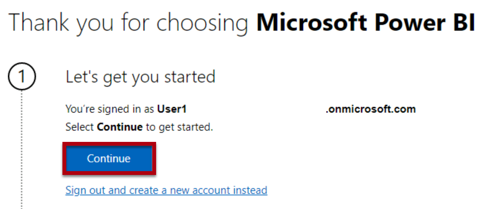
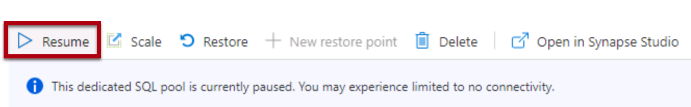
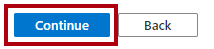
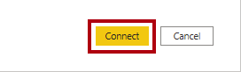
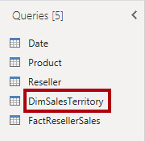

---
lab:
  title: 별모양 스키마 모델 만들기
  module: Prepare data for tabular models in Power BI
---

# 별모양 스키마 모델 만들기

## 개요

**이 랩의 예상 완료 시간은 30분입니다.**

이 랩에서는 Power BI Desktop을 사용하여 Azure Synapse Adventure Works 데이터 웨어하우스를 통해 데이터 모델을 개발합니다. 데이터 모델을 사용하면 데이터 웨어하우스를 통해 의미 체계 계층을 게시할 수 있습니다.

이 랩에서는 다음 사항들을 수행하는 방법에 대해 알아봅니다.

- Azure Synapse Analytics SQL 풀에 대한 Power BI 연결을 만듭니다.

- 모델 쿼리를 개발합니다.

- 모델 다이어그램을 구성합니다.

## 시작하기

이 연습에서는 환경을 준비합니다.

### Azure Synapse Analytics에 데이터 로드

   > **참고**: git 복제본을 사용하여 Azure Synapse Analytics에 데이터를 이미 로드한 경우 이 작업을 건너뛰고 **Power BI 설정**으로 진행할 수 있습니다.

1. [조직 자격 증명(또는 사용자에게 제공된 자격 증명)을 사용하여 Azure Portal](https://portal.azure.com)에 로그인합니다.
2. 페이지 위쪽의 검색 창 오른쪽에 있는 **[\>_]** 단추를 사용하여 Azure Portal에서 새 Cloud Shell을 만들고 ***PowerShell*** 환경을 선택하고 메시지가 표시되면 스토리지를 만듭니다. Cloud Shell은 다음과 같이 Azure Portal 아래쪽 창에 명령줄 인터페이스를 제공합니다.

    

    > **참고**: 이전에 *Bash* 환경을 사용하는 클라우드 셸을 만들었다면 클라우드 셸 창의 왼쪽 위에 있는 드롭다운 메뉴를 사용하여 ***PowerShell***로 변경합니다.

3. 창 맨 위에 있는 구분 기호 막대를 끌거나 창 오른쪽 위에 있는 **&#8212;** , **&#9723;** 및 **X** 아이콘을 사용하여 Cloud Shell 크기를 조정하여 창을 최소화, 최대화하고 닫을 수 있습니다. Azure Cloud Shell 사용에 관한 자세한 내용은 [Azure Cloud Shell 설명서](https://docs.microsoft.com/azure/cloud-shell/overview)를 참조하세요.

4. PowerShell 창에서 다음 명령을 입력하여 리포지토리를 복제합니다.

    ```
    rm -r dp500 -f
    git clone https://github.com/MicrosoftLearning/DP-500-Azure-Data-Analyst dp500
    ```

5. 리포지토리가 복제된 후에는 다음 명령을 입력하여 **setup** 폴더로 변경하고 이 폴더에 포함된 **setup.ps1** 스크립트를 실행합니다.

    ```
    cd dp500/Allfiles/04
    ./setup.ps1
    ```

6. 메시지가 표시되면 Azure Synapse SQL 풀에 대해 설정할 적절한 암호를 입력합니다.

    > **참고**: 이 암호를 기억하세요!

7. 스크립트가 완료될 때까지 기다리세요. 일반적으로 약 20분이 걸리지만 경우에 따라 더 오래 걸릴 수 있습니다.
8. Synapse 작업 영역 및 SQL 풀을 만들고 데이터를 로드한 후 스크립트는 불필요한 Azure 요금이 청구되지 않도록 풀을 일시 중지합니다. Azure Synapse Analytics에서 데이터를 사용할 준비가 되면 SQL 풀을 다시 시작해야 합니다.

### 이 과정에 대한 리포지토리 복제

1. 시작 메뉴에서 명령 프롬프트를 엽니다.

    
2. 명령 프롬프트 창에서 다음을 입력하여 D 드라이브로 이동합니다.

    `d:`

   Enter 키를 누릅니다.

    

3. 명령 프롬프트 창에서 다음 명령을 입력하여 과정 파일을 다운로드하고 DP500 폴더에 저장합니다.

   `git clone https://github.com/MicrosoftLearning/DP-500-Azure-Data-Analyst DP500`

4. 리포지토리가 복제된 경우 파일 탐색기에서 D 드라이브를 열어 파일이 다운로드되었는지 확인합니다.

### Power BI 설정

이 작업에서는 Power BI를 설정합니다.

1. Power BI Desktop을 열려면 작업 표시줄에서 **Power BI Desktop** 바로 가기를 선택합니다.

2. 오른쪽 위에 있는 X**를 **선택하여 시작 창을 닫습니다.

3. 아직 로그인하지 않은 경우 Power BI Desktop 오른쪽 위 모서리에서 **로그인**을 선택합니다. 조직 자격 증명(또는 사용자에게 제공된 랩 자격 증명)을 사용하여 로그인 프로세스를 완료합니다.

4. Microsoft Edge의 Power BI 가입 페이지로 리디렉션됩니다. **계속**을 선택하여 가입을 완료합니다.

   

5. 10자리 전화 번호를 입력하고 **시작**을 선택합니다. 다시 한 번 **시작**을 선택합니다. Power BI로 리디렉션됩니다.

6. 오른쪽 위에서 프로필 아이콘을 선택한 다음 **평가판 시작**을 선택합니다.

   

7. 메시지가 표시되면 **평가판 시작**을 선택합니다.

8. 나머지 작업을 수행하여 평가판 설정을 완료합니다.

   팁: Power BI 웹 브라우저 환경은 **Power BI 서비스**라고 알려져 있습니다.**

9. 작업 영역, **작업 영역 만들기**를 차례로 선택합니다.

    

10. DP500 labs라는 작업 영역을 만들고 **저장**을 선택합니다.

    *참고: 작업 영역 이름은 테넌트 내에서 고유해야 합니다. 오류가 발생하면 작업 영역 이름을 변경합니다.*

11. Power BI Desktop으로 다시 이동합니다. 화면의 오른쪽 위 모서리에 **로그인**이 보이면 랩 환경의 리소스 탭에 제공된 자격 증명을 사용하여 다시 로그인합니다. 이미 로그인한 경우 다음 단계로 진행합니다.

12. Power BI Desktop으로 이동한 다음 **파일**, **옵션 및 설정**을 선택한 다음 **옵션**, **보안**을 차례로 선택하고 인증 브라우저에서 **기본 웹 브라우저 사용**, **확인**을 차례로 선택합니다. Power BI Desktop을 닫습니다. 파일을 저장하지 마세요.

    다음 연습에서 Power BI Desktop을 다시 엽니다.**

### SQL 풀 시작

이 작업에서는 SQL 풀을 시작합니다.

1. Microsoft Edge에서 [https://portal.azure.com](https://portal.azure.com/)으로 이동합니다.

1. 랩 자격 증명을 사용하여 로그인 프로세스를 완료합니다.

1. Azure 서비스에서 **Azure Synapse Analytics**를 선택합니다. Synapse 작업 영역을 선택합니다.

   

1. 전용 SQL 풀을 찾아 선택합니다.

   

1. SQL 풀을 다시 시작합니다.

   

   중요: SQL 풀은 비용이 많이 드는 리소스입니다. 이 랩에서 작업할 때 이 리소스의 사용을 제한하세요. 랩의 마지막 작업에서는 이 리소스를 일시 중지하도록 안내합니다.**

### Power BI 작업 영역을 Azure Synapse Analytics에 연결

이 작업에서는 기존 Power BI 작업 영역을 Azure Synapse Analytics 작업 영역에 연결합니다.

1. Azure Portal의 전용 SQL 풀에 있는 리본에서 **Synapse Studio에서 열기**를 선택합니다.

1. Azure Synapse Studio의 홈페이지에서 **시각화**를 선택하여 Power BI 작업 영역을 연결합니다.

   

1. **작업 영역 이름** 드롭다운에서 이전 작업에서 만든 작업 영역을 선택하고 **만들기**를 선택합니다.

 


1. **관리**로 이동하고 **모두 게시**를 선택하여 변경 내용이 게시되도록 합니다.

## 데이터 모델 개발

이 연습에서는 Power BI 분석 및 데이터 웨어하우스 재판매인 판매 주체의 보고를 지원하는 DirectQuery 모델을 개발합니다.

### 데이터 세트 파일 다운로드

이 작업에서는 Synapse Studio에서 Power BI 데이터 원본 파일을 다운로드합니다.

1. Synapse Studio**의 **왼쪽에서 개발** 허브를 **선택합니다.

 

2. **개발** 창에서 **Power BI**, 작업 영역을 차례로 확장한 다음 **Power BI 데이터 세트**를 선택합니다. 없는 경우 **모두 게시**를 클릭하여 작업 영역을 게시하고 브라우저를 새로 고칩니다.

 

 *참고: 여기에 데이터가 표시되지 않으면 전용 SQL 풀이 실행 중이고 Power BI 작업 영역이 Synapse 작업 영역에 연결되어 있는지 확인합니다.*

3. **Power BI 데이터 세트** 창에서 **새 Power BI 데이터 세트**를 선택합니다.

 

4. 왼쪽 창의 아래쪽에서 **시작**을 선택합니다.

 

5. SQL 풀, **sqldw**를 선택한 다음 **계속**을 선택합니다.

 

6. .pbids 파일을 다운로드하려면 **다운로드**를 선택합니다.

 

 .pbids 파일에는 SQL 풀에 대한 연결이 포함되어 있는데, 이는 프로젝트를 시작하는 편리한 방법입니다. 이 파일을 열면 SQL 풀에 대한 연결 세부 정보가 이미 저장된 새 Power BI Desktop 솔루션이 생성됩니다.**

7. .pbids 파일이 다운로드되면 엽니다.

 파일이 열리면 연결을 사용하여 쿼리를 만들라는 메시지가 표시됩니다. 다음 작업에서는 이러한 쿼리를 정의합니다.**

### 모델 쿼리 만들기

이 작업에서는 각각 모델에 테이블로 로드되는 5개의 Power Query 쿼리를 만듭니다.

1. Power BI Desktop의 **SQL Server 데이터베이스** 창 왼쪽에서 **Microsoft 계정**을 선택합니다.

 

2. 로그인을** 선택합니다**.

3. 제공된 랩 Azure 자격 증명을 사용하여 로그인합니다.

4. **연결**을 선택합니다.

 

5. **탐색기** 창에서 **DimDate** 테이블을 (확인란으로 선택하지 말고) 그냥 선택합니다.

6. 오른쪽 창에서 테이블 행의 하위 집합을 보여 주는 미리 보기 결과를 확인합니다.

 

7. (모델 테이블이 될) 쿼리를 만들려면 다음 테이블 7개를 확인합니다.

- DimDate

- DimProduct
  
- DimProductCategory
  
- DimProductSubcategory

- DimReseller

- DimSalesTerritory

- FactResellerSales

8. 쿼리에 변환을 적용하려면 오른쪽 아래에서 **데이터 변환**을 선택합니다.

 

 데이터를 변환하면 모델에서 사용할 수 있는 데이터를 정의할 수 있습니다.**

9. **연결 설정** 창에서 **DirectQuery** 옵션을 선택합니다.

 

 이 결정은 중요합니다. DirectQuery는 스토리지 모드입니다. DirectQuery 스토리지 모드를 사용하는 모델 테이블은 데이터를 저장하지 않습니다. 따라서 Power BI 보고서 시각적 개체가 DirectQuery 테이블을 쿼리할 때 Power BI는 네이티브 쿼리를 데이터 원본으로 보냅니다. 이 스토리지 모드는 (대규모 데이터 볼륨을 가져오는 데 비실용적이거나 비경제적일 수 있기 때문에) Azure Synapse Analytics와 같은 대규모 데이터 저장소 또는 거의 실시간 결과가 필요한 경우에 사용할 수 있습니다.**

10. **확인**을 선택합니다.

 

11. **Power Query 편집기** 창의 왼쪽에 있는 **쿼리** 창에서 선택한 각 테이블마다 쿼리가 하나씩 있는지 확인합니다.

 이제 각 쿼리의 정의를 수정합니다. 각 쿼리는 모델에 적용될 때 모델 테이블이 됩니다. 이제 쿼리의 이름을 변경하여 보다 친숙하고 간결한 방법으로 설명하고, 알려진 보고 요구 사항에서 요구하는 열을 제공하기 위해 변환을 적용합니다.**

12. **DimDate** 쿼리를 선택합니다.

 

13. 쿼리 이름을 바꾸려면 오른쪽에 있는 **쿼리 설정** 창의 **이름** 상자에서 텍스트를 **Date**로 바꾸고 **Enter** 키를 누릅니다.

 

14. 불필요한 열을 제거하려면 **홈** 리본 탭의 **열 병합** 그룹에서 **열 선택** 아이콘을 선택합니다.

 

15. **열 선택** 창에서 모든 확인란의 선택을 취소하려면 첫 번째 확인란의 선택을 취소합니다.

 

16. 다음 5개의 열을 선택합니다.

- DateKey

- FullDateAlternateKey

- EnglishMonthName

- FiscalQuarter

- FiscalYear

 

 여기서 선택한 열에 따라 모델에서 사용할 수 있는 항목이 달라집니다.**

17. **확인**을 선택합니다.

 

18. **쿼리 설정** 창의 **적용된 단계** 목록에서 다른 열을 제거하는 단계가 추가된 것을 확인합니다.

 

 Power Query는 원하는 구조와 데이터를 갖기 위한 단계를 정의합니다. 각 변환은 쿼리 논리의 단계입니다.**

19. **FullDateAlternateKey** 열의 이름을 바꾸려면 **FullDateAlternateKey** 열 머리글을 두 번 클릭합니다.

20. 텍스트를 **Date**로 바꾸고 **Enter**를 누릅니다.

 

21. 새로 적용된 단계가 쿼리에 추가됩니다.

 

22. 다음과 같이 열 이름을 변경합니다.

- **EnglishMonthName**을 **Month**로

- **FiscalQuarter**를 **Quarter**로

- **FiscalYear**를 **Year**로

23. 쿼리 디자인의 유효성을 검사하려면 창 아래쪽에 있는 상태 표시줄에서 쿼리에 5개의 열이 있는지 확인합니다.

 

 중요: 쿼리 디자인이 일치하지 않는 경우 연습 단계를 검토하여 수정합니다.**

 **Date** 쿼리의 디자인이 이제 완성되었습니다.**

24. **적용된 단계** 창에서 마지막 단계를 마우스 오른쪽 단추로 클릭한 다음 **기본 쿼리 보기를** 선택합니다.

 

25. **기본 쿼리** 창에서 쿼리 디자인을 반영하는 SELECT 문을 검토합니다.

 이 개념은 중요합니다. 기본 쿼리는 Power BI가 데이터 원본을 쿼리하는 데 사용하는 쿼리입니다. 최상의 성능을 보장하기 위해 데이터베이스 개발자는 적절한 인덱스 만들기 등을 통해 이 쿼리를 최적화해야 합니다.**

26. **기본 쿼리** 창을 닫려면 **확인**을 선택합니다.

 

27. **DimProductCategory** 테이블을 선택합니다.

28. 쿼리 이름을 **Product Details**로 바꿉니다.

29. 리본의 홈 탭에 있는 결합 그룹에서 **쿼리 병합**을 선택합니다.

 *참고: 제품 세부 정보, 범주 및 하위 범주를 가져오기 위해 쿼리를 병합하고 있습니다. Product 차원에 사용됩니다.*

30. **DimProductSubcategory** 테이블을 선택하고 각 테이블에서 **ProductCategoryKey** 열을 선택합니다. **확인**을 선택합니다.

 

 *참고: 왼쪽 외부 조인인 이 병합에 기본 조인을 사용합니다.*

31. **DimProductSubcategory** 열을 확장하세요. **ProductSubcategoryKey**와 **EnglishProductSubcategoryName** 열을 선택합니다. **원래 열 이름을 접두사로 사용** 항목의 선택을 취소합니다.

 

 *확장 기능을 사용하면 원본 데이터의 외래 키 제약 조건에 따라 테이블을 조인할 수 있습니다. 이 랩에서 사용하는 디자인 방법은 눈송이 차원 테이블을 함께 조인하여 데이터의 비정규화된 표현을 생성하는 것입니다.*

32. **확인**을 선택합니다.

33. DimProductSubcategory.ProductSubcategoryKey** 열**의 이름을 ProductSubcategoryKey** 및 **DimProductSubcategory.EnglishProductSubcategoryName에서 EnglishProductSubcategoryName****으로 **바꿉**니다.

34. 다음을 제외한 모든 열을 제거합니다.

   - ProductSubcategoryKey

   - EnglishProductCategoryName

   - EnglishProductSubcategoryName

   이제 행이 37개인 열이 3개 있어야 합니다.

35. **DimProduct** 쿼리를 선택합니다.

 

36. 쿼리 이름을 **Product**로 바꿉니다.

 

37. 리본의 홈 탭에 있는 결합 그룹에서 **쿼리 병합**을 선택합니다.

38. **제품 세부 정보** 테이블을 선택하고 제품 테이블과 제품 세부 정보 테이블 모두에서 **ProductSubcategoryKey** 열을 선택합니다.

    

39. **확인**을 선택합니다.

40. 제품 세부 정보 열을 확장하고 **EnglishProductSubcategoryName**과 **EnglishProductCategoryName** 열을 선택합니다.

    

41. **확인**을 선택합니다.

42. 쿼리를 필터링하려면 **FinishedGoodsFlag** 열 머리글에서 드롭다운 메뉴를 열고 **FALSE**를 선택 취소합니다.

 

43. **확인**을 선택합니다.

44. 다음과 같이 열 이름을 변경합니다.

- **EnglishProductName**을 **Product**로

- **제품 세부 정보.EnglishProductCategoryName** as **Category**

- **Product Details.EnglishProductSubcategoryName** as **SubCategory**

45. 다음을 제외한 모든 열을 제거합니다.

- ProductKey

- Product

- Color

- 하위 범주

- 범주

46. **적용된 단계** 창에서 마지막 단계를 마우스 오른쪽 단추로 클릭한 다음 **기본 쿼리 보기를** 선택합니다.

 

47. **기본 쿼리** 창에서 쿼리 디자인을 반영하는 SELECT 문을 검토합니다.

48. **기본 쿼리** 창을 닫려면 **확인**을 선택합니다.

49. 쿼리에 열이 5개 있는지 확인합니다.

 **Product** 쿼리의 디자인이 이제 완성되었습니다.**

50. **DimReseller** 쿼리를 선택합니다.

 

51. 쿼리 이름을 **Reseller**로 바꿉니다.

52. 다음을 제외한 모든 열을 제거합니다.

- ResellerKey

- BusinessType

- ResellerName

53. 다음과 같이 열 이름을 변경합니다.

- **BusinessType**을 **Business Type**으로(공백으로 구분)

- **ResellerName**을 **Reseller**로

54. 쿼리에 열이 3개 있는지 확인합니다.

 **Reseller** 쿼리의 디자인이 이제 완성되었습니다.**

55. **DimSalesTerritory** 쿼리를 선택합니다.

 

56. 쿼리 이름을 **Territory**로 바꿉니다.

57. 다음을 제외한 모든 열을 제거합니다.

- SalesTerritoryKey

- SalesTerritoryRegion

- SalesTerritoryCountry

- SalesTerritoryGroup

58. 다음과 같이 열 이름을 변경합니다.

- **SalesTerritoryRegion**을 **Region**으로

- **SalesTerritoryCountry**를 **Country**로

- **SalesTerritoryGroup**을 **Group**으로

59. 쿼리에 열이 4개 있는지 확인합니다.

 이제 **Territory** 쿼리의 디자인이 완료되었습니다.**

60. **FactResellerSales** 쿼리를 선택합니다.

 

61. 쿼리 이름을 **Sales**로 바꿉니다.

62. 다음을 제외한 모든 열을 제거합니다.

- ResellerKey

- ProductKey

- OrderDateKey

- SalesTerritoryKey

- OrderQuantity

- UnitPrice

 

63. 다음과 같이 열 이름을 변경합니다.

- **OrderQuantity**를 **Quantity**로

- **UnitPrice**를 **Price**로

64. 계산된 열을 추가하려면 **열 추가** 리본 탭의 **일반** 그룹 내에서 **사용자 지정 열**을 선택합니다.

 

65. **사용자 지정 열** 창의 **새 열 이름** 상자에서 텍스트를 **Revenue**로 바꿉니다.

 

66. **사용자 지정 열 수식** 상자에 다음 수식을 입력합니다.

 ```
 [Quantity] * [Price]
 ```

67. **확인**을 선택합니다.

68. 열 데이터 형식을 수정하려면 **Revenue** 열 머리글에서 **ABC123**을 선택한 다음, **10진수**를 선택합니다.

 

69. 기본 쿼리를 검토하여 **Revenue** 열 계산 논리를 확인합니다.

70. 쿼리에 열이 7개 있는지 확인합니다.

 **Sales** 쿼리의 디자인이 이제 완성되었습니다.**

71. **제품 세부 정보** 테이블을 마우스 오른쪽 단추로 클릭하고 **로드 사용**을 선택 해제합니다. 이렇게 하면 제품 세부 정보 테이블이 데이터 모델에 로드되지 않으며 보고서에 나타나지 않습니다.

 

72. 이 단계를 반복하여 **DimProductSubcategory** 테이블의 로드 사용 선택을 해제합니다.

73. 쿼리를 적용하려면 **홈** 리본 탭의 **닫기** 그룹 내에서 **닫기&amp;적용** 아이콘을 선택합니다.

 

 각 쿼리는 모델 테이블을 만들기 위해 적용됩니다. 데이터 연결이 DirectQuery 스토리지 모드를 사용하므로 모델 구조만 생성됩니다. 데이터를 가져오지 않습니다. 이제 모델은 각 쿼리에 대해 하나의 테이블로 구성됩니다.**

74. Power BI Desktop에서 쿼리가 적용된 경우 상태 표시줄의 왼쪽 아래 모서리에서 모델 스토리지 모드가 DirectQuery임을 확인합니다.

 

### 모델 다이어그램 구성

이 작업에서는 별모양 스키마 디자인을 쉽게 이해할 수 있도록 모델 다이어그램을 구성할 수 있습니다.

1. Power BI Desktop의 왼쪽에서 **모델** 보기를 선택합니다.

 

2. 화면에 맞게 모델 다이어그램의 크기를 조정하려면 오른쪽 아래에서 **화면에 맞추기** 아이콘을 선택합니다.

 

3. **Sales** 팩트 테이블이 다이어그램의 중간에 있고 차원 테이블인 나머지 테이블은 팩트 테이블 주위에 배치되도록 테이블을 위치로 끌어옵니다.

4. 차원 테이블이 팩트 테이블과 관련이 없는 경우 다음 지침을 사용하여 관계를 만듭니다.

- 차원 키 열(예: **ProductKey**)을 끌어 **Sales** 테이블의 해당 열에 놓습니다.

- **관계 만들기** 창에서 **확인**을 선택합니다.

5. 모델 다이어그램의 최종 레이아웃을 검토합니다.

 

 이제 별모양 스키마 모델 만들기가 완료되었습니다. 계층 구조 추가, 계산 및 열 표시 유형과 같은 속성 설정 등 적용할 수 있는 모델링 구성이 많이 있습니다.**

6. 솔루션을 저장하려면 왼쪽 위에서 파일 메뉴를 선택하고 **여기에서 다른 이름으로** 저장을 선택합니다**.**

7. **다른 이름으로 저장** 창에서 **D:\DP500\Allfiles\04\MySolution** 폴더로 이동합니다.

8. **파일 이름** 상자에 **Sales Analysis**를 입력합니다.

 

9. **저장**을 선택합니다.

10. Power BI Desktop을 닫습니다.

### SQL 풀 일시 중지

이 작업에서는 SQL 풀을 중지합니다.

1. 웹 브라우저에서 [https://portal.azure.com](https://portal.azure.com/)로 이동합니다.

2. SQL 풀을 찾습니다.

3. SQL 풀을 일시 중지합니다.
