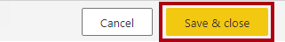
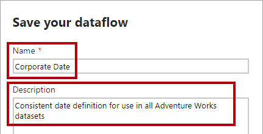
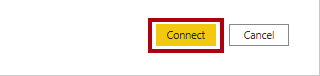
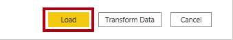
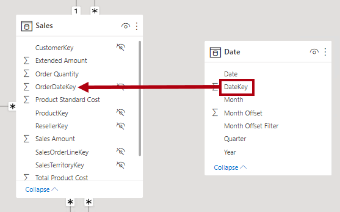
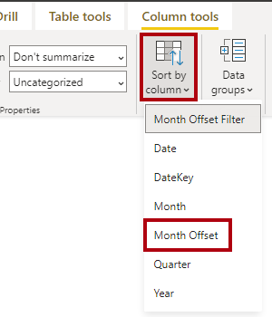

---
lab:
  title: 데이터 흐름 만들기
  module: Prepare data for tabular models in Power BI
---

# <a name="create-a-dataflow"></a>데이터 흐름 만들기

## <a name="overview"></a>개요

**이 랩을 완료하는 데 걸리는 예상 완료 시간은 45분입니다.**

이 랩에서는 Azure Synapse Adventure Works 데이터 웨어하우스에서 원본이 되는 날짜 차원 데이터를 배달하는 데이터 흐름을 만듭니다. 데이터 흐름은 조직의 비즈니스 분석가가 사용할 날짜 관련 데이터에 대한 일관된 정의를 제공합니다.

이 랩에서는 다음 사항들을 수행하는 방법에 대해 알아봅니다.

- Power Query Online을 사용하여 데이터 흐름을 개발합니다.

- Power BI Desktop 사용하여 데이터 흐름을 사용합니다.

## <a name="get-started"></a>시작

이 연습에서는 환경을 준비합니다.

### <a name="load-data-into-azure-synapse-analytics"></a>Azure Synapse Analytics에 데이터 로드

   > **참고**: git 복제본을 사용하여 Azure Synapse Analytics에 데이터를 이미 로드한 경우 이 작업을 건너뛰고 **Power BI 설정**으로 진행할 수 있습니다.

1. VM 오른쪽의 리소스 탭에 있는 로그인 정보를 사용하여 [Azure Portal](https://portal.azure.com)에 로그인합니다.
2. 페이지 위쪽의 검색 창 오른쪽에 있는 **[\>_]** 단추를 사용하여 Azure Portal에서 새 Cloud Shell을 만들고 ***PowerShell*** 환경을 선택하고 메시지가 표시되면 스토리지를 만듭니다. Cloud Shell은 다음과 같이 Azure Portal 아래쪽 창에 명령줄 인터페이스를 제공합니다.

    

    > **참고**: 이전에 *Bash* 환경을 사용하는 클라우드 셸을 만들었다면 클라우드 셸 창의 왼쪽 위에 있는 드롭다운 메뉴를 사용하여 ***PowerShell***로 변경합니다.

3. 창 맨 위에 있는 구분 기호 막대를 끌거나 창 오른쪽 위에 있는 **&#8212;** , **&#9723;** 및 **X** 아이콘을 사용하여 Cloud Shell 크기를 조정하여 창을 최소화, 최대화하고 닫을 수 있습니다. Azure Cloud Shell 사용에 관한 자세한 내용은 [Azure Cloud Shell 설명서](https://docs.microsoft.com/azure/cloud-shell/overview)를 참조하세요.

4. PowerShell 창에서 다음 명령을 입력하여 리포지토리를 복제합니다.

    ```
    rm -r dp500 -f
    git clone https://github.com/MicrosoftLearning/DP-500-Azure-Data-Analyst dp500
    ```

5. 리포지토리가 복제된 후에는 다음 명령을 입력하여 **setup** 폴더로 변경하고 이 폴더에 포함된 **setup.ps1** 스크립트를 실행합니다.

    ```
    cd dp500/Allfiles/04
    ./setup.ps1
    ```

6. 메시지가 표시되면 Azure Synapse SQL 풀에 대해 설정할 적절한 암호를 입력합니다.

    > **참고**: 이 암호를 기억하세요!

7. 스크립트가 완료될 때까지 기다리세요. 일반적으로 약 20분이 걸리지만 경우에 따라 더 오래 걸릴 수 있습니다.

1. Synapse 작업 영역 및 SQL 풀을 만들고 데이터를 로드한 후 스크립트는 불필요한 Azure 요금이 청구되지 않도록 풀을 일시 중지합니다. Azure Synapse Analytics에서 데이터를 사용할 준비가 되면 SQL 풀을 다시 시작해야 합니다.

### <a name="clone-the-repository-for-this-course"></a>이 과정용 리포지토리 복제

1. 시작 메뉴에서 명령 프롬프트를 엽니다.

    

1. 명령 프롬프트 창에서 다음을 입력하여 D 드라이브로 이동합니다.

    `d:` 

   Enter 키를 누릅니다.

    


1. 명령 프롬프트 창에서 다음 명령을 입력하여 과정 파일을 다운로드하고 DP500 폴더에 저장합니다.
    
    `
    git clone https://github.com/MicrosoftLearning/DP-500-Azure-Data-Analyst DP500
    `
   
2. 리포지토리가 복제되면 명령 프롬프트 창을 닫습니다. 
   
3. 파일 탐색기에서 D 드라이브를 열어 파일이 다운로드되었는지 확인합니다.

### <a name="set-up-power-bi-desktop"></a>Power BI Desktop 설정

이 작업에서는 Power BI Desktop을 설정합니다.

1. 파일 탐색기를 열려면 작업 표시줄에서 **파일 탐색기** 바로 가기를 선택합니다.

    

1. **D:\DP500\Allfiles\05\Starter** 폴더로 이동합니다.

1. 미리 개발된 Power BI Desktop 파일을 열려면 **Sales Analysis - Create a dataflow.pbix** 파일을 두 번 클릭합니다.

1. 아직 로그인하지 않은 경우 Power BI Desktop 오른쪽 위 모서리에서 **로그인**을 선택합니다. 랩 자격 증명을 사용하여 로그인 프로세스를 완료합니다.

    

1. 파일을 저장하려면 **파일** 리본에서 **다른 이름으로 저장**을 선택합니다.

1. **다른 이름으로 저장** 창에서 **D:\DP500\Allfiles\05\MySolution** 폴더로 이동합니다.

1. Power BI Desktop으로 이동한 다음 **파일**, **옵션 및 설정**을 선택한 다음 **옵션**, **보안**을 차례로 선택하고 인증 브라우저에서 **기본 웹 브라우저 사용**, **저장**을 차례로 선택합니다.

    데이터 흐름을 원본 날짜 차원 데이터로 사용하도록 Power BI Desktop 솔루션을 업데이트합니다.

### <a name="sign-in-to-the-power-bi-service"></a>Power BI 서비스에 로그인

이 작업에서는 Power BI 서비스에 로그인하고, 평가판 라이선스를 시작하여 작업 영역을 만듭니다.

중요: VM 환경에서 Power BI를 이미 설정한 경우 다음 작업을 계속 진행합니다.

1. 웹 브라우저에서 [https://powerbi.com](https://powerbi.com/)로 이동합니다.

1. 랩 자격 증명을 사용하여 로그인 프로세스를 완료합니다.

    중요: Power BI Desktop에서 로그인하는 데 사용한 것과 동일한 자격 증명을 사용해야 합니다.

1. 오른쪽 위에서 프로필 아이콘을 선택한 다음 **평가판 시작**을 선택합니다.

    

1. 메시지가 표시되면 **평가판 시작**을 선택합니다.

    

1. 나머지 작업을 수행하여 평가판 설정을 완료합니다.

    팁: Power BI 웹 브라우저 환경은 **Power BI 서비스**라고 알려져 있습니다.

  

### <a name="create-a-workspace"></a>작업 영역 만들기

이 작업에서는 작업 영역을 만듭니다.

1. Power BI 서비스에서 작업 영역을 만들려면 왼쪽에 있는 **탐색** 창에서 **작업 영역**을 선택한 다음, **작업 영역 만들기**를 선택합니다.

    


1. 오른쪽에 있는 **작업 영역 만들기** 창에서 **작업 영역 이름** 상자에 작업 영역의 이름을 입력합니다.

    작업 영역 이름은 테넌트 내에서 고유해야 합니다.

    

1. **저장**을 선택합니다.

    

    일단 만들어지면 작업 영역이 열립니다. 이후 연습에서는 이 작업 영역에 대한 데이터 흐름을 만듭니다.

### <a name="start-the-sql-pool"></a>SQL 풀 시작

이 작업에서는 SQL 풀을 시작합니다.

1. 웹 브라우저에서 [https://portal.azure.com](https://portal.azure.com/)로 이동합니다.

1. 랩 자격 증명을 사용하여 로그인 프로세스를 완료합니다.

1. 검색 창을 사용하여 Azure Synapse Analytics를 찾습니다. 

1. Azure Synapse Analytics 인스턴스를 선택합니다.
    

1. 전용 SQL 풀을 찾아 선택합니다.
    

1. 전용 SQL 풀을 다시 시작합니다.

    

    중요: SQL 풀은 비용이 많이 드는 리소스입니다. 이 랩에서 작업할 때 이 리소스의 사용을 제한하세요. 랩의 마지막 작업에서는 이 리소스를 일시 중지하도록 안내합니다.

## <a name="develop-a-dataflow"></a>데이터 흐름 개발

이 연습에서는 Power BI 모델 개발을 지원하는 데이터 흐름을 개발합니다. 데이터 웨어하우스 날짜 차원 테이블의 일관된 표현을 제공합니다.

### <a name="review-the-data-model"></a>데이터 모델 검토

이 작업에서는 Power BI Desktop에서 개발된 데이터 모델을 검토합니다.

1. Power BI Desktop 솔루션으로 전환합니다.

1. 왼쪽에서 **모델** 보기로 전환합니다.

    

1. 모델 다이어그램에서 **Date** 테이블을 확인합니다.

    

    비즈니스 분석가가 만든 **Date** 테이블입니다. 날짜 관련 데이터의 일관된 정의를 나타내지 않으며 상대 날짜 필터를 지원하는 데 유용한 오프셋 열은 포함하지 않습니다. 이후 연습에서는 이 테이블을 데이터 흐름에서 원본으로 사용하는 새 테이블로 바꿉니다.

### <a name="create-a-dataflow"></a>데이터 흐름 만들기

이 작업에서는 날짜 관련 데이터의 일관된 정의를 나타내는 데이터 흐름을 만듭니다.

1. Power BI 서비스에서 **새로 만들기**, **데이터 흐름**을 선택합니다.

    

1. 데이터 흐름을 만들려면 **데이터 흐름** 타일을 선택합니다.

    

1. **새 테이블 정의** 타일에서 **새 테이블 추가**를 선택합니다.

    

    새 테이블을 추가하려면 Power Query Online을 사용하여 쿼리를 정의해야 합니다.

1. 데이터 원본을 선택하려면 **Azure Synapse Analytics(SQL DW)** 를 선택합니다.

    

    팁: 오른쪽 위에 있는 검색창을 사용하여 데이터 원본을 찾을 수 있습니다.

1. Synapse 연결 설정을 입력합니다.

     - Azure Portal에서 서버 이름 입력 
     
     
     
      서버 이름은 다음과 유사하게 표시됩니다.
      
      synapsewsxxxxx.sql.azuresynapse.net
      
     - 인증 종류가 **조직 계정**인지 확인합니다. 로그인하라는 메시지가 표시되면 랩에서 제공한 자격 증명을 사용합니다.
     

1. 오른쪽 아래에서 **다음**을 선택합니다.

    

1. Power Query 탐색 창에서 sqldw를 확장하고 **DimDate** 테이블을 선택합니다(체크상자로 선택 안 함).

    

1. 테이블 데이터의 미리 보기를 확인합니다.

1. 쿼리를 만들려면 **DimDate** 테이블을 선택합니다.

    

1. 오른쪽 아래에서 **데이터 변환**을 선택합니다.

    

    이제 Power Query Online을 사용하여 테이블에 변환을 적용합니다. Power BI Desktop에서 Power Query 편집기와 거의 동일한 환경을 제공합니다.

1. 쿼리 이름을 바꾸려면 오른쪽에 있는 **쿼리 설정** 창의 **이름** 상자에서 텍스트를 **Date**로 바꾸고 **Enter** 키를 누릅니다.

    

1. 불필요한 열을 제거하려면 **홈** 리본 탭의 **열 병합** 그룹에서 **열 선택** 아이콘을 선택합니다.

    

1. **열 선택** 창에서 모든 확인란의 선택을 취소하려면 첫 번째 확인란의 선택을 취소합니다.

    


1. 다음 5개의 열을 선택합니다.

    - DateKey

    - FullDateAlternateKey

    - MonthNumberOfYear

    - FiscalQuarter

    - FiscalYear

    

1. **확인**을 선택합니다.

    

  
1. **쿼리 설정** 창의 **적용된 단계** 목록에서 다른 열을 제거하는 단계가 추가된 것을 확인합니다.

    

    Power Query는 원하는 구조와 데이터를 갖기 위한 단계를 정의합니다. 각 변환은 쿼리 논리의 단계입니다.

1. **FullDateAlternateKey** 열의 이름을 바꾸려면 **FullDateAlternateKey** 열 머리글을 두 번 클릭합니다.

1. 텍스트를 **Date**로 바꾸고 **Enter**를 누릅니다.

    

1. 계산된 열을 추가하려면 **열 추가** 리본 탭의 **일반** 그룹 내에서 **사용자 지정 열**을 선택합니다.

    

   

1. **사용자 지정 열** 창의 **새 열 이름** 상자에서 텍스트를 **Year**로 바꿉니다.

1. **데이터 형식** 드롭다운 목록에서 **텍스트**를 선택합니다.

    

1. **사용자 지정 열 수식** 상자에 다음 수식을 입력합니다.

    팁: 모든 수식은 **D:\DP500\Allfiles\05\Assets\Snippets.txt** 파일에서 복사하여 붙여 넣을 수 있습니다.


    ```
    "FY" & Number.ToText([FiscalYear])
    ```


1. **확인**을 선택합니다.

    이제 사용자 지정 열을 4개 더 추가합니다.

1. 다음 수식을 사용하여 **텍스트** 데이터 형식으로 **Quarter**라는 다른 사용자 지정 열을 추가합니다.


    ```
    [Year] & " Q" & Number.ToText([FiscalQuarter])
    ```


1. 다음 수식을 사용하여 **텍스트** 데이터 형식으로 **Month**라는 다른 사용자 지정 열을 추가합니다.


    ```
    Date.ToText([Date], "yyyy-MM")
    ```

1. 다음 수식을 사용하여 **정수** 데이터 형식을 사용하여 **Month Offset**(단어 사이에 공백 포함)이라는 다른 사용자 지정 열을 추가합니다.


    ```
    ((Date.Year([Date]) * 12) + Date.Month([Date])) - ((Date.Year(DateTime.LocalNow()) * 12) + Date.Month(DateTime.LocalNow()))
    ```


    이 수식은 현재 월의 월 수를 결정합니다. 현재 달은 0이고, 지난 달은 음수이고, 향후 월은 양수입니다. 예를 들어 지난 달의 값은 -1입니다.

   

1. 다음 수식을 사용하여 **텍스트** 데이터 형식을 사용하여 **Month Offset Filter**(단어 사이에 공백 포함)라는 다른 사용자 지정 열을 추가합니다.


    ```
    if [Month Offset] > 0 then Number.ToText([Month Offset]) & " month(s) future"

    else if [Month Offset] = 0 then "Current month"

    else Number.ToText(-[Month Offset]) & " month(s) ago"
    ```


    이 수식은 숫자 오프셋을 친숙한 텍스트 형식으로 바꿉니다.

    팁: 모든 수식은 **D:\DP500\Allfiles\05\Assets\Snippets.txt** 파일에서 복사하여 붙여 넣을 수 있습니다.

1. 불필요한 열을 제거하려면 **홈** 리본 탭의 **열 병합** 그룹에서 **열 선택** 아이콘을 선택합니다.

    

1. **수식 선택** 창에서 다음 열의 선택을 취소합니다.

    - MonthNumberOfYear

    - FiscalQuarter

    - FiscalYear

    

1. **확인**을 선택합니다.

1. 오른쪽 아래에서 **저장 &amp; 닫기**를 선택합니다.

    

1. **데이터 흐름 저장** 창의 **이름** 상자에 **Corporate Date**(회사 날짜)를 입력합니다.

1. **설명** 상자에 **Consistent date definition for use in all Adventure Works datasets**(모든 Adventure Works 데이터 세트에서 사용할 수 있도록 일관된 날자 정의)라고 입력합니다.

1. 팁: 설명은 **D:\DP500\Allfiles\05\Assets\Snippets.txt** 파일에서 복사하여 붙여 넣을 수 있습니다.

    

1. **저장**을 선택합니다.

    

1. Power BI 서비스의 **탐색** 창에서 작업 영역 이름을 선택합니다.

    이 작업을 수행하면 작업 영역에 대한 방문 페이지가 열립니다.

1. 데이터 흐름을 새로 고치려면 **회사 날짜** 데이터 흐름 위에 커서를 놓고 **지금 새로 고침** 아이콘을 선택합니다.

    

  

1. 데이터 흐름 설정으로 이동하려면 **회사 날짜** 데이터 흐름 위에 커서를 놓고 줄임표를 선택한 다음 **설정**을 선택합니다.

    

1. 구성 옵션은 다음과 같습니다.

    

    구성해야 하는 두 가지 설정이 있습니다. 먼저 매일 데이터 흐름 데이터를 업데이트하도록 예약된 새로 고침을 구성해야 합니다. 이렇게 하면 현재 날짜를 사용하여 월 오프셋을 계산합니다. 둘째, 데이터 흐름은 (권한 있는 검토자에 의해) 인증된 것으로 승인되어야 합니다. 인증된 데이터 흐름은 품질 표준을 충족하며 신뢰할 수 있고 신뢰할 수 있는 것으로 간주될 수 있음을 다른 사용자에게 선언합니다.

    설정을 구성하는 것 외에도 모든 콘텐츠 작성자가 데이터 흐름을 사용할 수 있는 권한을 부여해야 합니다.

## <a name="consume-a-dataflow"></a>데이터 흐름 사용

이 연습에서는 Power BI Desktop 솔루션에서 기존 **Date** 테이블을 데이터 흐름에서 데이터를 가져오는 새 테이블로 바꿉니다.

### <a name="remove-the-original-date-table"></a>원래 Date 테이블 제거

이 작업에서는 원래 **Date** 테이블을 제거합니다.

1. Power BI Desktop 솔루션으로 전환합니다.

1. 모델 다이어그램에서 **Date** 테이블을 마우스 오른쪽 단추로 클릭한 다음 **모델에서 삭제**를 선택합니다.

    

1. 테이블을 삭제하라는 메시지가 표시되면 **확인**을 선택합니다.

    

  


### <a name="add-a-new-date-table"></a>새 Date 테이블 추가

이 작업에서는 데이터 흐름에서 데이터를 가져오는 새 **Date** 테이블을 추가합니다.

1. **홈** 리본의 **데이터** 그룹 내에서 **데이터 가져오기**를 선택합니다.

    

1. **데이터 가져오기** 창의 왼쪽에서 **Power Platform**을 선택한 다음 **Power BI 데이터 흐름**을 선택합니다.

    

1. **연결**을 선택합니다.

    

  

1. **Power BI 데이터 흐름** 창에서 **로그인**을 선택합니다.

    

1. 랩 자격 증명을 사용하여 로그인 프로세스를 완료합니다.

    중요: Power BI 서비스에 로그인하는 데 사용한 것과 동일한 자격 증명을 사용해야 합니다.

1. **연결**을 선택합니다.

    

1. **탐색기** 창의 왼쪽 창에서 작업 영역 폴더를 확장한 다음 **Corporate Date** 데이터 흐름 폴더를 확장합니다.

    


1. **Date** 테이블을 선택합니다.

    

1. **로드**를 선택합니다.

    

    Power Query 편집기 사용하여 데이터를 변환할 수 있습니다.

1. 새 테이블이 모델에 추가되면 **Date** 테이블의 **DateKey** 열을 **Sales** 테이블의 **OrderDateKey** 열로 끌어 관계를 만듭니다.

    

    열을 숨기거나 계층 구조를 만드는 것과 같이 수행할 수 있는 다른 많은 모델 구성이 있습니다.

### <a name="validate-the-model"></a>모델의 유효성 검사

이 작업에서는 간단한 보고서 레이아웃을 만들어 모델을 테스트합니다.

1. 왼쪽에서 **보고서** 보기로 전환합니다.

    

1. 페이지에 시각적 개체를 추가하려면 **시각화** 창에서 누적 가로 막대형 차트 시각적 개체를 선택합니다.

    

1. 보고서 페이지를 채우도록 시각적 개체의 크기를 조정합니다.

  

1. **필드** 창에서 **Date** 테이블을 확장한 다음 **Month Offset** 필터 필드를 가로 막대형 차트 시각적 개체로 끌어옵니다.

    

1. **필드** 창에서 **Sales** 테이블을 확장한 다음 **Sales Amount** 필드를 가로 막대형 차트 시각적 개체로 끌어옵니다.

    


1. 세로 축을 정렬하려면 시각적 개체의 오른쪽 위에서 줄임표를 선택한 다음 **축 정렬** > **Month Offset** 필터를 선택합니다.

    

1. 월 오프셋 필터 값이 시간순으로 정렬되도록 하려면 **필드** 창에서 **Month Offset** 필터 필드를 선택합니다.

1. **열 도구** 리본 탭의 **정렬** 그룹 내에서 **정렬**을 선택한 다음, **Month Offset**을 선택합니다.

    

1. 이제 시간순으로 정렬되는 업데이트된 가로 막대형 차트 시각적 개체를 검토합니다.

    날짜 오프셋 열을 사용하는 주요 이점은 보고서를 사용자 지정된 방식으로 상대 날짜를 기준으로 필터링할 수 있다는 것입니다. (슬라이서 및 필터 역시 상대 날짜 및 기간별로 필터링하지만 이 동작은 사용자 지정할 수 없습니다. 또한 분기별로 필터링을 허용하지 않습니다.)

1. Power BI Desktop 파일을 저장합니다.

1. Power BI Desktop을 닫습니다.

### <a name="pause-the-sql-pool"></a>SQL 풀 일시 중지

이 작업에서는 SQL 풀을 중지합니다.

1. 웹 브라우저에서 [https://portal.azure.com](https://portal.azure.com/)로 이동합니다.

1. SQL 풀을 찾습니다.

1. SQL 풀을 일시 중지합니다.
