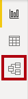
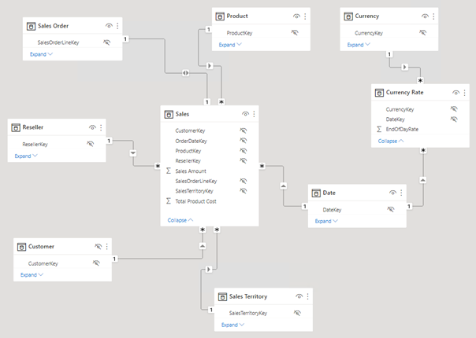
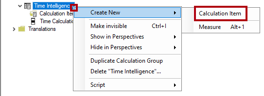
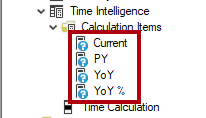
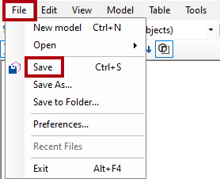
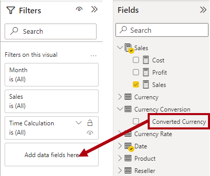

---
lab:
  title: 계산 그룹 만들기
  module: Design and build tabular models
---
# 계산 그룹 만들기

## 개요

이 랩을 완료하는 데 걸리는 예상 완료 시간은 45분입니다.

이 랩에서는 Power BI Desktop 및 테이블 형식 편집기 2를 사용하여 계산 그룹을 만듭니다.

이 랩에서는 다음 사항들을 수행하는 방법에 대해 알아봅니다.

-   계산 그룹 만들기
-   계산 항목의 서식을 지정합니다.
-   계산 그룹의 우선 순위를 설정합니다.
-   계산 그룹을 사용하도록 시각적 개체를 구성합니다.

## 시작
### 이 과정용 리포지토리 복제

1. 시작 메뉴에서 명령 프롬프트를 엽니다.

    

1. 명령 프롬프트 창에서 다음을 입력하여 D 드라이브로 이동합니다.

    `d:` 

   Enter 키를 누릅니다.

    


1. 명령 프롬프트 창에서 다음 명령을 입력하여 과정 파일을 다운로드하고 DP500 폴더에 저장합니다.
    
    `git clone https://github.com/MicrosoftLearning/DP-500-Azure-Data-Analyst DP500`
   
1. 리포지토리가 복제되면 명령 프롬프트 창을 닫습니다. 
   
1. 파일 탐색기에서 D 드라이브를 열어 파일이 다운로드되었는지 확인합니다.

## 환경 준비

테이블 형식 편집기 2를 설치하고, Power BI 데스크톱을 설정하고, 데이터 모델을 검토하고, 측정값을 만들어 랩 환경을 준비합니다.

### 테이블 형식 편집기 2 다운로드 및 설치

테이블 형식 편집기 2를 다운로드하여 설치해 계산 그룹을 만들 수 있습니다.

**중요:** VM 환경에 테이블 형식 편집기 2를 이미 설치한 경우 다음 작업을 계속 진행합니다.

테이블 형식 편집기는 Analysis Services 및 Power BI에 대한 테이블 형식 모델을 작성하기 위한 편집기 대체 도구입니다. 테이블 형식 편집기 2는 모델의 데이터에 액세스하지 않고 BIM 파일을 편집할 수 있는 오픈 소스 프로젝트입니다.

1.  Power BI Desktop이 닫혀 있는지 확인합니다.

1.  Microsoft Edge에서 테이블 형식 편집기 릴리스 페이지로 이동합니다.

    ```https://github.com/TabularEditor/TabularEditor/releases```
    
1. **자산** 섹션까지 아래로 스크롤하여 **TabularEditor.Installer.msi** 파일을 선택합니다. 그러면 파일 설치가 시작됩니다.

1. 완료되면 **파일 열기**를 선택하여 설치 관리자를 실행합니다.

    

1.  테이블 형식 편집기 설치 관리자 창에서 **다음**을 선택합니다.

    

1.  **사용권 계약** 단계에서 동의하는 경우 **동의**를 선택하고 **다음**을 선택합니다.

    

1.  **설치 폴더 선택** 단계에서 **다음**을 선택합니다.


2.  **애플리케이션 바로 가기** 단계에서 **다음**을 선택합니다.


3. **설치 확인** 단계에서 **다음**을 선택합니다.

4. **사용자 계정 컨트롤** 팝업 창이 표시되면 **예**를 선택합니다.

5. 설치가 완료되면 **닫기**를 선택합니다.

    이제 테이블 형식 편집기가 설치되어 Power BI Desktop 외부 도구로 등록됩니다.

### Power BI Desktop 설정

이제 미리 개발된 Power BI Desktop 솔루션을 엽니다.

1.  파일 탐색기에서 **D:\\DP500\\Allfiles\\07\\Starter** 폴더로 이동합니다.

2.  미리 개발된 Power BI Desktop 파일을 열려면 **Sales Analysis - Create calculation groups.pbix** 파일을 두 번 클릭합니다.

3.  파일을 저장하려면 **파일** 리본 탭에서 **다른 이름으로 저장**을 선택합니다.

4.  **다른 이름으로 저장** 창에서 **D:\\DP500\\Allfiles\\07\\MySolution** 폴더로 이동합니다.

5.  **저장**을 선택합니다.

6.  **외부 도구** 리본 탭을 선택합니다.

    

7.  이 리본 탭에서 테이블 형식 편집기를 시작할 수 있습니다.

    

    다음 연습에서는 테이블 형식 편집기를 사용하여 계산 그룹을 만듭니다.

### 데이터 모델 검토

데이터 모델을 검토하여 계산 그룹이 이 모델에 적용되는 방식을 이해합니다.

1.  Power BI Desktop의 왼쪽에서 **모델** 보기로 전환합니다.

    

2.  모델 다이어그램을 사용하여 모델 디자인을 검토합니다.

    

    모델은 7개의 차원 테이블과 2개의 팩트 테이블로 구성됩니다. **Sales** 팩트 테이블에는 판매 주문 세부 정보가 저장됩니다. **Currency Rate** 팩트 테이블은 여러 통화에 대한 일일 환율을 저장합니다. 이 테이블은 클래식 별모양 스키마 디자인입니다.

3.  **보고서** 보기로 전환합니다.

    

4.  오른쪽에 있는 **데이터** 창에서 **Sales** 테이블을 확장하여 필드를 검토합니다.

    

5.  두 **Sales** 테이블 필드는 시그마 기호(∑)로 데코레이팅됩니다.

    시그마 기호는 합계, 개수, 평균 등의 집계 함수를 사용하여 필드가 자동으로 요약됨을 나타냅니다.

    그러나 계산 그룹이 모델에 추가되면 이 자동 동작을 사용하지 않도록 설정해야 합니다. 즉, DAX(데이터 분석 식) 수식을 사용하여 정의된 측정값으로만 요약을 수행할 수 있습니다. 다음 작업에서는 모델에 측정값을 추가합니다.

### 측정값 만들기

계산 그룹 만들기를 준비하기 위해 세 가지 판매 관련 측정값을 만듭니다.

1.  **데이터** 창에서 **Sales** 테이블을 마우스 오른쪽 단추로 클릭한 다음 **새 측정값을** 선택합니다.

    

2.  리본 아래에 있는 수식 입력줄에서 텍스트를 다음 측정값 정의로 바꾼 다음 **Enter** 키를 누릅니다.

    팁: 모든 수식은 **D:\\DP500\\Allfiles\\07\\Assets\\Snippets.txt** 파일에서 복사하여 붙여 넣을 수 있습니다.

    DAX

    ```Sales = SUM ( 'Sales'[Sales Amount] )```

3.  **측정값 도구** 상황별 리본의 **서식** 그룹에서 소수 자릿수를 **2**로 설정합니다.

    

4.  다음 정의를 사용하여 **비용**이라는 두 번째 측정값을 만들고 마찬가지로 서식을 지정합니다.

    DAX

    ```Cost = SUM ( 'Sales'[Total Product Cost] )```

5.  다음 정의를 사용하여 **수익**이라는 세 번째 측정값을 만들고 마찬가지로 서식을 지정합니다.

    DAX

    ```Profit = [Sales] - [Cost]```

6.  **데이터** 창에서 **판매액** 필드를 마우스 오른쪽 단추로 클릭한 다음 **숨기기**를 선택합니다.

    

7.  또한 **총 제품 비용** 필드도 숨깁니다.

8.  이제 **Sales** 테이블이 **데이터** 창에 먼저 나열되고 다중 계산기 아이콘으로 데코레이트됩니다.

    

    테이블이 표시되는 측정값으로만 구성되면 창 맨 위에 표시됩니다. 이렇게 하면 측정값 그룹(다차원 모델의 개체)처럼 동작합니다. 테이블 형식 모델의 이 코스메틱 표현을 DAX 계산 그룹과 혼동하지 마세요.

## 계산 그룹 만들기

이 단원에서는 계산 그룹을 두 개 만듭니다. 첫 번째는 시간 인텔리전스를 지원하고 두 번째는 통화 환산을 지원합니다.

### 시간 인텔리전스 계산 그룹 만들기

테이블 형식 편집기를 사용하여 **시간 인텔리전스** 계산 그룹을 만듭니다. 이렇게 하면 PY(이전 연도), YoY(전년 대비), YoY%(전년 대비 백분율)를 비롯한 여러 시간 관련 계산의 만들기를 간소화합니다. 계산 그룹을 사용하면 다양한 시간 인텔리전스 계산을 사용하여 측정값을 분석할 수 있습니다.

Power BI Desktop은 계산 그룹의 생성 또는 관리를 지원하지 않습니다.

   > **팁**: 모든 구문은 D:\DP500\Allfiles\07\Assets\Snippets.txt에서 복사하여 붙여 넣을 수 있습니다.

1.  **외부 도구** 리본에서 **테이블 형식 편집기**를 선택합니다.

    

    테이블 형식 편집기가 새 창에서 열리고 Power BI Desktop에서 호스트되는 데이터 모델에 실시간으로 연결됩니다. 테이블 형식 편집기에서 모델에 대한 변경 내용은 저장할 때까지 Power BI Desktop에 전파되지 않습니다.

2.  테이블 형식 편집기 창의 왼쪽 창에서 **Tables** 폴더를 마우스 오른쪽 단추로 클릭한 다음 **새로 만들기**\>**계산 그룹 만들기**를 선택합니다.

    

3.  왼쪽 창에서 기본 이름을 **시간 인텔리전스**로 바꾼 다음 **Enter** 키를 누릅니다.

4.  그런 다음 **Time Intelligence** 테이블을 확장합니다.

5.  **이름** 열을 선택합니다.

    

    계산 그룹은 이 단일 열로 구성되지만 데이터 행은 계산 그룹을 정의합니다. 계산의 제목을 반영하도록 열 이름을 바꾸는 것이 좋습니다.

6.  오른쪽 아래에 있는 **속성** 창에서 **이름** 속성을 선택한 다음 이름을 **시간 계산**으로 바꿉니다.

    

7.  계산 항목을 만들려면 **Time Intelligence** 테이블을 마우스 오른쪽 단추로 클릭한 다음 **새로 만들기**\>**계산 항목**을 선택합니다.

    

8.  왼쪽 창에서 기본 이름을 **Current**로 바꾼 다음 **Enter** 키를 누릅니다.

9.  **속성** 창 위에 있는 **식 편집기** 창에서 다음 수식을 입력합니다.

    DAX

    ```SELECTEDMEASURE ()```

    

    SELECTEDMEASURE 함수는 계산 항목을 계산할 때 현재 컨텍스트에 있는 측정값에 대한 참조를 반환합니다.

10. **식 편집기** 창 도구 모음에서 첫 번째 단추를 선택하여 변경 내용을 적용합니다.

    

11. 다음 수식을 사용하여 **PY**라는 두 번째 계산 항목을 만듭니다.

    DAX

    ```CALCULATE ( SELECTEDMEASURE (), SAMEPERIODLASTYEAR ( 'Date'[Date] ) )```

    PY(이전 연도) 수식은 이전 연도에 선택한 측정값의 값을 계산합니다.

12. 다음 수식을 사용하여 **YoY**라는 세 번째 계산 항목을 만듭니다.

    DAX
    ```
    SELECTEDMEASURE () 
        - CALCULATE ( SELECTEDMEASURE (), 'Time Intelligence'[Time Calculation] = "PY" )
    ```

    *전년 대비(YoY) 수식은 선택한 연도와 전년도의 측정값의 차이를 계산합니다.*

13. 다음 수식을 사용하여 **YoY %** 라는 계산 항목을 4개 만듭니다.

    DAX
    ```
    DIVIDE (
        CALCULATE ( SELECTEDMEASURE (), 'Time Intelligence'[Time Calculation] = "YoY" ),
        CALCULATE ( SELECTEDMEASURE (), 'Time Intelligence'[Time Calculation] = "PY" )
    )
    ```
    *전년 대비 백분율(YoY%) 수식은 전년 대비 선택한 측정값의 변경 비율을 계산합니다.*

14. **속성** 창에서 **서식 문자열 식** 속성을 다음과 같이 설정합니다. 
    ```
    "0.00%;-0.00%;0.00%"
    ```

    팁: 서식 문자열 식은 **D:\\DP500\\Allfiles\\07\\Assets\\Snippets.txt**에서 복사하여 붙여 넣을 수 있습니다.

    

15. **시간 인텔리전스** 계산 그룹에 4개의 계산 항목이 있는지 확인합니다.

    

16. 변경 내용을 Power BI Desktop 모델에 저장하려면 **파일** 메뉴에서 **저장**을 선택합니다.

    

    **팁:** 도구 모음 단추를 선택하거나 **Ctrl+S**를 누를 수도 있습니다.

17. Power BI Desktop으로 전환합니다.

18. 보고서 디자이너 위에서 노란색 배너를 확인합니다.

    

19. 배너 오른쪽에서 **지금 새로 고침**을 선택합니다.

    

    새로 고침은 계산 그룹을 모델 테이블로 만들어 변경 내용을 적용합니다. 그런 다음 계산 항목을 데이터 행으로 로드합니다.

20. **데이터** 창에서 **시간 인텔리전스** 테이블을 엽니다.

    

### 행렬 시각적 개체 업데이트

이제 **Time Calculation** 열을 사용하도록 행렬 시각적 개체를 수정합니다.

1.  보고서에서 행렬 시각적 개체를 선택합니다.

2.  **시각화** 창의 **값** 웰에서 **X**를 선택하여 **Sales Amount** 필드를 제거합니다.

    

3.  **데이터** 창의 **Sales** 테이블 내부에서 **Sales** 필드를 **값** 웰로 끌어옵니다.

    

4.  **데이터** 창의 **Time Intelligence** 테이블 내부에서 **시간 계산** 필드를 열 웰로 끌어**옵니다**.

    

5.  행렬 시각적 개체에 월별로 그룹화된 시간 관련 **판매** 측정값 그리드가 표시되는지 확인합니다.

    

    값의 형식은 선택한 측정값에서 파생됩니다. 그러나 **YoY %** 측정값에 대한 형식 문자열 식을 설정하여 백분율 형식을 생성한다는 점을 기억하세요.

### 통화 환산 계산 그룹 만들기

이제 **통화 환산** 계산 그룹을 만듭니다. **Sales** 테이블 측정값을 선택한 통화로 환산할 수 있는 유연성을 제공합니다. 또한 선택한 통화에 적절한 서식을 적용합니다.

1.  Power BI Desktop에서 **데이터** 보기로 전환합니다.

    

2.  **데이터** 창에서 **통화** 테이블을 선택합니다.

3.  서식 문자열 식이 포함된 숨겨진 **FormatString** 열이 열 값인지 확인합니다.

    

    DAX 식을 사용하여 선택한 통화의 형식 문자열을 적용합니다.

4.  테이블 형식 편집기로 전환합니다.

5.  **Currency Conversion**이라는 계산 그룹을 만듭니다.

    작업의 반복으로 인해 간단한 지침이 제공됩니다. 필요한 경우 이 연습의 첫 번째 작업의 단계를 참조할 수 있습니다.

    

6.  **Name** 열의 이름을 **Converted Currency**로 바꿉니다.

    

7.  다음 수식을 사용하여 **통화 환산**이라는 계산 항목을 만듭니다.

    DAX
    ```
    IF (
        HASONEVALUE ( 'Currency'[Currency] ),
        SUMX (
            VALUES ( 'Date'[Date] ),    CALCULATE (
                DIVIDE ( SELECTEDMEASURE (), MAX ( 'Currency Rate'[EndOfDayRate] ) )
            )
        )
    )
    ```
    필터 컨텍스트에 통화가 하나만 있는 경우 수식은 선택한 측정값의 일별 값을 해당 날짜의 종료율로 나눈 값을 합산합니다.

8.  **속성** 창에서 **서식 문자열 식** 속성을 다음 수식으로 설정합니다.

    DAX
    ```
    SELECTEDVALUE ( 'Currency'[FormatString] )
    ```
    이 수식은 선택한 통화의 서식 문자열을 반환합니다. 이러한 방식으로 서식 지정은 **통화** 차원 테이블의 데이터에 의해 동적으로 구동됩니다.

9.  변경 내용을 Power BI Desktop 모델에 저장합니다.

10. Power BI 데스크톱으로 전환하고 변경 내용을 새로 고칩니다.

    

11. **보고서** 보기로 전환합니다.

    

12. 행렬 시각적 개체를 선택합니다.

13. **데이터** 창의 **통화 변환** 테이블 내에서 **변환된 통화** 필드를 **필터** 창으로 끌어 **이 시각적** 개체 그룹의 필터로 끕니다.

    

14. 필터 카드에서 **통화 환산** 값을 확인합니다.

    

15. 값 형식은 미국 달러 금액을 명확하게 설명하도록 업데이트됩니다.

    

16. **통화** 슬라이서에서 다른 통화를 선택한 다음 행렬 시각적 개체에서 업데이트된 값과 서식을 확인합니다.

17. **통화** 슬라이서를 **미국 달러** 되돌립니다.

    

18. 그러나 **YoY %** 값은 더 이상 백분율이 아닙니다.

    문제가 있습니다. **Time Intelligence** 및 **Currency Conversion** 계산 그룹이 모두 적용되지만 계산 순서가 잘못되었습니다. 현재 **YoY %** 계산이 수행되면 통화 환산은 월별 일일 계산 결과를 추가합니다. 올바른 결과를 생성하려면 계산 순서를 반전해야 합니다. 우선 순위 값을 설정하여 계산 순서를 제어할 수 있습니다.

### 계산 그룹 우선 순위 수정

이제 두 계산 그룹의 계산 그룹 우선 순위를 수정합니다.

1.  테이블 형식 편집기로 전환합니다.

2.  왼쪽 창에서 **Time Intelligence** 계산 그룹을 선택합니다.

    

3.  **속성** 창에서 **계산 그룹 우선 순위** 속성을 **20**으로 설정합니다.

    

    값이 높을수록 애플리케이션의 우선 순위가 높습니다. 따라서 우선 순위가 높은 계산 그룹이 먼저 적용됩니다.

4.  **통화 환산** 계산 그룹의 계산 그룹 우선 순위를 **10**으로 설정합니다.

    

    이러한 구성은 나중에 **시간 인텔리전스** 계산이 수행되도록 합니다.

5.  변경 내용을 Power BI Desktop 모델에 저장합니다.

6.  Power BI Desktop으로 전환합니다.

7.  **YoY %** 값은 이제 백분율입니다.

    

### 완료

이제 이 작업을 마무리합니다.

1.  Power BI Desktop 파일을 저장합니다.

    

2.  Power BI Desktop을 닫습니다.

3.  테이블 형식 편집기를 닫습니다.
