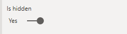

---
lab:
  title: 복합 모델 만들기
  module: Design and build tabular models
---

# 복합 모델 만들기

## 개요

**이 랩의 예상 완료 시간은 30분입니다.**

이 랩에서는 미리 개발된 DirectQuery 모델에 테이블을 추가하여 복합 모델을 만듭니다.

이 랩에서는 다음 사항들을 수행하는 방법에 대해 알아봅니다.

- 복합 모델 만들기

- 모델 관계 만들기

- 측정값 만들기

## 시작

이 연습에서는 환경을 준비합니다.

### 이 과정용 리포지토리 복제

1. 시작 메뉴에서 명령 프롬프트를 엽니다.

    

1. 명령 프롬프트 창에서 다음을 입력하여 D 드라이브로 이동합니다.

    `d:` 

   Enter 키를 누릅니다.

    


1. 명령 프롬프트 창에서 다음 명령을 입력하여 과정 파일을 다운로드하고 DP500 폴더에 저장합니다.
    
    `git clone https://github.com/MicrosoftLearning/DP-500-Azure-Data-Analyst DP500`
   
1. 리포지토리가 복제되면 명령 프롬프트 창을 닫습니다. 
   
1. 파일 탐색기에서 D 드라이브를 열어 파일이 다운로드되었는지 확인합니다.

### Power BI Desktop 설정

이 작업에서는 미리 개발된 Power BI 템플릿 파일을 엽니다.

1. 파일 탐색기를 열려면 작업 표시줄에서 **파일 탐색기**를 선택합니다.

2. **D:\DP500\Allfiles\08\Starter** 폴더로 이동합니다.

3. 미리 개발된 Power BI Desktop 파일을 열려면 **Sales Analysis - Create a composite model.pbit**를 두 번 클릭합니다. 

4. 잠재적인 보안 위험을 승인하라는 메시지가 표시되면 **확인**을 선택합니다.

5. 아래에 제공된 대로 SQLServerInstance, SqlServerDatabase, Culture를 입력합니다. **로드**를 선택합니다.

    SqlServerInstance = ```localhost```

    SqlServerDatabase = ```AdventureWorksDW2022-DP500```

    Culture = ```en```

    

6. SQL Server 데이터베이스 연결 프롬프트에서 **연결**을 선택합니다.

7. 암호화 지원 창에서 **확인**을 선택합니다.

8. 네이티브 데이터베이스 쿼리 창에서 **실행**을 선택합니다.

9. 파일을 저장합니다. **파일** 메뉴에서 **다른 이름으로 저장**을 선택합니다.

10. **다른 이름으로 저장** 창에서 **D:\DP500\Allfiles\08\MySolution** 폴더로 이동합니다. 파일 이름은 **Sales Analysis - 복합 model.pbix 만들기**입니다.

11. **저장**을 선택합니다.

### 보고서 검토

이 작업에서는 미리 개발된 보고서를 검토합니다.

1. Power BI Desktop 상태 표시줄의 오른쪽 아래 모서리에 있는 스토리지 모드가 DirectQuery임을 알 수 있습니다.

    

    DirectQuery 모델은 DirectQuery 스토리지 모드를 사용하는 테이블로 구성됩니다. DirectQuery 스토리지 모드를 사용하는 테이블은 쿼리를 기본 데이터 원본으로 전달합니다. 데이터 모델러는 이 스토리지 모드를 사용하여 대용량 데이터를 모델링하는 경우가 많습니다. 이 경우 기본 데이터 원본은 SQL Server 데이터베이스입니다.

1. 보고서 디자인을 검토합니다.

    

    이 보고서 페이지에는 제목과 두 개의 시각적 개체가 있습니다. 슬라이서 시각적 개체는 단일 회계 연도별로 필터링할 수 있는 반면 세로 막대형 차트 시각적 개체는 분기별 판매 금액을 표시합니다. 세로 막대형 차트 시각적 개체에 판매 목표를 추가하여 이 디자인을 개선할 수 있습니다.

1. **회계 연도** 슬라이서에서 **FY2021**을 선택합니다.

    

    슬라이서 선택은 세로 막대형 차트 시각적 개체에 적용되는 필터를 변경한다는 것을 이해하는 것이 중요합니다. Power BI는 세로 막대형 차트 시각적 개체를 새로 고칩니다. 여기에는 원본 데이터베이스에서 데이터를 검색하는 작업이 포함됩니다. 이렇게 하면 세로 막대형 차트 시각적 개체에 최신 원본 데이터가 표시됩니다(일부 보고서 수준 캐싱이 발생할 수 있으며, 보고서가 이전에 쿼리한 데이터를 다시 사용할 수 있습니다.)

### 데이터 모델 검토

이 작업에서는 미리 개발된 데이터 모델을 검토합니다.

1. **모델** 뷰로 전환합니다.

    

1. 모델 다이어그램을 사용하여 모델 디자인을 검토합니다.

    

    모델은 세 개의 차원 테이블과 한 개의 팩트 테이블로 구성됩니다. **Sales** 팩트 테이블은 판매 주문 세부 정보를 나타냅니다. 표준 별모양 스키마 디자인입니다. 각 테이블의 위쪽에 있는 막대는 DirectQuery 스토리지 모드를 사용함을 나타냅니다. 각 테이블에는 파란색 막대가 있으므로 모든 테이블이 동일한 원본 그룹에 속한다는 것을 나타냅니다.

    모델을 다른 팩트 테이블로 확장하여 판매 대상 팩트 분석도 지원합니다.

## 복합 모델 만들기

이 연습에서는 DirectQuery 모델을 복합 모델로 변환하는 가져오기 테이블을 추가합니다.

*복합 모델은 둘 이상의 원본 그룹으로 구성됩니다.*

### 테이블 추가

이 작업에서는 Excel 통합 문서에서 가져온 판매 목표를 저장하는 테이블을 추가합니다.

1. **홈** 리본 탭의 **데이터** 그룹 내에서  **통합 문서**를 선택합니다.

    

1. **열기** 창에서 **D:\DP500\Allfiles\08\Assets** 폴더로 이동합니다.

1. **SalesTargets.xlsx** 파일을 선택합니다.

    

1. **열기**를 선택합니다.

    

1. **탐색** 창에서 **Targets** 테이블을 확인합니다.

    

1. 오른쪽에 있는 미리 보기 창에서 테이블은 세 개의 열로 구성되며 테이블의 각 행은 회계 분기, 판매 지역, 목표 판매액을 나타냅니다.

    

    이 데이터를 가져와 DirectQuery 모델에 테이블을 추가합니다. DirectQuery를 사용하여 Excel 통합 문서에 연결할 수 없으므로 Power BI에서 통합 문서를 가져옵니다.

1. **데이터 변환**을 선택합니다.

    

1. Power Query 편집기 창에서 첫 번째 열의 이름을 바꾸려면 **Period** 열 머리글을 두 번 클릭합니다.

1. 열의 이름을 **Fiscal Quarter**로 바꾼 다음, **Enter**를 누릅니다.

    

1. 세 번째 열의 데이터 형식을 수정하려면 **Target Amount** 열 머리글에서 데이터 형식 아이콘(123)을 선택한 다음, **고정 10진수**를 선택합니다.

    

1. 쿼리를 적용하려면 **홈** 리본 탭의 **닫기** 그룹 내에서 **닫기 및 적용** 아이콘을 선택합니다.

    

1. 잠재적인 보안 위험에 대한 메시지가 표시되면 메시지를 읽은 다음 **확인**을 선택합니다.

    

1. Power BI Desktop에서 로드 프로세스가 완료되면 모델 다이어그램에서 새 테이블을 **Order Date** 테이블 바로 아래에 배치합니다.

    테이블이 보이지 않을 수 있습니다. 이 경우에는 가로로 스크롤하여 테이블을 표시하도록 합니다.

    

1. **Targets** 테이블에는 위쪽에 파란색 막대가 없습니다.

    막대가 없다는 것은 해당 테이블이 가져오기 원본 그룹에 속한다는 것을 나타냅니다.

### 모델 관계 만들기

이 작업에서는 두 개의 모델 관계를 만듭니다.

1. 관계를 만들려면 **Sales Territory** 테이블에서 **Region** 열을 끌어서 **Targets** 테이블의 **Region** 열에 놓습니다.

    

1. **관계 만들기** 창에서 **카디널리티** 드롭다운 목록이 **일대다**로 설정되어 있는지 확인합니다.

    **Sales Territory** 테이블의 **Region** 열에는 고유한 값이 포함되며 **Targets** 테이블의 **Region** 열에는 중복 값이 포함됩니다. 이 일대다 카디널리티는 차원과 팩트 테이블 간의 관계에 공통적으로 적용됩니다.

1. **확인**을 선택합니다.

    

1. 모델 다이어그램에서 이제 **Sales Territory**와 **Target** 테이블 사이에 관계가 있음을 확인합니다.

1. 또한 관계 선이 다른 관계 선과는 다르게 보인다는 점을 유의하세요.

    

    “연결이 끊어진” 선은 관계가 제한된 관계임을 나타냅니다. 모델 관계는 “한” 쪽이 보장되지 않을 때 제한됩니다. 이 경우에는 관계가 원본 그룹에 걸쳐 있기 때문입니다. 쿼리 시 관계 평가는 제한된 관계에 대해 다르게 될 수 있습니다. 자세한 내용은 [제한된 관계](https://docs.microsoft.com/power-bi/transform-model/desktop-relationships-understand)를 참조하세요.

1. 이번에는 **Order Date** 테이블의 **Fiscal Quarter** 열을 **Targets** 테이블의 **Fiscal Quarter** 열과 연결하는 다른 관계를 만듭니다.

    

1. **관계 만들기** 창에서 **카디널리티** 드롭다운 목록이 **다대다**로 설정되어 있는지 확인합니다.

    두 열 모두 중복 값을 포함하기 때문에 Power BI Desktop은 자동으로 카디널리티를 다대다로 설정합니다. 그러나 기본 교차 필터 방향이 올바르지 않습니다.

1. **교차 필터 방향** 드롭다운 목록에서 **Single(Order Date filters Targets)** 을 선택합니다.

    

    차원 테이블이 팩트 테이블을 필터링하는 것이 일반적입니다. 이 모델 디자인에서는 팩트 테이블의 필터를 차원 테이블로 전파할 필요가 없으며 효율적이지 않습니다.

1. **확인**을 선택합니다.

    

### 모델 속성 설정

이 작업에서는 새 테이블의 모델 속성을 설정하게 됩니다.

1. **Targets** 테이블에서 **Fiscal Quarter** 열을 선택합니다.

1. **Ctrl** 키를 누르는 동안 **Region** 열도 선택합니다.

1. **속성** 창에서 **숨김** 속성을 **예**로 설정합니다.

    

1. **Targets** 테이블에서 **Target Amount** 열을 선택합니다.

1. **속성** 창의 **서식 지정** 섹션 내에서 **소수 자릿수** 속성을 **2**로 설정합니다.

    

### 측정값 추가

이 작업에서는 판매 목표 차이를 분석할 수 있는 두 개의 측정값을 추가합니다.

1. **보고서** 보기로 전환합니다.

    

1. 측정값을 만들려면 오른쪽에 있는 **데이터** 창에서 **대상** 테이블을 마우스 오른쪽 단추로 클릭한 다음 **새 측정값**을 선택합니다.

    

1. 수식 입력줄에 다음 측정값 정의를 입력합니다.

    *팁: 모든 측정값 정의를* **D:\DP500\Allfiles\08\Assets\Snippets.txt** *파일에서 복사하여 붙여넣을 수 있습니다.*


    ```
    Variance = SUM ( 'Sales'[Sales Amount] ) - SUM ( 'Targets'[Target Amount] )
    ```


    측정값 **Variance**에서는 **Sales Amount**의 합계에서 **Target Amount**의 합계를 뺍니다.

1. **측정 도구** 상황별 리본 탭의 **서식 지정** 그룹에서 소수 자릿수 상자에 **2**를 입력합니다.

    

1. 다음 측정값 정의를 사용하여 다른 측정값을 만듭니다.


    ```
    Variance Margin =

    DIVIDE (

    [Variance],

    SUM ( 'Targets'[Target Amount] )

    )
    ```


    **Variance Margin**이라는 측정값은 DAX [DIVIDE](https://docs.microsoft.com/dax/divide-function-dax) 함수를 사용하여 **Variance** 측정값을 **Target Amount** 열의 합계로 나눕니다.

1. **측정 도구** 상황별 리본 탭의 **서식 지정** 그룹 내 **서식** 드롭다운 목록에서 **백분율**을 선택합니다.

    

1. **데이터** 창의 대상 테이블 내에서 두 개의 측정값이 있는지 확인**합니다**.

    

### 보고서 레이아웃 업데이트

이 작업에서는 새 측정값을 사용하도록 보고서를 업데이트합니다.

1. 보고서에서 세로 막대형 차트 시각적 개체를 선택합니다.

1. **데이터** 창에서 **대상 금액** 필드를 **시각화** 창으로 끌어서 **값** 웰 내**의 Sales Amount** 필드 바로 아래에 놓습니다.

    

1. 이제 세로 막대형 차트 시각적 개체에 판매액과 목표 액이 표시됩니다.

1. 두 측정값을 **도구 설명** 웰로 끌어옵니다.

    

1. 커서를 열 위로 가져가면 도구 설명이 나타나고 측정값이 표시됩니다.

    

    이제 DirectQuery와 가져오기 테이블을 결합하는 복합 모델 만들기를 완료했습니다. 모델을 최적화하여 이중 스토리지 모드를 사용하도록 차원 테이블을 설정하고 집계를 추가하여 쿼리 성능을 향상시킬 수 있습니다. 그러나 이러한 향상은 다른 랩의 학습 목표가 될 것입니다.

### 완료

이 작업에서는 마무리합니다.

1. Power BI Desktop 파일을 저장합니다.

    

1. Power BI Desktop을 닫습니다.
