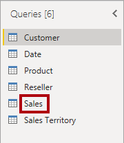
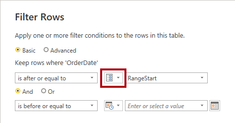
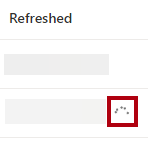
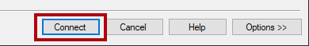

---
lab:
  title: 하이브리드 테이블을 사용하여 성능 향상
  module: Optimize enterprise-scale tabular models
---

# 하이브리드 테이블을 사용하여 성능 향상

## 개요

**이 랩을 완료하는 데 걸리는 예상 완료 시간은 45분입니다.**

이 랩에서는 증분 새로 고침을 설정하고 DirectQuery 파티션이 실시간 업데이트를 제공하고 새로 고침 및 쿼리 성능을 향상시킬 수 있도록 합니다.

이 랩에서는 다음 사항들을 수행하는 방법에 대해 알아봅니다.

- 증분 새로 고침을 설정합니다.

- 테이블 파티션을 검토합니다.

## 시작

이 연습에서는 환경을 준비합니다.

### 이 과정용 리포지토리 복제

1. 시작 메뉴에서 명령 프롬프트를 엽니다.

    

1. 명령 프롬프트 창에서 다음을 입력하여 D 드라이브로 이동합니다.

    `d:` 

   Enter 키를 누릅니다.

    

1. 명령 프롬프트 창에서 다음 명령을 입력하여 과정 파일을 다운로드하고 DP500 폴더에 저장합니다.
    
    `git clone https://github.com/MicrosoftLearning/DP-500-Azure-Data-Analyst DP500`
   
1. 리포지토리가 복제된 경우 파일 탐색기에서 D 드라이브를 열어 파일이 다운로드되었는지 확인합니다. **명령 프롬프트 창을 닫습니다**.

### Azure SQL Database 배포 

이 작업에서는 Power BI의 데이터 원본으로 사용할 Azure SQL 데이터베이스를 만듭니다. 설치 스크립트를 실행하면 Azure SQL 데이터베이스 서버가 만들어지고 AdventureWorksDW2022 데이터베이스가 로드됩니다.

1. 파일 탐색기를 열려면 작업 표시줄에서 **파일 탐색기** 바로 가기를 선택합니다.

    

2. **D:\DP500\Allfiles\10** 폴더로 이동합니다.

3. 두 번 클릭하여 **setup2.ps1** 파일 스크립트를 엽니다.
    - 스크립트가 설정하는 리소스를 이해하려면 메모장에서 스크립트를 읽어 보세요. #으로 시작하는 줄은 스크립트가 수행하는 작업을 나타냅니다.
    - 스크립트를 닫습니다.

5. 작업 표시줄의 검색 상자에 `PowerShell`를 입력합니다.  
   
   검색 결과가 표시되면 **관리자 권한으로 실행**을 선택합니다.
    
    
    
    메시지가 표시되면 예를 선택하여 이 앱이 디바이스를 변경할 수 있도록 합니다.
1. PowerShell에서 다음 2줄의 텍스트를 입력하여 스크립트를 실행합니다. 
    
    ` cd D:\DP500\Allfiles\10`

    **Enter** 키를 누릅니다.

    `.\setup2.ps1`
    
    **Enter** 키를 누릅니다.

    

2. 메시지가 표시되면 **Azure 계정 사용자 이름**, **암호** 및 **리소스 그룹 이름**을 입력합니다. **Enter** 키를 누릅니다. 

    

    스크립트를 실행하려면 10~15분 정도 걸립니다.

    참고: 이 랩에서는 리소스 그룹이 Azure SQL 데이터베이스를 만들어야 합니다. 호스트된 랩 환경에 제고된 리소스 그룹이 없는 경우 Azure 구독에서 [리소스 그룹을 만듭니다](https://docs.microsoft.com/azure/azure-resource-manager/management/manage-resource-groups-portal#create-resource-groups).
3. 스크립트를 완료한 후 PowerShell 창을 닫습니다.

### Azure SQL Database 설정

이 작업에서는 VM(가상 머신)의 IP 주소에서 연결을 허용하도록 Azure SQL Database를 설정합니다. 이 스크립트는 사용자 이름, 암호 및 리소스 그룹을 입력한 후 실행하는 데 약 10분이 걸립니다.

1. 웹 브라우저에서 [https://portal.azure.com](https://portal.azure.com/)로 이동합니다.

2. 둘러보라는 메시지가 표시되면 **나중에**를 선택하세요.

    

3. **SQL 데이터베이스** 타일을 선택합니다.

    

4. SQL 데이터베이스 목록에서 **AdventureWorksDW2022-DP500** 데이터베이스를 선택합니다.

5. 개요 탭의 작업 표시줄에서 **서버 방화벽 설정**을 선택합니다.

    

6. 퍼블릭 액세스 탭에서 선택한 네트워크를 선택합니다.

7. **클라이언트 IPv4 주소 추가**를 선택합니다.

    

7. **저장**을 선택합니다.

    

8. Azure Portal 웹 브라우저 세션을 열어 두세요. **Power BI Desktop 설정 작업**에서 데이터베이스 연결 문자열을 복사해야 합니다.

### Power BI 서비스 설정

이 작업에서는 Power BI 서비스 로그인하고 평가판 라이선스를 시작합니다.

중요: VM 환경에서 Power BI를 이미 설정한 경우 다음 작업을 계속 진행합니다.

1. 웹 브라우저에서 [https://powerbi.com](https://powerbi.com/)로 이동합니다.

2. 랩 자격 증명을 사용하여 로그인 프로세스를 완료합니다.

3. 오른쪽 위에서 프로필 아이콘을 선택한 다음 **평가판 시작**을 선택합니다.

    

4. 메시지가 표시되면 **평가판 시작**을 선택합니다.

    

    이 랩을 완료하려면 Power BI PPU(사용자 단위 Premium) 라이선스가 필요합니다. 평가판 라이선스로 충분합니다.

5. 나머지 작업을 수행하여 평가판 설정을 완료합니다.

    팁: Power BI 웹 브라우저 환경은 **Power BI 서비스**라고 알려져 있습니다.

### 작업 영역 만들기

이 작업에서는 작업 영역을 만듭니다.

1. Power BI 서비스에서 작업 영역을 만들려면 왼쪽에 있는 **탐색** 창에서 **작업 영역**을 선택한 다음, **작업 영역 만들기**를 선택합니다.

    

2. 오른쪽에 있는 **작업 영역 만들기** 창에서 **작업 영역 이름** 상자에 작업 영역의 이름을 입력합니다.

    작업 영역 이름은 테넌트 내에서 고유해야 합니다.

    

3. **설명** 상자 아래에서 **고급** 섹션을 엽니다.

    

4. **라이선스 모드** 옵션을 **사용자 단위 Premium**으로 설정합니다.

    

    Power BI는 작업 영역에서 증분 새로 고침 및 하이브리드 테이블만 지원합니다.

5. **저장**을 선택합니다.

    

    만든 다음 Power BI 서비스가 해당 작업 영역을 엽니다. 이 랩의 뒷부분에서는 이 작업 영역으로 돌아갑니다.

### Power BI Desktop 설정

이 작업에서는 미리 개발된 Power BI Desktop 솔루션을 열고, 데이터 원본 설정 및 권한을 설정한 다음, 데이터 모델을 새로 고칩니다.

1. 파일 탐색기를 열려면 작업 표시줄에서 **파일 탐색기** 바로 가기를 선택합니다.

    

2. **D:\DP500\Allfiles\10\Starter** 폴더로 이동합니다.

3. 미리 개발된 Power BI Desktop 파일을 열려면 **Sales Analysis - Improve performance with hybrid tables.pbix** 파일을 두 번 클릭합니다.

4. 데이터베이스 데이터 원본을 편집하려면 **홈** 리본 탭의 **쿼리** 그룹 내에서 **데이터 변환** 드롭다운을 선택한 다음 **, 데이터 원본 설정**을 선택합니다.

    

5. **데이터 원본 설정** 창에서 **원본 변경**을 선택합니다.

    

6. **SQL Server 데이터베이스** 창의 **서버** 상자에서 텍스트를 랩 Azure SQL Database 서버로 바꿉니다. Azure Portal, SQL 데이터베이스에 있습니다.

    

7. **확인**을 선택합니다.

    

8. **권한 편집**을 선택합니다.

    

9. **사용 권한 편집** 창에서 데이터베이스 자격 증명을 편집하려면 **편집**을 선택합니다.

    

10. **SQL Server 데이터베이스** 창에서 SQL Server 데이터베이스 사용자 이름 및 암호를 입력하고 저장합니다. 

    사용자 이름: `sqladmin`

    암호: `P@ssw0rd01`

    

11.  **확인**을 선택합니다.
    

12. **데이터 원본 설정** 창에서 **닫기**를 선택합니다.

    

13. **홈** 리본 탭의 **쿼리** 그룹 내에서 **새로 고침**을 선택합니다.

    

14. 데이터 새로 고침이 완료될 때까지 기다립니다.

15. 파일을 저장하려면 **파일** 리본 탭에서 **다른 이름으로 저장**을 선택합니다.

16. **다른 이름으로 저장** 창에서 **D:\DP500\Allfiles\10\MySolution** 폴더로 이동합니다.

17. **저장**을 선택합니다.

18. 아직 로그인하지 않은 경우 Power BI Desktop 오른쪽 위 모서리에서 **로그인**을 선택합니다. 랩 자격 증명을 사용하여 로그인 프로세스를 완료합니다.

    중요: Power BI 서비스에 로그인하는 데 사용한 것과 동일한 자격 증명을 사용해야 합니다.

    

### 보고서 검토

이 작업에서는 미리 개발된 보고서를 검토합니다.

1. Power BI Desktop에서 보고서 디자인을 검토합니다.

    

    이 보고서 페이지에는 제목과 두 개의 시각적 개체가 있습니다. 슬라이서 시각적 개체를 사용하면 단일 회계 연도별로 필터링할 수 있으며 막대형 차트 시각적 개체는 분기별 매출을 표시합니다. 이 랩에서는 증분 새로 고침 및 하이브리드 테이블을 설정하여 보고서의 성능을 향상시킵니다.

### 데이터 모델 검토

이 작업에서는 미리 개발된 데이터 모델을 검토합니다.

1. **모델** 뷰로 전환합니다.

    

2. 모델 다이어그램을 사용하여 모델 디자인을 검토합니다.

    

    모델은 5개의 차원 테이블과 1개의 팩트 테이블로 구성됩니다. 각 테이블은 스토리지 가져오기 모드를 사용합니다. **Sales** 팩트 테이블은 판매 주문 세부 정보를 나타냅니다. 이 테이블은 클래식 별모양 스키마 디자인입니다.

    이 랩에서는 증분 새로 고침을 사용하고 하이브리드 테이블이 되도록 **Sales** 테이블을 설정합니다. 하이브리드 테이블에는 최신 기간을 나타내는 DirectQuery 파티션이 포함되어 있습니다. 해당 파티션은 Power BI 보고서에서 데이터 원본의 현재 데이터를 사용할 수 있도록 합니다.

## 증분 새로 고침 설정

이 연습에서는 증분 새로 고침을 설정합니다.

증분 새로 고침은 새 데이터와 업데이트된 데이터를 자주 로드하는 데이터 세트 테이블에 대해 자동화된 파티션 만들기 및 관리를 제공하여 예약된 새로 고침 작업을 확장합니다. 새로 고침 시간을 줄여 원본 데이터 및 Power BI에 대한 부담을 줄이는 데 도움이 됩니다. 또한 현재 데이터를 Power BI 보고서에 더 빠르게 노출하는 데 도움이 될 수 있습니다.

### 매개 변수 추가

이 작업에서는 두 개의 매개 변수를 추가합니다.

1. Power Query 편집기 창을 열려면 **홈** 리본 탭의 **쿼리** 그룹 내에서 **데이터 변환** 아이콘을 클릭합니다.

    

2. Power Query 편집기 창의 **쿼리** 창 내에서 **Sales** 쿼리를 선택합니다.

    

3. 미리 보기 창에서 날짜/시간 열인 **OrderDate** 열을 확인합니다.

    증분 새로 고침을 사용하려면 테이블에 yyyymmdd 형식의 값이 있는 날짜/시간 또는 정수 데이터 형식의 날짜 열을 포함해야 합니다.

    증분 새로 고침을 설정하려면 Power BI에서 이 열을 필터링하여 테이블 파티션을 만드는 데 사용할 매개 변수를 만들어야 합니다.

4. 매개 변수를 만들려면 **홈** 리본 탭에서 **관리자 매개 변수** 아이콘을 선택합니다.

    

5. **매개 변수 관리** 창에서 **새로 만들기**를 선택합니다.

    

6. **이름** 상자에서 텍스트를 **RangeStart**로 바꿉니다.

7. **형식** 드롭다운 목록에서 **날짜/시간**을 선택합니다.

8. **현재 값** 상자에 **6/1/2022**(2022년 6월 1일 - VM에서 사용하는 미국 날짜 형식 사용)를 입력합니다. 

    매개 변수를 설정하는 동안 임의의 값을 사용할 수 있습니다. Power BI는 파티션을 만들고 관리할 때 매개 변수 값을 업데이트합니다. 이 랩에서는 2022년 6월의 범위를 설정합니다.

    두 번째 매개 변수를 만들려면 **새로 만들기**를 선택합니다.

    

9. 다음 매개 변수 속성을 설정합니다.

10. 이름: **RangeEnd**

    - 형식: **Date/Time**

    - 현재 값: **7/1/2022**(2022년 7월 1일)

    - **확인**을 선택합니다.

      쿼리 필터링

    

11. 이번 작업에서는 **Sales** 쿼리에 필터를 추가합니다.

    

### **쿼리** 창에서 **Sales** 쿼리를 선택합니다.

**OrderDate** 열의 머리글에서 아래쪽 화살표를 선택한 다음 **날짜/시간 필터** > **사이**를 선택합니다.

1. **행 필터링** 창에서 첫 번째 달력 아이콘 드롭다운 목록을 선택한 다음 **매개 변수**를 선택합니다.

2. 인접한 드롭다운 목록에서 **RangeStart** 매개 변수가 설정되어 있는지 확인합니다.

    

3. 기본 매개 변수 선택은 올바른 선택입니다.

    

4. 두 번째 “범위” 드롭다운 목록 **보다 전**을 선택합니다.

    해당 드롭다운 목록에서 **RangeEnd** 매개 변수를 선택합니다.

5. **확인**을 선택합니다.

    

6. **홈** 리본 탭의 **닫기** 그룹 내에서 **닫기&amp;적용** 아이콘을 클릭합니다.

    

7. Power BI Desktop에서 **Sales** 테이블에 5,134개의 행을 로드했습니다.

    

8. 다음은 2022년 6월에 대해 필터링된 행입니다.

    

9. Power BI Desktop 파일을 저장합니다.

    

    증분 새로 고침 설정

10. 이 작업에서는 **Sales** 테이블에 대한 증분 새로 고침 정책을 설정합니다.

    

### 모델 다이어그램에서 **Sales** 테이블 머리글을 마우스 오른쪽 단추로 클릭한 다음 **증분 새로 고침**을 선택합니다.

**증분 새로 고침 및 실시간 데이터** 창의 2단계에서 증분 새로 고침을 켭니다.

1. 다음과 같이 설정합니다. 새로 고침 날짜 **2년** 전부터 데이터를 보관합니다.

    

2. 이 설정은 기록 기간을 결정합니다. 이 경우 Power BI는 기록 데이터에 대한 두 개의 전체 연도 파티션을 만듭니다.

    

3. 다음과 같이 설정합니다. 새로 고침 날짜 **7일** 전부터 데이터를 증분 방식으로 새로 고칩니다.

    

    이 설정에 따라 해당 기간에 날짜/시간이 포함된 모든 행이 새로 고침 파티션에 포함되고 각 새로 고침 작업으로 새로 고쳐지는 증분 새로 고침 기간이 결정됩니다.

4. 3단계에서 **DirectQuery를 사용하여 실시간으로 최신 데이터 가져오기** 옵션을 선택합니다.

    

    이 설정을 사용하면 DirectQuery를 사용하여 증분 새로 고침 기간 이후 데이터 원본에서 선택한 테이블의 최신 변경 내용을 가져올 수 있습니다. 날짜/시간이 증분 새로 고침 기간보다 오래된 모든 행은 DirectQuery 파티션에 포함되고 모든 데이터 세트 쿼리를 사용하여 데이터 원본에서 가져옵니다. 이 설정은 가져오기 파티션과 하나의 DirectQuery 파티션을 포함하므로 테이블을 하이브리드 테이블로 만듭니다.

5. **적용**을 선택합니다.

    

    Power BI Desktop 파일을 저장합니다.

6. 데이터 세트 게시

    

7. 이 작업에서는 데이터 세트를 게시합니다.

    

### 보고서를 게시하려면 **홈** 리본 탭에서 **게시**를 선택합니다.

**Power BI에 게시** 창에서 이 랩에서 만든 작업 영역을 선택합니다.

1. 게시에 성공하면 **가져오기**를 선택합니다.

    

2. Power BI Desktop을 닫습니다.

    

3. 변경 내용을 저장하라는 메시지가 표시되면 **저장**을 선택합니다.

    

4. 데이터 세트 설정

5. 이 작업에서는 데이터 원본 자격 증명을 설정하고 데이터 세트를 새로 고칩니다.

    

### Power BI 서비스 웹 브라우저 세션으로 전환합니다.

작업 영역 방문 페이지에서 보고서 및 데이터 세트를 찾습니다.

1. 데이터 세트 위에 커서를 가져가 줄임표가 나타나면 줄임표를 선택한 다음 **설정**을 선택합니다.

2. **데이터 원본 자격 증명** 섹션에서 **자격 증명 편집** 링크를 선택합니다.

    

3. 창에서 사용자 이름 및 암호를 입력하고 프라이버시 수준을 조직으로 설정합니다.

    

4. 사용자 이름: `sqladmin`

    

5. 암호: `P@ssw0rd01`
       
    **로그인**을 선택합니다.

    **예약된 새로 고침 및 성능 최적화** 섹션을 열어 확장합니다.

    

6. 설정은 변경하지 마세요.

    

8. 실제 설정에서는 Power BI가 파티션을 반복적으로 새로 고치고 관리할 수 있도록 데이터 새로 고침을 예약합니다.

    

9. 이 랩에서는 주문형 새로 고침을 수행합니다.

    (왼쪽에 있는) **탐색** 창에서 작업 영역을 선택합니다.

    작업 영역 방문 페이지에서 데이터 세트 위에 커서를 놓고 **새로 고침** 아이콘을 선택합니다.

10. **새로 고침** 열에서 회전하는 아이콘을 확인하고 중지될 때까지 기다립니다(중지되면 새로 고침이 완료되었음을 나타냄).

11. 작업 영역 설정을 열려면 오른쪽 위에서 **설정**을 선택합니다.

    

12. **설정** 창에서 **Premium** 탭을 선택합니다.

    

13. 작업 영역 연결을 클립보드에 복사하려면 **복사**를 선택합니다.

    

14. 작업 영역 연결을 사용하여 SSMS(SQL Server Management Studio)에서 연결합니다.

    

15. 창을 닫으려면 **취소**를 선택합니다.

    

    테이블 파티션 검토

16. 이 작업에서는 SSMS를 사용하여 테이블 파티션을 검토합니다.

    

### SSMS를 열려면 작업 표시줄에서 **SSMS** 바로 가기를 선택합니다.

**서버에 연결** 창의 **서버 유형** 드롭다운 목록에서 **분석 서비스**를 선택합니다.

1. SSMS에서 XMLA 읽기/쓰기 엔드포인트를 사용하여 작업 영역에 연결할 수 있습니다. 엔드포인트는 Premium 작업 영역에만 사용할 수 있습니다.

    

2. **서버 이름** 상자에서 작업 영역 연결에 붙여넣어 텍스트를 바꿉니다(**Ctrl+V** 누르기).

    

    **인증** 드롭다운 목록에서 **Azure Active Directory - 암호**를 선택합니다.

3. 랩 자격 증명을 입력합니다.

4. **연결**을 선택합니다.

5. 왼쪽에 있는 개체 탐색기에서 **Databases** 폴더를 확장하고 **Sales Analysis...** 데이터베이스(데이터 세트)를 연 다음 **Tables** 폴더를 확장합니다.

6. **Sales** 테이블을 마우스 오른쪽 단추로 클릭한 다음 **파티션**을 선택합니다.

    

7. **파티션** 창에서 2년 기록에 대한 파티션 목록과 분기별 파티션 및 일별 파티션을 확인합니다.

    

8. 목록의 아래쪽으로 스크롤하여 마지막 파티션이 현재 날짜와 이후 날짜에 대한 DirectQuery 파티션임을 확인합니다.

    

9. Power BI는 이러한 모든 파티션을 자동으로 만들고 관리합니다.

10. **취소**를 선택합니다.

    하이브리드 테이블 테스트

11. 이 연습에서는 보고서를 열고 판매 주문을 추가한 다음 보고서 데이터 업데이트를 확인합니다.

    

## 보고서 열기

이 작업에서는 보고서를 엽니다.

### Power BI 서비스 웹 브라우저 세션으로 전환합니다.

작업 영역 방문 페이지에서 보고서를 선택합니다.

1. 필요한 경우 **회계 연도** 슬라이서에서 (오늘 날짜를 기준으로) 현재 월이 포함된 회계 연도를 선택합니다.

2. 현재 월은 막대형 차트에 막대로 표시되어야 합니다.

    

3. 데이터베이스에 주문 추가

    이 작업에서는 데이터베이스에 주문을 추가합니다.

    SSMS로 전환합니다.

### 스크립트 파일을 열려면 **파일** 메뉴에서**열기** > **파일**을 선택합니다.

**파일 열기** 창에서 **:\DP500\Allfiles\10\Assets** 폴더로 이동합니다.

1. **1-InsertOrder.sql** 파일을 선택하고 **열기**를 선택합니다.

2. **데이터베이스 엔진에 연결** 창에서 **서버 이름** 드롭다운 목록이 랩 Azure SQL Database 서버로 설정되어 있는지 확인합니다.

3. **인증** 드롭다운 목록에서 **Azure Active Directory - 암호**를 선택합니다.

4. 랩 자격 증명을 입력합니다.

    

5. **연결**을 선택합니다.

6. 스크립트를 검토합니다.

7. 이 스크립트는 오늘을 주문 날짜로 사용하여 **FactInternetSales** 테이블에 단일 주문을 삽입합니다.

8. 스크립트를 실행하려면 도구 모음에서 **실행**을 선택하거나 **F5** 키를 누릅니다.

    

9. 파일을 닫으려면 **파일** 메뉴에서 **닫기**를 선택합니다.

    보고서 새로 고침

10. 이 작업에서는 보고서를 새로 고칩니다.

    

11. Power BI 서비스 웹 브라우저 세션으로 전환합니다.

### 보고서에서 현재 월의 판매액을 기록해 둡니다.

작업 표시줄에서 **새로 고침** 명령을 선택합니다.

1. 보고서 새로 고침이 완료되면 현재 월의 판매액이 10,000달러 증가했는지 확인합니다.

2. Power BI가 **Sales** 테이블을 쿼리할 때 DirectQuery 파티션에서 현재 데이터를 검색합니다. 이렇게 하면 Azure SQL Database를 직접 쿼리합니다.

3. 팁: 하이브리드 테이블은 Power BI 보고서를 자동으로 새로 고치는 기능인 자동 페이지 새로 고침이 특히 잘 작동합니다.

    

4. 완료

    이 작업에서는 마무리합니다.

    SSMS에서 **2-Cleanup.sql** 파일을 엽니다.

### 이 스크립트는 삽입한 순서를 제거합니다.

스크립트를 실행합니다. SSMS를 닫습니다.

1. In SSMS, open the <bpt id="p1">**</bpt>2-Cleanup.sql<ept id="p1">**</ept> file.

    

    This script removes the order that you inserted.

2. Run the script.

3. Close SSMS.
