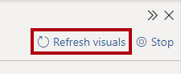
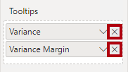

---
lab:
  title: 이중 스토리지 모드를 사용하여 쿼리 성능 향상
  module: Optimize enterprise-scale tabular models
---

# 이중 스토리지 모드를 사용하여 쿼리 성능 향상

## 개요

**이 랩의 예상 완료 시간은 30분입니다.**

이 랩에서는 이중 스토리지 모드를 사용하도록 일부 테이블을 설정하여 복합 모델의 성능을 향상시킵니다.

이 랩에서는 다음 사항들을 수행하는 방법에 대해 알아봅니다.

- 이중 스토리지 모드를 설정합니다.

- 성능 분석기를 사용하여 새로 고침 작업을 검토합니다.

## 시작하기

이 연습에서는 환경을 준비합니다.

### 이 과정에 대한 리포지토리 복제

1. 시작 메뉴에서 명령 프롬프트를 엽니다.

    

1. 명령 프롬프트 창에서 다음을 입력하여 D 드라이브로 이동합니다.

    `d:` 

   Enter 키를 누릅니다.

    

1. 명령 프롬프트 창에서 다음 명령을 입력하여 과정 파일을 다운로드하고 DP500 폴더에 저장합니다.
    
    `git clone https://github.com/MicrosoftLearning/DP-500-Azure-Data-Analyst DP500`
   
1. 리포지토리가 복제되면 명령 프롬프트 창을 닫습니다. 
   
1. 파일 탐색기에서 D 드라이브를 열어 파일이 다운로드되었는지 확인합니다.

### Power BI Desktop 설정

이 작업에서는 미리 개발된 Power BI Desktop 솔루션을 엽니다.

1. 파일 탐색기를 열려면 작업 표시줄에서 **파일 탐색기** 바로 가기를 선택합니다.

2. **D:\DP500\Allfiles\11\Starter** 폴더로 이동합니다.

3. 미리 개발된 Power BI Desktop 파일을 열려면 **Sales Analysis - Improve query performance with dual storage mode.pbix** 파일을 두 번 클릭합니다.

4. 잠재적인 보안 위험에 대한 메시지가 표시되면 메시지를 읽은 다음 **확인**을 선택합니다.

5. 네이티브 데이터베이스 쿼리 실행을 승인하라는 메시지가 표시되면 **실행**을 선택합니다.

6. 파일을 저장하려면 **파일** 리본 탭에서 **다른 이름으로 저장**을 선택합니다.

7. **다른 이름으로 저장** 창에서 **D:\DP500\Allfiles\11\MySolution** 폴더로 이동합니다.

8. **저장**을 선택합니다.

### 보고서 검토

이 작업에서는 미리 개발된 보고서를 검토합니다.

1. Power BI Desktop 상태 표시줄의 오른쪽 아래 모서리에 있는 스토리지 모드가 Mixed임을 알 수 있습니다.

    

    혼합 모델은 서로 다른 소스 그룹의 테이블로 구성됩니다. 이 모델에는 Excel 통합 문서에서 데이터를 소스로 하는 가져오기 테이블이 하나 있습니다. 나머지 테이블은 데이터 웨어하우스인 SQL Server 데이터베이스에 대한 DirectQuery 연결을 사용합니다.**

2. 보고서 디자인을 검토합니다.

    

    이 보고서 페이지에는 제목과 두 개의 시각적 개체가 있습니다. 슬라이서 시각적 개체를 사용하면 단일 회계 연도별로 필터링할 수 있으며 세로 막대형 차트 시각적 개체는 분기별 매출 및 목표 금액을 표시합니다. 이중 스토리지 모드를 사용하도록 일부 테이블을 설정하여 보고서의 성능을 향상시켜 봅니다.**

### 데이터 모델 검토

이 작업에서는 미리 개발된 데이터 모델을 검토합니다.

1. **모델** 보기로 전환합니다.

    

2. 모델 다이어그램을 사용하여 모델 디자인을 검토합니다.

    

    모델은 세 개의 차원 테이블과 두 개의 팩트 테이블로 구성됩니다. **Sales** 팩트 테이블은 판매 주문 세부 정보를 나타내고 **Targets** 테이블은 분기별 판매 목표액을 나타냅니다. 표준 별모양 스키마 디자인입니다. 일부 테이블의 위쪽에 있는 막대는 DirectQuery 스토리지 모드를 사용함을 나타냅니다. 파란색 막대가 있는 모든 테이블은 동일한 소스 그룹에 속합니다.**

    이 랩에서는 이중 스토리지 모드를 사용하도록 일부 테이블을 설정합니다.**

## 이중 스토리지 모드 설정

이 연습에서는 이중 스토리지 모드를 설정합니다.

이중 스토리지 모드를 사용하는 모델 테이블은 가져오기 및 DirectQuery 스토리지 모드를 동시에 사용합니다. Power BI는 쿼리별로 사용할 수 있는 가장 효율적인 스토리지 모드를 결정하며, 더 빠르기 때문에 가능하면 항상 가져오기 모드를 사용하기 위해 노력합니다.**

### 성능 분석기 사용

이 작업에서는 성능 분석기를 열고 사용하여 새로 고침 이벤트를 검사합니다.

1. **보고서** 보기로 전환합니다.

    

2. 시각적 개체 새로 고침 이벤트를 검사하려면 **보기** 리본 탭의 **표시** 창 그룹 내에서 **성능 분석기**를 선택합니다.

    

3. **시각화** 창 왼쪽에 있는 **성능 분석기** 창에서 **기록 시작**을 선택합니다.

    

    성능 분석기는 시각적 개체를 업데이트하거나 새로 고치는 데 필요한 기간을 검사하고 표시합니다. 각 시각적 개체는 원본 데이터베이스에 대해 하나 이상의 쿼리를 실행합니다. 자세한 내용은 [성능 분석기를 사용하여 보고서 요소 성능 검사](https://docs.microsoft.com/power-bi/create-reports/desktop-performance-analyzer)를 참조하세요.**

4. **시각적 개체 새로 고침**을 선택합니다.

    

5. **성능 분석기** 창에서 **슬라이서** 시각적 개체를 열어 확장하고 직접 쿼리 이벤트를 확인합니다.

    

    직접 쿼리 이벤트가 표시될 때마다 Power BI에서 DirectQuery 스토리지 모드를 사용하여 원본 데이터베이스에서 데이터를 검색했음을 알 수 있습니다.**

6. **Sales Result by Fiscal Quarter** 시각적 개체를 열어 확장하고 직접 쿼리 이벤트로 기록했는지 확인합니다.

    

    항상 동일한 테이블의 필드를 하나 이상 사용하여 슬라이서 시각적 개체를 설정합니다. 다른 테이블의 필드를 사용하여 슬라이서를 설정할 수는 없습니다. 또한 슬라이서에서는 거의 항상 차원 테이블의 필드를 사용합니다. 따라서 슬라이서 시각적 개체의 쿼리 성능을 향상시키려면 슬라이서 시각적 개체가 가져온 데이터를 저장하는지 확인합니다. 이 경우 차원 테이블에 DirectQuery 스토리지 모드가 사용되므로 이중 스토리지 모드로 설정할 수 있습니다. 차원 테이블에는 팩트 테이블을 기준으로 행이 거의 없기 때문에 모델 캐시가 지나치게 커서는 안 됩니다.**

### 이중 스토리지 모드 설정

이 작업에서는 이중 스토리지 모드를 사용하도록 모든 차원 테이블을 설정합니다.

1. **모델** 보기로 전환합니다.

2. **Product** 테이블의 머리글을 선택합니다.

3. **Ctrl** 키를 누른 상태에서 **Order Date** 및 **Sales Territory** 테이블의 머리글도 선택합니다.

4. **속성** 창에서 **고급** 섹션을 열어 확장합니다.

    

5. **스토리지 모드** 드롭다운 목록에서 **이중**을 선택합니다.

    

6. 업데이트를 확인하라는 메시지가 표시되면 **확인**을 선택합니다.

    

    이 경고는 Power BI Desktop이 데이터를 모델 테이블로 가져오는 데 상당한 시간이 걸릴 수 있음을 알려줍니다.**

7. 모델 다이어그램에서 각 차원 테이블의 위쪽을 가로질러 줄무늬 막대가 있는지 확인합니다.

    

    줄무늬 막대는 이중 스토리지 모드를 나타냅니다.**

### 보고서 검토

이 작업에서는 미리 개발된 보고서를 검토합니다.

1. **보고서** 보기로 전환합니다.

    

2. **성능 분석기** 창에서 **지우기**를 선택합니다.

    

3. 시각적 개체를 새로 고칩니다.

    

4. 슬라이서 시각적 개체는 더 이상 직접 쿼리 연결을 사용하지 않습니다.

    Power BI는 가져온 데이터의 모델 캐시를 쿼리하므로 슬라이서가 더 빠르게 새로 고침됩니다.**

5. 그러나 세로 막대형 차트 시각적 개체는 여전히 직접 쿼리 연결을 사용합니다.

    이는 **Sales Amount** 필드가 DirectQuery 저장소 모드를 사용하는 **Sales** 테이블의 열이기 때문입니다.**

6. 세로 막대형 차트 시각적 개체를 선택한 다음 **시각화** 창의 **값** 웰 내부에서 **Sales Amount** 필드를 제거합니다.

    

7. 또한 **도구 설명** 웰에서 필드 두 개를 제거합니다.

    

    이러한 두 측정값은 **Sales Amount** 열에 따라 달라집니다.**

8. **성능 분석기** 창에서 마지막 새로 고침 이벤트를 열고 세로 막대형 차트 시각적 개체가 더 이상 직접 쿼리 연결을 사용하지 않는지 확인합니다.

    이는 세로 막대형 차트 시각적 개체가 이제 두 개의 테이블만 사용하므로 둘 다 모델에 캐시되기 때문입니다. **Order Date** 테이블은 이중 스토리지 모드를 사용하고 **Targets** 테이블은 스토리지 가져오기 모드를 사용합니다.**

    이제 Power BI가 모델 캐시에서 데이터를 검색할 수 있는 특정 쿼리의 성능을 향상시켰습니다. 중요한 점은 DirectQuery 팩트 테이블과 연결된 차원 테이블을 일반적으로 이중 스토리지 모드로 설정해야 한다는 것입니다. 이렇게 하면 슬라이서가 쿼리할 때 쿼리가 빠릅니다.**

    집계를 추가하여 쿼리 성능을 향상시키기 위해 모델을 더욱 최적화할 수 있습니다. 그러나 이러한 향상은 다른 랩에서 다룹니다.**

### 완료

이 작업에서는 마무리합니다.

1. Power BI Desktop 파일을 저장합니다.

    

2. Power BI Desktop을 닫습니다.
