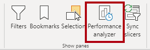
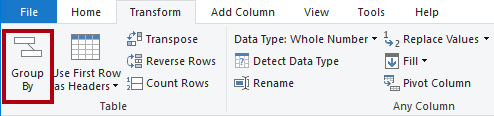
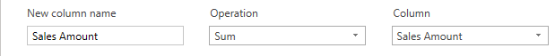

---
lab:
  title: 집계를 사용하여 쿼리 성능 향상
  module: Optimize enterprise-scale tabular models
---

# 집계를 사용하여 쿼리 성능 향상

## 개요

**이 랩의 예상 완료 시간은 30분입니다.**

이 랩에서는 집계를 추가하여 **Sales** 팩트 테이블의 쿼리 성능을 향상시킵니다.

이 랩에서는 다음 사항들을 수행하는 방법에 대해 알아봅니다.

- 집계를 설정합니다.

- 성능 분석기를 사용하여 Power BI에서 집계를 사용하는지 여부를 확인합니다.

## 시작하기

이 연습에서는 환경을 준비합니다.

### 이 과정에 대한 리포지토리 복제

1. 시작 메뉴에서 명령 프롬프트를 엽니다.

    

1. 명령 프롬프트 창에서 다음을 입력하여 D 드라이브로 이동합니다.

    `d:` 

   Enter 키를 누릅니다.

    

1. 명령 프롬프트 창에서 다음 명령을 입력하여 과정 파일을 다운로드하고 DP500 폴더에 저장합니다.
    
    `git clone https://github.com/MicrosoftLearning/DP-500-Azure-Data-Analyst DP500`
   
1. 리포지토리가 복제되면 명령 프롬프트 창을 닫습니다. 
   
1. 파일 탐색기에서 D 드라이브를 열어 파일이 다운로드되었는지 확인합니다.

### Power BI Desktop 설정

이 작업에서는 미리 개발된 Power BI Desktop 솔루션을 엽니다.

1. 파일 탐색기를 열려면 작업 표시줄에서 **파일 탐색기** 바로 가기를 선택합니다.

2. **D:\DP500\Allfiles\12\Starter** 폴더로 이동합니다.

3. 미리 개발된 Power BI Desktop 파일을 열려면 **Sales Analysis - Improve query performance with aggregations.pbix** 파일을 두 번 클릭합니다.

    잠재적인 보안 위험 경고가 표시되면 {b>확인을 선택<b}합니다.
    
    *네이티브 데이터베이스 쿼리 실행을 승인하라는 메시지가 표시되면 **실행을 선택**합니다.

4. 파일을 저장하려면 **파일** 리본 탭에서 **다른 이름으로 저장**을 선택합니다.

5. **다른 이름으로 저장** 창에서 **D:\DP500\Allfiles\12\MySolution** 폴더로 이동합니다.

6. **저장**을 선택합니다.

### 보고서 검토

이 작업에서는 미리 개발된 보고서를 검토합니다.

1. Power BI Desktop 상태 표시줄의 오른쪽 아래 모서리에 있는 스토리지 모드가 **Mixed**임을 알 수 있습니다.

    

    혼합 모드 모델은 서로 다른 소스 그룹의 테이블로 구성됩니다. 이 모델에는 Excel 통합 문서에서 데이터를 소스로 하는 가져오기 테이블이 하나 있습니다. 나머지 테이블은 데이터 웨어하우스인 SQL Server 데이터베이스에 대한 DirectQuery 연결을 사용합니다.**

2. 보고서 디자인을 검토합니다.

    

    이 보고서 페이지에는 제목과 두 개의 시각적 개체가 있습니다. 슬라이서 시각적 개체를 사용하면 단일 회계 연도별로 필터링할 수 있으며 세로 막대형 차트 시각적 개체는 분기별 매출 및 목표 금액을 표시합니다. 이 랩에서는 집계를 추가하여 보고서의 성능을 향상시킵니다.**

### 데이터 모델 검토

이 작업에서는 미리 개발된 데이터 모델을 검토합니다.

1. **모델** 보기로 전환합니다.

    

2. 모델 다이어그램을 사용하여 모델 디자인을 검토합니다.

    

    모델은 세 개의 차원 테이블과 두 개의 팩트 테이블로 구성됩니다. **Sales** 팩트 테이블은 판매 주문 세부 정보를 나타내고 **Targets** 테이블은 분기별 판매 목표액을 나타냅니다. 표준 별모양 스키마 디자인입니다. 일부 테이블의 위쪽에 있는 막대는 DirectQuery 스토리지 모드를 사용함을 나타냅니다. 파란색 막대가 있는 모든 테이블은 동일한 소스 그룹에 속합니다.**

    세 개의 차원 테이블에는 이중 스토리지 모드를 사용한다는 것을 나타내는 줄무늬 막대가 있습니다. 즉, 테이블은 가져오기 및 DirectQuery 스토리지 모드를 모두 사용하는 것이 됩니다. Power BI는 쿼리별로 사용할 수 있는 가장 효율적인 스토리지 모드를 결정하며, 속도가 더 빠르기 때문에 가능할 때마다 가져오기 모드를 사용하기 위해 노력하고 있습니다.**

    이 랩에서는 집계를 추가하여 특정 **Sales** 테이블 쿼리의 성능을 향상시킵니다.**

### 성능 분석기 사용

이 작업에서는 성능 분석기를 열고 사용하여 새로 고침 이벤트를 검사합니다.

1. **보고서** 보기로 전환합니다.

    

2. 시각적 개체 새로 고침 이벤트를 검사하려면 **보기** 리본 탭의 **표시** 창 그룹 내에서 **성능 분석기**를 선택합니다.

    

3. **시각화** 창 왼쪽에 있는 **성능 분석기** 창에서 **기록 시작**을 선택합니다.

    

    성능 분석기는 시각적 개체를 업데이트하거나 새로 고치는 데 필요한 기간을 검사하고 표시합니다. 각 시각적 개체는 원본 데이터베이스에 대해 하나 이상의 쿼리를 실행합니다. 자세한 내용은 [성능 분석기를 사용하여 보고서 요소 성능 검사](https://docs.microsoft.com/power-bi/create-reports/desktop-performance-analyzer)를 참조하세요.**

4. **시각적 개체 새로 고침**을 선택합니다.

    

5. **성능 분석기** 창에서 **Sales Result by Fiscal Quarter** 시각적 개체를 열어 확장하고 직접 쿼리 이벤트를 확인합니다.

6. 이 랩에서 나중에 비교하기 위한 기준으로 사용할 수 있도록 총 지속 시간(밀리초)을 기록해 둡니다.

    

    직접 쿼리 이벤트가 표시될 때마다 Power BI에서 DirectQuery 스토리지 모드를 사용하여 원본 데이터베이스에서 데이터를 검색했음을 알 수 있습니다.**

    데이터 웨어하우스 팩트 테이블이 DirectQuery 모드를 사용하는 일반적인 이유는 대용량 데이터 볼륨 때문입니다. 이렇게 많은 양의 데이터를 가져오는 것은 불가능하거나 경제적으로 실용적이지 않습니다. 그러나 데이터 모델은 일반적으로 상위 수준의 특정 쿼리의 성능을 향상시키는 데 도움이 될 수 있는 팩트 테이블의 집계된 뷰를 캐시할 수 있습니다.**

    이 랩에서는 **Sales** 테이블 데이터의 집계를 추가하여 날짜 및 판매 지역별로 **Sales Amount** 열의 합계를 쿼리하는 시각적 개체 새로 고침 성능을 향상시킵니다.**

## 집계 설정

이 연습에서는 집계를 설정합니다.

Power BI의 집계는 매우 큰 DirectQuery 테이블에 대한 쿼리 성능을 향상시킬 수 있습니다. 데이터 모델은 집계를 사용하여 집계된 메모리 내 수준에서 데이터를 캐시합니다. Power BI는 가능하면 언제든지 집계를 자동으로 사용할 수 있습니다.**

### 집계 테이블 추가

이 작업에서는 모델에 집계 테이블을 추가합니다.

1. Power Query 편집기 창을 열려면 **홈** 리본 탭의 **쿼리** 그룹 내에서 **데이터 변환** 아이콘을 클릭합니다.

    

2. Power Query 편집기 창의 **쿼리** 창 내에서 **Sales** 쿼리를 마우스 오른쪽 단추로 클릭한 다음, **중복**을 선택합니다.

    

3. **쿼리** 창에 새 쿼리가 추가된 것을 확인합니다.

    

    **OrderDateKey** 및 **SalesTerritoryKey** 열별로 그룹에 변환을 적용하고 **Sales Amount** 열의 합계를 집계합니다.**

4. 오른쪽에 있는 **쿼리 설정** 창의 **이름** 상자에서 텍스트를 **Sales Agg**로 바꿉니다.

    

5. **변환** 리본 탭의 **테이블** 그룹에서 **그룹화**를 선택합니다.

    

6. **그룹화** 창에서 **고급** 옵션을 선택합니다.

    

    고급 옵션을 사용하면 둘 이상의 열을 그룹화할 수 있습니다.**

7. 그룹화 드롭다운 목록에서 **OrderDateKey**를 선택합니다.

    

8. **그룹 추가**를 선택합니다.

    

9. 두 번째 그룹화 드롭다운 목록에서 **SalesTerritoryKey**를 선택합니다.

    

10. **새 열 이름** 상자에서 텍스트를 **Sales Amount**로 바꿉니다.

11. **작업** 드롭다운 목록에서 **Sum**을 선택합니다.

12. **열** 드롭다운 목록에서 **Sales Amount**를 선택합니다.

    

13. **확인**을 선택합니다.

    

14. **홈** 리본 탭의 **닫기** 그룹 내에서 **닫기&amp;적용** 아이콘을 클릭합니다.

    

    Power BI Desktop은 모델에 새 테이블을 추가합니다.**

15. Power BI Desktop 파일을 저장합니다.

    

### 모델 속성 설정

이 작업에서는 새 테이블의 모델 속성을 설정합니다.

1. **모델** 보기로 전환합니다.

    

2. 모델 다이어그램에서 **Targets** 테이블의 오른쪽에 새 테이블을 배치합니다.

    

3. **Sales Agg** 테이블에는 DirectQuery 스토리지 모드를 사용하고 있음을 나타내는 파란색 막대가 위쪽에 있습니다.

    집계에서 DirectQuery 스토리지 모드를 사용할 수도 있지만 이러한 경우에는 데이터 원본의 구체화된 뷰에 연결해야 합니다. 이 랩에서는 집계에서 가져오기 스토리지 모드를 사용합니다.**

4. **Sales Agg** 테이블을 선택합니다.

5. **속성** 창에서 **고급** 섹션을 열어 확장합니다.

    

6. **스토리지 모드** 드롭다운 목록에서 **가져오기**를 선택합니다.

    

7. 업데이트를 확인하라는 메시지가 표시되면 **확인**을 선택합니다.

    

    이 경고는 Power BI Desktop이 데이터를 모델 테이블로 가져오는 데 상당한 시간이 걸릴 수 있음을 알려줍니다. 또한 되돌릴 수 없는 작업임을 알려줍니다. 이전 버전의 Power BI Desktop 파일에서 복원하지 않는 한 가져오기 스토리지 모드 테이블을 DirectQuery 스토리지 모드 테이블로 다시 변경할 수 없습니다.**

8. Power BI Desktop은 6,806개의 데이터 행을 새 테이블에 로드했습니다.

    

    이러한 행은 각 주문 날짜 및 판매 지역 조합을 나타냅니다. 잠재적으로 매우 많은 양의 팩트 테이블 행을 요약한 매우 적은 양의 데이터입니다.**

9. **Sales Agg** 테이블에서 **Sales Amount** 열을 선택합니다.

10. **속성** 창의 **서식** 섹션에 있는 **데이터 형식** 드롭다운 목록에서 **고정 10진수**를 선택합니다.

    

    집계를 관리하려면(이 연습의 뒷부분에서) 데이터 형식이 **Sales** 테이블의 **Sales Amount** 열과 형식과 일치해야 합니다.**

11. 업데이트를 확인하라는 메시지가 표시되면 **확인**을 선택합니다.

    

### 모델 관계 만들기

이 작업에서는 두 개의 모델 관계를 만듭니다.

1. 관계를 만들려면 **Order Date** 테이블에서 **DateKey** 열을 끌어서 **Sales Agg** 테이블의 **OrderDateKey** 열에 놓습니다.

    

2. **관계 만들기** 창에서 **카디널리티** 드롭다운 목록이 **일대다**로 설정되어 있는지 확인합니다.

    **Order Date** 테이블의 **DateKey** 열에는 고유한 값이 포함되며 **Sales Agg** 테이블의 **OrderDateKey** 열에는 중복 값이 포함됩니다. 이 일대다 카디널리티는 팩트 테이블을 기반으로 차원과 집계 간의 관계에 공통적으로 적용됩니다.**

3. **확인**을 선택합니다.

    

4. 모델 다이어그램에서 이제 **Order Date**와 **Sales Agg** 테이블 사이에 관계가 있음을 확인합니다.

5. 이번에는 **Sales Territory** 테이블의 **SalesTerritoryKey** 열과 **Sales Agg** 테이블의 **SalesTerritoryKey** 열과 연결하는 다른 관계를 만듭니다.

    

6. **관계 만들기** 창에서 **확인**을 선택합니다.

    

    이 랩에서 완료한 작업은 가져오기 테이블을 모델에 추가하고 다른 모델 테이블과 연관시켰습니다. 그러나 Power BI가 쿼리 성능을 향상시키기 위해 투명하게 사용할 수 있는 집계는 아직 아닙니다. 다음 작업에서 집계를 설정합니다.**

7. 모델 다이어그램을 검토하고 **Sales Agg** 테이블이 이제 두 차원 테이블과 관련되어 있는지 확인합니다.

    

### 집계 설정

이 작업에서는 집계를 설정합니다.

1. 모델 다이어그램에서 **Sales Agg** 테이블 머리글을 마우스 오른쪽 단추로 클릭한 다음, **집계 관리**를 선택합니다.

    

2. **집계 관리** 창에서 **OrderDateKey** 열에 대해 다음 속성을 설정합니다.

    - 요약: **GroupBy**

    - 세부 정보 테이블: **Sales**

    - 세부 정보 열: **OrderDateKey**

    

3. **Sales Amount** 열에서 다음 속성을 설정합니다.

    - 요약: **Sum**

    - 세부 정보 테이블: **Sales**

    - 세부 정보 열: **Sales Amount**

4. **SalesTerritoryKey** 열에서 다음 속성을 설정합니다.

    - 요약: **GroupBy**

    - 세부 정보 테이블: **Sales**

    - 세부 정보 열: **SalesTerritoryKey**

5. 집계 설정이 다음과 같은지 확인합니다.

    

6. Power BI가 테이블을 숨긴다는 경고가 표시됩니다.

    

    Power BI Desktop 숨겨진 다른 모델 개체와는 다른 방식으로 테이블을 숨깁니다. Power BI는 항상 집계를 숨기며 모델 계산에서도 집계를 참조할 수 없습니다.**

7. **모두 적용**을 선택합니다.

    

8. 모델 다이어그램에서 **Sales Agg** 테이블은 숨겨진 테이블임을 확인합니다.

    

    이제 시각적 개체가 **Sales** 테이블에 **Sales Amount** 열의 합계를 쿼리할 때마다 **Order Date** 또는 **Sales Territory** 테이블의 열을 기준으로 그룹화하면 Power BI에서 집계를 대신 사용합니다.**

### 집계 테스트

이 작업에서는 집계를 테스트하고 Power BI에서 집계를 사용하는지 여부를 결정합니다.

1. **보고서** 보기로 전환합니다.

    

2. **성능 분석기** 창에서 **시각적 개체 새로 고침**을 선택합니다.

    

3. **Sales Result by Fiscal Quarter** 시각적 개체를 열어 확장하고 더 이상 직접 쿼리 이벤트가 없음을 확인합니다.

4. 이 랩의 앞부분에서 기록한 기준선과 기간을 비교합니다.

    

    사용자가 다른 테이블로 세로 막대형 차트 시각적 개체를 필터링하면 어떻게 될까요?**

5. **Fiscal Year** 슬라이서를 복제하려면 먼저 슬라이서를 선택합니다.

6. **홈** 리본 탭의 **클립보드** 그룹 내에서 **복사**를 선택합니다.

    

7. **홈** 리본 탭의 **클립보드** 그룹 내에서 **붙여넣기**를 선택합니다.

    

8. 새 슬라이서의 위치를 원래 슬라이서 바로 아래로 배치합니다.

    

9. 새 슬라이서를 선택한 다음 **시각화** 창의 **필드** 웰에서 **Fiscal Year** 필드를 제거합니다.

    

10. **필드** 창에서 **Sales Territory** 테이블을 열어 확장하고 **그룹** 필드를 **필드** 웰로 끌어옵니다.

    

11. **그룹** 슬라이서에서 빈 그룹을 제외한 모든 그룹을 선택합니다.

    

    Power BI에서 집계를 사용하나요?**

    집계가 **SalesTerritoryKey** 열별로 그룹화되기 때문에 대답은 ‘예’입니다. 이 열은 **Sales Territory** 테이블과 관련이 있습니다. 따라서 **Sales Territory** 테이블의 모든 열을 사용하여 세로 막대형 차트 시각적 개체를 필터링할 수 있으며 집계를 사용할 수도 있게 됩니다.**

12. **그룹** 슬라이서 복제를 통해 **Product** 테이블의 **Category** 필드를 기반으로 슬라이서를 만듭니다.

    

    Power BI에서 집계를 사용하나요?**

    집계가 **ProductKey** 열(또는 **Product** 테이블의 다른 열)별로 그룹화되지 않기 때문에 대답은 ‘아니요’입니다. 이 경우 Power BI는 DirectQuery 연결을 사용하여 시각적 개체를 새로 고쳐야 합니다.**

    이제 Power BI가 모델 캐시에서 데이터를 검색할 수 있도록 허용하여 특정 쿼리의 성능을 향상시켰습니다. 특히 특정 측정값 및 상위 수준 그룹화에 대해 집계를 통해 팩트 테이블 쿼리의 성능을 가속화할 수 있다는 점이 중요합니다. 또한 이중 스토리지 모드와 집계가 잘 작동함으로써 Power BI가 원본 데이터에 비용이 많이 드는 DirectQuery 연결을 사용하지 않도록 할 수 있는 기회를 제공할 수 있습니다.**

### 완료

이 작업에서는 마무리합니다.

1. Power BI Desktop 파일을 저장합니다.

    

2. Power BI Desktop을 닫습니다.
