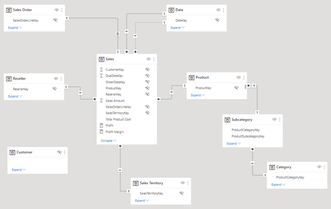
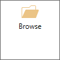

---
lab:
  title: 도구를 사용하여 Power BI 성능 최적화
  module: Optimize enterprise-scale tabular models
---

# <a name="use-tools-to-optimize-power-bi-performance"></a>도구를 사용하여 Power BI 성능 최적화

## <a name="overview"></a>개요

**이 랩의 예상 완료 시간은 30분입니다.**

이 랩에서는 두 개의 외부 도구를 사용하여 데이터 모델 및 DAX 쿼리를 개발, 관리 및 최적화하는 방법을 알아봅니다.

이 랩에서는 다음 사항들을 수행하는 방법에 대해 알아봅니다.

- BPA(모범 사례 분석기) 사용

- DAX Studio 사용

## <a name="get-started"></a>시작
### <a name="clone-the-repository-for-this-course"></a>이 과정용 리포지토리 복제

1. 시작 메뉴에서 명령 프롬프트를 엽니다.

    

1. 명령 프롬프트 창에서 다음을 입력하여 D 드라이브로 이동합니다.

    `d:` 

   Enter 키를 누릅니다.

    


1. 명령 프롬프트 창에서 다음 명령을 입력하여 과정 파일을 다운로드하고 DP500 폴더에 저장합니다.
    
    `git clone https://github.com/MicrosoftLearning/DP-500-Azure-Data-Analyst DP500`
   
1. 리포지토리가 복제되면 명령 프롬프트 창을 닫습니다. 
   
1. 파일 탐색기에서 D 드라이브를 열어 파일이 다운로드되었는지 확인합니다.

## <a name="use-best-practice-analyzer"></a>모범 사례 분석기 사용

In this exercise, you will install Tabular Editor 2 and load Best Practice Analyzer (BPA) rules. You will review the BPA rules, and then address specific issues found in the data model.

BPA는 모델 디자인 및 성능을 개선하기 위해 저지를 수 있는 잠재적인 모델링 실수나 수행할 수 있는 변경 내용을 알리는 무료 타사 도구입니다. 여기에는 성능 향상을 위해 적용할 수 있는 명명, 사용자 환경 및 일반적인 최적화에 대한 권장 사항이 포함됩니다. 자세한 내용은 [모델 성능 향상을 위한 모범 사례 규칙](https://powerbi.microsoft.com/blog/best-practice-rules-to-improve-your-models-performance/)을 참조하세요.


### <a name="download-and-install-tabular-editor-2"></a>테이블 형식 편집기 2 다운로드 및 설치

테이블 형식 편집기 2를 다운로드하여 설치해 계산 그룹을 만들 수 있습니다.

**중요:** VM 환경에 테이블 형식 편집기 2를 이미 설치한 경우 다음 작업을 계속 진행합니다.

테이블 형식 편집기는 Analysis Services 및 Power BI에 대한 테이블 형식 모델을 작성하기 위한 대체 도구입니다. 테이블 형식 편집기 2는 모델의 데이터에 액세스하지 않고 BIM 파일을 편집할 수 있는 오픈 소스 프로젝트입니다.

1.  Power BI Desktop이 닫혀 있는지 확인합니다.

1.  Microsoft Edge에서 테이블 형식 편집기 릴리스 페이지로 이동합니다.

    ```https://github.com/TabularEditor/TabularEditor/releases```
    
1. Scroll down to the <bpt id="p1">**</bpt>Assets<ept id="p1">**</ept> section and select the <bpt id="p2">**</bpt>TabularEditor.Installer.msi<ept id="p2">**</ept> file. This will initiate the file install.

1. 완료되면 **파일 열기**를 선택하여 설치 관리자를 실행합니다.

    

1.  테이블 형식 편집기 설치 관리자 창에서 **다음**을 선택합니다.

    

1.  **사용권 계약** 단계에서 동의하는 경우 **동의**를 선택하고 **다음**을 선택합니다.

    

1.  **설치 폴더 선택** 단계에서 **다음**을 선택합니다.

    

1.  **애플리케이션 바로 가기** 단계에서 **다음**을 선택합니다.

    

1.  **설치 확인** 단계에서 **다음**을 선택합니다. 

    메시지가 표시되면 **예**를 선택하여 앱을 변경할 수 있도록 허용합니다.

    

1. 설치가 완료되면 **닫기**를 선택합니다.

    

    이제 테이블 형식 편집기가 설치되어 Power BI Desktop 외부 도구로 등록됩니다.

### <a name="set-up-power-bi-desktop"></a>Power BI Desktop 설정

이 작업에서는 미리 개발된 Power BI Desktop 솔루션을 엽니다.

1. 파일 탐색기에서 **D:\DP500\Allfiles\13\Starter** 폴더로 이동합니다.

2. 미리 개발된 Power BI Desktop 파일을 열려면 **Sales Analysis - Use tools to optimize Power BI performance.pbix** 파일을 두 번 클릭합니다.

3. 파일을 저장하려면 **파일** 리본 탭에서 **다른 이름으로 저장**을 선택합니다.

4. **다른 이름으로 저장** 창에서 **D:\DP500\Allfiles\13\MySolution** 폴더로 이동합니다.

5. **저장**을 선택합니다.

6. **외부 도구** 리본 탭을 선택합니다.

    

7. 이 리본 탭에서 테이블 형식 편집기를 시작할 수 있습니다.

    

    이 연습의 뒷부분에서는 테이블 형식 편집기를 사용하여 BPA로 작업합니다.

### <a name="review-the-data-model"></a>데이터 모델 검토

이 작업에서는 데이터 모델을 검토합니다.

1. Power BI Desktop의 왼쪽에서 **모델** 보기로 전환합니다.

    

2. 모델 다이어그램을 사용하여 모델 디자인을 검토합니다.

    

    모델은 8개의 차원 테이블과 1개의 팩트 테이블로 구성됩니다. **Sales** 팩트 테이블에는 판매 주문 세부 정보가 저장됩니다. 제품 차원에 대한 눈송이 차원 테이블(Category > **Subcategory** > **Product**)을 포함하는 클래식 별모양 스키마 디자인입니다.

    이 연습에서는 BPA를 사용하여 모델 문제를 검색하고 해결합니다.

### <a name="load-bpa-rules"></a>BPA 규칙 로드

이 작업에서는 BPA 규칙을 로드합니다.

BPA 규칙은 테이블 형식 편집기 설치 중에 추가되지 않으므로 다운로드하여 설치해야 합니다.

1. **외부 도구** 리본에서 **테이블 형식 편집기**를 선택합니다.

    

    테이블 형식 편집기가 새 창에서 열리고 Power BI Desktop에서 호스트되는 데이터 모델에 실시간으로 연결됩니다. 테이블 형식 편집기에서 모델에 대한 변경 내용은 저장할 때까지 Power BI Desktop에 전파되지 않습니다.

2. BPA 규칙을 로드하려면 **고급 스크립팅** 탭을 선택합니다.

    

3. 다음 스크립트에 붙여넣습니다.

    팁: 스크립트는 **D:\DP500\Allfiles\13\Assets\Snippets.txt** 파일에서 복사하여 붙여 넣을 수 있습니다.

    ```
    System.Net.WebClient w = new System.Net.WebClient(); 

    string path = System.Environment.GetFolderPath(System.Environment.SpecialFolder.LocalApplicationData);
    string url = "https://raw.githubusercontent.com/microsoft/Analysis-Services/master/BestPracticeRules/BPARules.json";
    string downloadLoc = path+@"\TabularEditor\BPARules.json";
    w.DownloadFile(url, downloadLoc);
    ```

4. 스크립트를 실행하려면 도구 모음에서 **스크립트 실행** 명령을 선택합니다.

    

    BPA 규칙을 사용하려면 테이블 형식 편집기를 닫았다가 다시 열어야 합니다.

5. 테이블 형식 편집기를 닫습니다.

6. 테이블 형식 편집기를 다시 열려면 Power BI Desktop의 **외부 도구** 리본에서 **테이블 형식 편집기**를 선택합니다.

    

### <a name="review-the-bpa-rules"></a>BPA 규칙 검토

이 작업에서는 이전 작업에서 로드한 BPA 규칙을 검토합니다.

1. 테이블 형식 편집기 메뉴에서 **도구** > **규칙 관리**를 선택합니다.

    

2. **모범 사례 관리 규칙** 창의 **규칙 컬렉션** 목록에서 **로컬 사용자에 대한 규칙**을 선택합니다.

    

3. **컬렉션의 규칙** 목록에서 규칙 목록을 아래로 스크롤합니다.

    팁: 오른쪽 아래 모서리를 끌어 창을 확대할 수 있습니다.

    몇 초 내에 테이블 형식 편집기에서 각 규칙에 대해 전체 모델을 검색하고 각 규칙의 조건을 충족하는 모든 모델 개체에 대한 보고서를 제공합니다.

4. BPA는 규칙을 범주로 그룹화합니다.

    DAX 식과 같은 일부 규칙은 성능 최적화에 초점을 맞추고 다른 규칙(예: 서식 규칙)은 모양에 중점을 둡니다.

5. **Severity** 열을 확인합니다.

    숫자가 높을수록 더 중요한 규칙입니다.

6. 목록 맨 아래로 스크롤한 다음 **Set IsAvailableInMdx to false on non-attribute columns(비특성 열에 대해 IsAvailableInMdx를 false로 설정)** 규칙을 선택 취소합니다.

    

    개별 규칙 또는 전체 규칙 범주를 사용하지 않도록 설정할 수 있습니다. BPA는 모델에 대해 사용하지 않도록 설정된 규칙을 확인하지 않습니다. 특정 규칙을 제거하는 것이 규칙을 사용하지 않도록 설정하는 방법입니다.

7. **확인**을 선택합니다.

    

### <a name="address-bpa-issues"></a>BPA 문제 해결

이 작업에서는 BPA를 열고 검사 결과를 검토합니다.

1. 메뉴에서 **도구** > **모범 사례 분석기**를 선택하거나 **F10** 키를 누릅니다.

    

2. 필요한 경우 **모범 사례 분석기** 창에서 창을 최대화합니다.

3. 범주별로 그룹화된 (가능한) 문제 목록을 확인합니다.

4. 첫 번째 범주에서 **'Product'** 테이블을 마우스 오른쪽 단추로 클릭한 다음 **항목 무시**를 선택합니다.

    

    문제가 실제로 문제로 이어지지 않는 경우 해당 항목을 무시할 수 있습니다. 도구 모음에서 **무시된 항목 표시** 명령을 사용하여 항상 무시된 항목을 표시할 수 있습니다.

5. 목록 아래 쪽에 있는 **Use the DIVIDE function for division**(나누기에 DIVIDE 함수 사용) 범주에서 **[이익률]** 을 마우스 오른쪽 단추로 클릭하고 **Go to object**(개체로 이동)를 선택합니다.

    

    이 명령은 테이블 형식 편집기로 전환하고 개체에 중점을 둡니다. 따라서 문제에 수정 사항을 쉽게 적용할 수 있습니다.

6. 식 편집기에서 [DIVIDE](https://docs.microsoft.com/dax/divide-function-dax) 함수를 더욱 효율적이고 (안전하게) 사용할 수 있도록 다음과 같이 DAX 수식을 수정합니다.

    팁: 모든 수식은 **D:\DP500\Allfiles\13\Assets\Snippets.txt** 파일에서 복사하여 붙여 넣을 수 있습니다.

    ```
    DIVIDE ( [Profit], SUM ( 'Sales'[Sales Amount] ) )
    ```

7. 모델 변경 내용을 저장하려면 도구 모음에서 **Save changes to the connected database**(연결된 데이터베이스에 변경 내용 저장) 명령을 선택하거나 **Ctrl+S**를 누릅니다.

    

    변경 내용을 저장하면 Power BI Desktop 데이터 모델이 수정됩니다.

8. (포커스 밖에 있는) **모범 사례 분석기** 창으로 다시 전환합니다.

9. BPA에 더 이상 문제가 나열되지 않습니다.

10. 문제 목록을 아래로 스크롤하여 **Provide format string for "Date" columns**("Date" 열에 서식 문자열 제공) 범주를 찾습니다.

    

11. **'Date'[Date]** 이슈를 마우스 오른쪽 단추로 클릭한 다음 **수정 스크립트 생성**을 선택합니다.

    

    이 명령은 C# 스크립트를 생성하여 클립보드에 복사합니다. **수정 적용** 명령을 사용하여 스크립트를 생성하고 실행할 수도 있지만 스크립트를 실행하기 전에 스크립트를 검토하고 수정하는 것이 더 안전할 수 있습니다.

12. BPA가 수정 스크립트를 클립보드에 복사했다는 알림이 표시되면 **확인**을 선택합니다.

13. 테이블 형식 편집기로 전환하고 **고급 스크립팅** 탭을 선택합니다.

    

14. 수정 스크립트를 복사하려면 창 내부를 마우스 오른쪽 단추로 클릭한 다음 **Ctrl+C**를 누릅니다.

    

    서식 문자열을 변경하도록 선택할 수 있습니다.

15. 스크립트를 실행하려면 도구 모음에서 **스크립트 실행** 명령을 선택합니다.

    

16. 모델 변경 내용을 저장합니다.

17. 테이블 형식 편집기를 닫으려면 메뉴에서 **파일** > **종료**를 선택합니다.

18. Power BI Desktop 파일을 저장합니다.

    

    또한 테이블 형식 편집기 변경 내용이 저장되도록 Power BI Desktop 파일을 저장해야 합니다.

## <a name="use-dax-studio"></a>DAX Studio 사용

DAX Studio를 다운로드하여 설치합니다.

웹 사이트에 따르면 DAX Studio는 “Microsoft 테이블 형식 모델에 대해 DAX 쿼리를 실행하고 분석하기 위한 궁극적인 도구”입니다. DAX 작성, 진단, 성능 조정 및 분석을 위한 기능이 풍부한 도구입니다. 기능에는 개체 검색, 통합 추적, 자세한 통계를 사용한 쿼리 실행 분석, DAX 구문 강조 표시 및 서식 지정이 포함됩니다.

### <a name="download-dax-studio"></a>DAX Studio 다운로드

이 작업에서는 DAX Studio를 다운로드합니다.

DAX 쿼리를 최적화하기 위해 DAX Studio를 다운로드하여 설치합니다.

1.  Microsoft Edge에서 DAX Studio 다운로드 페이지로 이동합니다.

    ```https://daxstudio.org/downloads/```
    
1. Select <bpt id="p1">**</bpt>DAX Studio v.2.x.x (installer)<ept id="p1">**</ept> - this will initiate the file install.
    <bpt id="p1">*</bpt>note: The version of DAX studio will change slightly over time. Download the latest release.<ept id="p1">*</ept>

1. 완료되면 **파일 열기**를 선택하여 설치 관리자를 실행합니다.

    

1.  DAX Studio 설치 관리자 창에서 **모든 사용자에 대해 설치(권장)** 를 선택합니다.

1. 사용자 계정 컨트롤 창에서 예를 선택하여 앱이 디바이스를 변경할 수 있도록 허용합니다.

    

1.  **사용권 계약** 단계에서 사용 조건에 동의하는 경우 **계약에 동의함**을 선택하고 **다음**을 선택합니다.

    

1. **다음**을 선택하여 기본 대상 위치를 사용합니다.
1. **다음**을 선택하여 설치할 기본 구성 요소를 선택합니다.
1. **다음**을 선택하여 기본 시작 메뉴 폴더에 바로 가기를 배치합니다.
1. **바탕 화면 바로 가기 만들기**를 선택하고 다음을 선택합니다.

    
1. **설치**를 선택합니다.

1. Upon completion, with <bpt id="p1">**</bpt>Launch DAX Studio<ept id="p1">**</ept> selected, select <bpt id="p2">**</bpt>Finish<ept id="p2">**</ept>. This will open DAX Studio.
    <ph id="ph1"></ph>

1. **연결** 창에서 **PBI/SSDT 모델** 옵션을 선택합니다.

1. 해당 드롭다운 목록에서 **Sales Analysis - Use tools to optimize Power BI performance**(판매 분석 - 도구를 사용하여 Power BI 성능 최적화) 모델이 선택되어 있는지 확인합니다.

    

    **Sales Analysis - Use tools to optimize Power BI performance**(판매 분석 - 도구를 사용하여 Power BI 성능 최적화) 시작 파일이 열려 있지 않은 경우에는 연결할 수 없습니다. 이 파일이 열려 있는지 확인하세요.

1. **연결**을 선택합니다.

    

1. 필요한 경우 DAX Studio 창을 최대화합니다.

### <a name="use-dax-studio-to-optimize-a-query"></a>DAX Studio를 사용하여 쿼리 최적화

이 작업에서는 향상된 측정값 수식을 사용하여 쿼리를 최적화합니다.

데이터 모델 볼륨이 작은 경우 쿼리를 최적화하기 어렵습니다. 이 연습에서는 DAX 쿼리를 최적화하는 대신 DAX Studio를 사용하는 데 중점을 둡니다.

1. **파일** 리본 탭에서 **찾아보기**를 선택합니다.

    

2. **열기** 창에서 **D:D:\DP500\Allfiles\13\Assets** 폴더로 이동합니다.

3. **Monthly Profit Growth.dax**를 선택합니다.

4. **열기**를 선택합니다.

    

5. 파일 맨 위에 있는 주석을 읽은 다음 이어지는 쿼리를 검토합니다.

    쿼리 전체를 이해하는 것은 중요하지 않습니다.

    이 쿼리는 월별 이익 증가를 결정하는 두 가지 측정값을 정의합니다. 현재 쿼리는 첫 번째 측정값(72번 줄)만 사용합니다. 측정값을 사용하지 않으면 쿼리 실행에 영향을 주지 않습니다.

6. 서버 추적을 실행하여 성능 프로파일링에 대한 자세한 타이밍 정보를 기록하려면 **홈** 리본 탭의 **추적** 그룹 내에서 **서버 타이밍**을 선택합니다.

    

7. 스크립트를 실행하려면 **홈** 리본 탭의 **쿼리** 그룹 내에서 **실행** 아이콘을 선택합니다.

    

8. 아래쪽 창에서 쿼리 결과를 검토합니다.

    마지막 열에는 측정값 결과가 표시됩니다.

9. 아래쪽 창에서 **서버 타이밍** 탭을 선택합니다.

    

10. 왼쪽에서 사용할 수 있는 통계를 검토합니다.

    

    왼쪽 위에서 오른쪽 아래로 통계는 쿼리를 실행하는 데 걸린 시간(밀리초) 및 SE(스토리지 엔진) CPU에 걸린 기간을 알려줍니다. 이 경우(여러분의 결과는 다를 수 있음) 수식 엔진(FE)은 73.5%의 시간이 걸렸고 SE는 나머지 26.5%를 차지했습니다. 개별 SE 쿼리는 34개, 캐시 적중률은 21이었습니다.

11. 쿼리를 다시 실행하고 모든 SE 쿼리가 SE 캐시에서 온 것을 확인합니다.

    *이는 다시 사용할 수 있도록 결과가 캐시되었기 때문입니다. 경우에 따라 테스트에서 캐시를 지우려고 할 수 있습니다. 이 경우 **홈** 리본 탭에서 **실행** 명령의 아래쪽 화살표를 선택합니다.*

    

    두 번째 측정값 정의는 보다 효율적인 결과를 제공합니다. 이제 두 번째 측정값을 사용하도록 쿼리를 업데이트합니다.

12. 72번 줄에서 **Bad** 라는 단어를 **Better**로 바꿉니다.

    

13. 쿼리를 실행한 다음 서버 타이밍 통계를 검토합니다.

    

14. 쿼리를 두 번째로 실행하여 전체 캐시 적중률을 생성합니다.

    

    이 경우 변수 및 시간 인텔리전스 함수를 사용하는 “더 나은” 쿼리가 쿼리 실행 시간을 거의 50% 단축하면서 더 효율적으로 수행하는지 확인할 수 있습니다.

### <a name="finish-up"></a>완료

이 작업에서는 마무리합니다.

1. DAX Studio를 닫으려면 **파일** 리본 탭에서 **끝내기**를 선택합니다.

2. Power BI Desktop을 닫습니다.
