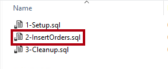

---
lab:
  title: 실시간으로 데이터 모니터링
  module: Implement advanced data visualization techniques by using Power BI
---

# 실시간으로 데이터 모니터링

## 개요

**이 랩의 예상 완료 시간은 30분입니다.**

In this lab, you will configure a report to use automatic page refresh. That way, it will be possible for report consumers to monitor real-time internet sales results.

이 랩에서는 다음 사항들을 수행하는 방법에 대해 알아봅니다.

- 성능 분석기를 사용하여 새로 고침 작업을 검토합니다.

- 자동 페이지 새로 고침을 설정합니다.

- 변경 검색 기능을 만들고 사용합니다.

## 시작

이 연습에서는 환경을 준비합니다.

### 이 과정용 리포지토리 복제

1. 시작 메뉴에서 명령 프롬프트를 엽니다.

    

1. 명령 프롬프트 창에서 다음을 입력하여 D 드라이브로 이동합니다.

    `d:` 

   Enter 키를 누릅니다.

    

1. 명령 프롬프트 창에서 다음 명령을 입력하여 과정 파일을 다운로드하고 DP500 폴더에 저장합니다.
    
    `git clone https://github.com/MicrosoftLearning/DP-500-Azure-Data-Analyst DP500`
   
1. 리포지토리가 복제되면 명령 프롬프트 창을 닫습니다. 
   
1. 파일 탐색기에서 D 드라이브를 열어 파일이 다운로드되었는지 확인합니다.

### 데이터베이스 설정

이 작업에서는 두 개의 스크립트를 실행하여 SSMS(SQL Server Management Studio)를 사용하여 데이터베이스를 설정합니다.

1. SSMS를 열려면 작업 표시줄에서 **SSMS** 바로 가기를 선택합니다.

    

2. In the <bpt id="p1">**</bpt>Connect to Server<ept id="p1">**</ept> window, ensure that the <bpt id="p2">**</bpt>Server name<ept id="p2">**</ept> dropdown list is set to <bpt id="p3">**</bpt>localhost<ept id="p3">**</ept>, and that the Authentication dropdown list is set to <bpt id="p4">**</bpt>Windows Authentication<ept id="p4">**</ept>.
    

3. **연결**을 선택합니다.
    
    

4. 스크립트 파일을 열려면 **파일** 메뉴에서**열기** > **파일**을 선택합니다.

5. **파일 열기** 창에서 **D:\DP500\Allfiles\14\Assets** 폴더로 이동합니다.

6. **1-Setup.sql** 파일을 선택합니다.

    

7. **열기**를 선택합니다.

    

8. 스크립트를 검토합니다.

    이 스크립트는 **FactInternetSalesRealTime**이라는 테이블을 만듭니다. 다른 스크립트는 이 테이블에 데이터를 로드하여 인터넷 판매 주문의 실시간 워크로드를 시뮬레이션합니다.

9. 스크립트를 실행하려면 도구 모음에서 **실행**을 선택하거나 **F5** 키를 누릅니다.

    

10. 파일을 닫으려면 **파일** 메뉴에서 **닫기**를 선택합니다.

11. **2-InsertOrders.sql** 파일을 엽니다.

    

12. 이 스크립트도 검토합니다.

    이 스크립트는 무한 루프를 실행합니다. 각 루프에 대해 판매 주문을 삽입한 다음 1~15초의 임의 기간 동안 지연됩니다.

13. 스크립트를 실행하고 랩이 끝날 때까지 실행 상태로 둡니다.

### Power BI Desktop 설정

이 작업에서는 미리 개발된 Power BI Desktop 솔루션을 엽니다.

1. 파일 탐색기를 열려면 작업 표시줄에서 **파일 탐색기** 바로 가기를 선택합니다.

    

2. **D:\DP500\Allfiles\14\Starter** 폴더로 이동합니다.

3. 미리 개발된 Power BI Desktop 파일을 열려면 **Internet Sales - Monitor data in real time.pbix** 파일을 두 번 클릭합니다.

4. 파일을 저장하려면 **파일** 리본 탭에서 **다른 이름으로 저장**을 선택합니다.

5. **다른 이름으로 저장** 창에서 **D:\DP500\Allfiles\14\MySolution** 폴더로 이동합니다.

6. **저장**을 선택합니다.

### 보고서 검토

이 작업에서는 미리 개발된 보고서를 검토합니다.

1. Power BI Desktop에서 보고서 페이지를 검토합니다.

    

    이 보고서 페이지에는 제목과 두 개의 시각적 개체가 있습니다. 카드 시각적 개체는 판매 주문 수를 표시하고 가로 막대형 차트 시각적 개체는 각 자전거 하위 범주의 판매액을 표시합니다.

2. 보고서를 새로 고치려면 **보기** 리본 탭의 **표시** 창 그룹 내에서 **성능 분석기**를 선택합니다.

    

3. **시각화** 창 오른쪽에 있는 **성능 분석기** 창에서 **기록 시작**을 선택합니다.

    

    성능 분석기는 시각적 개체를 업데이트하거나 새로 고치는 데 필요한 기간을 검사하고 표시합니다. 각 시각적 개체는 원본 데이터베이스에 대해 하나 이상의 쿼리를 실행합니다. 자세한 내용은 [성능 분석기를 사용하여 보고서 요소 성능 검사](https://docs.microsoft.com/power-bi/create-reports/desktop-performance-analyzer)를 참조하세요.

4. **시각적 개체 새로 고침**을 선택합니다.

    

5. 최신 인터넷 판매 결과를 표시하도록 보고서 시각적 개체가 업데이트됩니다.

    로컬 DirectQuery 모델에 연결하는 보고서를 개발하는 경우 **홈** 리본 탭에 있는 **새로 고침** 명령을 사용하여 보고서를 새로 고칠 수 없습니다. 이는 Power BI Desktop이 DirectQuery 테이블 연결을 대신 새로 고치기 때문입니다. 보고서 시각적 개체를 새로 고치려면 방금 수행한 단계를 수행하세요. Power BI 서비스에 게시되면 보고서 소비자는 작업 모음에서 **새로 고침**을 선택하여 보고서 시각적 개체를 새로 고칠 수 있습니다.

    실시간 분석을 위해 보고서를 디자인할 때 사용자에게 보고서 페이지를 지속적으로 새로 고치도록 요청하는 것보다 더 좋은 방법이 있어야 합니다. 다음 연습에서 자동 페이지 새로 고침을 설정하면 더 나은 방법이 마련됩니다.

## 자동 페이지 새로 고침 설정

이 연습에서는 변경 검색 기능을 사용하여 자동 페이지 새로 고침을 설정하고 실험합니다.

페이지를 자동으로 새로 고치려면 DirectQuery 스토리지 모드를 사용하도록 설정된 하나 이상의 모델 테이블이 필요합니다.

### 자동 페이지 새로 고침 설정

이 작업에서는 자동 페이지 새로 고침을 설정합니다.

1. 보고서 페이지를 선택하려면 먼저 보고서 페이지의 빈 영역을 선택합니다.

2. **시각화** 창에서 서식 아이콘(페인트 브러시)을 선택합니다.

    

3. (목록의 마지막에 있는) **페이지 새로 고침** 설정을 **켜기**로 전환합니다.

    

    자동 페이지 새로 고침은 페이지 수준 설정입니다. 보고서의 특정 페이지에 사용하도록 설정할 수 있습니다.

4. **성능 분석기** 창에서 보고서 시각적 개체가 방금 새로 고침된 것을 확인합니다.

5. **시각화** 창에서 **페이지 새로 고침** 설정을 확장하여 엽니다.

    

6. 기본적으로 페이지는 30분마다 새로 고침됩니다.

7. 5초마다 페이지를 새로 고치도록 설정을 수정합니다.

    

    중요: 빈번한 새로 고침 간격은 이 랩을 효율적으로 진행하는 데 도움이 됩니다. 그러나 빈번한 새로 고침 간격을 설정하면 원본 데이터베이스의 성능과 보고서를 보는 다른 사용자에게 심각한 영향을 미칠 수 있으므로 주의해야 합니다.

    *인터넷 판매 주문이 1~15초마다 로드되기 때문에 (데이터베이스가 지난 5초 동안 주문을 기록하지 않아) 페이지를 새로 고침했는데도 동일한 결과가 검색되는 경우가 있습니다. 필요한 경우에만 보고서 시각적 개체를 새로 고치는 것이 좋습니다. 다음 작업에서는 이를 위해 변경 검색 기능을 설정합니다.*

    Power BI 서비스에 게시된 후 새로 고침 간격이 30분 미만이면 Premium 용량에 할당된 작업 영역에 보고서를 저장해야 합니다. 또한 용량 관리자는 이와 같이 빈번한 간격을 허용하도록 용량을 사용하도록 설정해야 합니다. 자세한 내용은 [Power BI에서 자동 페이지 새로 고침](https://docs.microsoft.com/power-bi/create-reports/desktop-automatic-page-refresh)을 참조하세요.

### 변경 검색 설정

이 작업에서는 변경 검색을 설정합니다.

1. **페이지 새로 고침** 설정에서 **새로 고침 유형** 드롭다운 목록을 **변경 검색**으로 설정합니다.

    

2. 변경 검색 측정값을 만들려면 **변경 검색 추가** 링크를 선택합니다.

    

3. **변경 검색** 창에서 기본 설정은 새 측정값을 만드는 것입니다.

    

4. **계산 선택** 드롭다운 목록에서 **개수(고유)** 를 선택합니다.

    

5. (창 내부에서 오른쪽에 있는) **필드** 창에서 아래로 스크롤하여 **Internet Sales** 테이블을 찾습니다.

6. **Sales Order** 필드를 선택하고 창에서 이 필드가 **적용할 필드 선택** 상자에 추가된 것을 확인합니다.

    

7. **다음 간격마다 변경 내용 확인** 설정을 5초로 설정합니다.

    

8. **적용**을 선택합니다.

    

9. **필드** 창의 **Internet Sales** 테이블 내에서 변경 검색 측정값이 추가된 것을 확인합니다.

    

    이제 Power BI는 변경 검색 측정값을 사용하여 5초마다 원본 데이터베이스를 쿼리합니다. 매번 Power BI는 다음에 사용될 때 비교할 수 있도록 결과를 저장합니다. 결과가 다르면 데이터가 변경되었음을 의미합니다(이 경우 데이터베이스에서 새 인터넷 판매 주문 삽입). 이 경우 Power BI는 모든 보고서 페이지 시각적 개체를 새로 고칩니다.

    Power BI 서비스에 게시되면 Power BI는 Premium 용량에 대한 변경 검색 측정값만 지원합니다.

10. **성능 분석기** 창에서 **지우기**를 선택합니다.

    

11. 성능 분석기는 변경 검색 쿼리를 표시합니다.

12. Power BI Desktop이 보고서 시각적 개체를 새로 고치기 전에 여러 변경 검색 쿼리가 발생하는 경우가 있습니다.

    이는 데이터베이스에 당시 새 인터넷 판매 주문이 삽입되지 않았기 때문입니다. 이제 필요한 경우에만 보고서 시각적 개체가 새로 고침되므로 이 설정이 더 효율적입니다.

### 완료

이 작업에서는 마무리합니다.

1. Power BI Desktop 파일을 저장합니다.

    

2. Power BI Desktop을 닫습니다.

3. SSMS에서 스크립트 실행을 중지하려면 도구 모음에서 **중지**를 선택하거나 **Alt+Break**를 누릅니다.

    

4. 스크립트 파일을 닫습니다.

5. **3-Cleanup.sql** 파일을 엽니다.

    

    이 스크립트는 **FactInternetSalesRealTime** 테이블을 제거합니다.

6. 스크립트를 실행합니다.

7. SSMS를 닫습니다.
