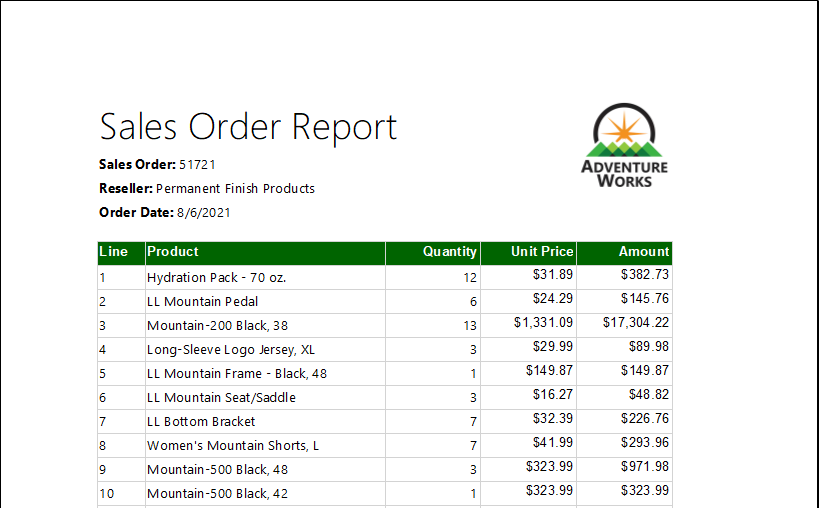
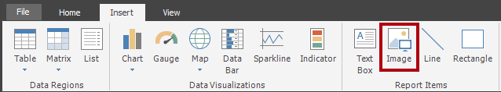
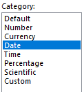
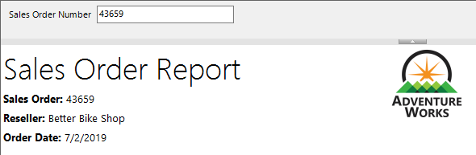
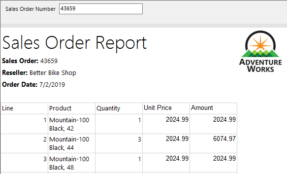
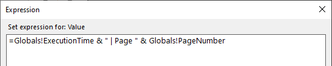

# <a name="create-a-paginated-report"></a>페이지를 매긴 보고서 만들기

## <a name="overview"></a>개요

**이 랩을 완료하는 데 걸리는 예상 완료 시간은 45분입니다.**

이 랩에서는 Power BI Report Builder를 사용하여 **AdventureWorksDW2022-DP500** SQL Server 데이터베이스의 데이터를 원본으로 하는 픽셀 퍼펙트 페이지를 매긴 보고서 레이아웃을 개발합니다. 그런 다음 데이터 원본과 데이터 세트를 만들고, 보고서 매개 변수도 구성합니다. 보고서 레이아웃을 사용하면 데이터를 여러 페이지에 걸쳐 렌더링하고, PDF 및 기타 형식으로 내보낼 수 있습니다.

최종 보고서는 다음과 유사한 형태입니다.



이 랩에서는 다음 작업을 수행하는 방법을 알아봅니다.

- Power BI Report Builder 사용

- 다중 페이지 보고서 레이아웃 디자인

- 데이터 원본 정의

- 데이터 세트 정의

- 보고서 매개 변수 만들기

- 보고서를 PDF로 내보내기

## <a name="get-started"></a>시작

이 연습에서는 Power BI Report Builder를 열어 보고서를 만든 다음 저장합니다.

### <a name="clone-the-repository-for-this-course"></a>이 과정용 리포지토리 복제

1. 시작 메뉴에서 명령 프롬프트를 엽니다.

    

1. 명령 프롬프트 창에서 다음을 입력하여 D 드라이브로 이동합니다.

    `d:` 

   Enter 키를 누릅니다.

    


1. 명령 프롬프트 창에서 다음 명령을 입력하여 과정 파일을 다운로드하고 DP500 폴더에 저장합니다.
    
    `git clone https://github.com/MicrosoftLearning/DP-500-Azure-Data-Analyst DP500`
   
1. 리포지토리가 복제되면 명령 프롬프트 창을 닫습니다. 
   
1. 파일 탐색기에서 D 드라이브를 열어 파일이 다운로드되었는지 확인합니다.

### <a name="create-the-report"></a>보고서 만들기

이 작업에서는 Power BI Report Builder를 열어 보고서를 만든 다음 저장합니다.

1. Power BI Report Builder를 열려면 작업 표시줄에서 **Power BI Report Builder** 바로 가기를 선택합니다.

    

1. 최신 버전의 Power BI Report Builder로 업데이트하라는 메시지가 표시되면 **취소**를 선택합니다.

2. Power BI Report Builder 창에서 새 보고서를 만들려면 **시작** 창에서 **빈 보고서**를 선택합니다.

    

  
3. 보고서를 저장하려면 왼쪽 위에 있는 **파일** 탭을 선택한 다음 **저장**를 선택합니다.

    

4. **보고서로 저장** 창에서 **D:\DP500\Allfiles\15\MySolution** 폴더로 이동합니다.

5. **이름** 상자에 **Sales Order Report**를 입력합니다.

6. **저장**을 선택합니다.

## <a name="develop-the-report-layout"></a>보고서 레이아웃 디자인하기

이 연습에서는 보고서 레이아웃을 개발한 다음 최종 보고서 디자인을 살펴봅니다.

### <a name="configure-the-report-header"></a>보고서 머리글 구성

이 작업에서는 보고서 머리글을 구성합니다.

1. 보고서 디자이너에서 본문 영역과 보고서 바닥글 영역으로 구성된 기본 보고서 레이아웃을 볼 수 있습니다.

    

    *본문에는 보고서 제목에 사용할 단일 텍스트 상자가 포함되어 있으며, 보고서 바닥글에는 보고서 실행 시간을 설명하는 단일 텍스트 상자가 포함되어 있습니다.*

    기본 디자인은 첫 번째 렌더링된 페이지에서 본문에 보고서 제목을 한 번 렌더링합니다. 그러나 이제 보고서 머리글 영역을 추가하고 보고서 제목 텍스트 상자를 이 영역으로 이동하여 보고서 디자인을 수정합니다. 이렇게 하면 보고서 제목이 모든 페이지에서 반복됩니다. 회사 로고 이미지도 추가합니다.

2. 보고서 머리글 영역을 추가하려면 **삽입** 리본 탭의 **머리글 &amp; 바닥글** 그룹 안에서 **머리글**을 연 다음 **머리글 추가**를 선택합니다.

    

3. 보고서 디자이너에서 보고서 머리글 영역이 보고서 레이아웃에 추가된 것을 볼 수 있습니다.

4. 본문 텍스트 상자를 선택하려면 “제목을 추가하려면 클릭하세요” 텍스트 상자를 선택합니다.

5. 텍스트 상자를 이동하려면 십자형 화살표 아이콘을 선택한 다음 머리글 영역으로 끌어 보고서 머리글 영역의 왼쪽 위에 놓습니다.

    

6. 보고서 제목 텍스트 상자의 텍스트를 수정하려면 텍스트 상자 안을 선택하고 **Sales Order Report(판매 주문 보고서)** 라고 입력합니다.

    텍스트 상자의 크기를 조정하려면 먼저 **속성** 창을 엽니다. 위치 및 크기 속성을 세밀하게 제어하려면 **속성** 창을 사용해야 합니다.

7. **보기** 리본 탭의 **표시/숨기기** 그룹 안에서 **속성**을 선택합니다.

    

8. 보고서 제목 텍스트 상자에 포커스를 설정하려면 먼저 텍스트 상자 외부 영역을 선택한 다음 텍스트 상자를 다시 선택합니다.

    *강조 표시된 텍스트 상자의 테두리가 보이고 크기 조정 핸들(작은 원)이 테두리에 나타나면 텍스트 상자가 선택됩니다.*

9. 오른쪽에 있는 **속성** 창에서 목록 아래로 스크롤하여 **위치** 그룹을 찾습니다.

    

    **위치** 그룹을 사용하면 보고서 항목의 위치 및 크기에 정확한 값을 설정할 수 있습니다.

    중요: 이 랩에서 지시한 대로 값을 입력합니다. 랩의 끝에서 페이지 렌더링을 수행하려면 픽셀에 완벽한 레이아웃이 필요합니다.

10. **위치(Position)** 그룹 안에서 **위치(Location)** 그룹을 확장하고 **왼쪽** 및 **위쪽** 속성이 각각 **0in**로 설정되어 있는지 확인합니다.

    랩 가상 머신의 국가별 설정이 미국으로 설정되어 있으므로 위치 및 크기 단위는 인치 단위입니다. 지역에서 메트릭 측정값을 사용하는 경우 기본 단위는 센티미터입니다.

11. **위치(Position)** 그룹 안에서 **크기** 그룹을 확장한 다음 **너비** 속성을 **4**로 설정합니다.

    


12. 이미지를 삽입하려면 **삽입** 리본 탭의 **보고서 항목** 그룹 안에서 **이미지**를 선택합니다.

    

13. 보고서 디자인에 이미지를 추가하려면 보고서 제목 텍스트 상자의 오른쪽에 있는 보고서 머리글 안의 영역을 선택합니다.

14. **이미지 속성** 창에서 이미지 파일로부터 가져오려면 **가져오기**를 선택합니다.

    

15. **열기** 창에서 **D:\DP500\Allfiles\15\Assets** 폴더로 이동한 다음, **AdventureWorksLogo.jpg** 파일을 선택합니다.

16. **열기**를 선택합니다.

17. **이미지 속성** 창에서 **확인**을 선택합니다.

18. 보고서 디자이너에서 이미지가 추가되고 이미지에 포커스가 설정된 것을 볼 수 있습니다.

 

19. 이미지를 배치하고 크기를 조정하려면 **속성** 창에서 다음 속성을 구성합니다.

    |  **속성** | **값** |
    |--- | --- |
    |  위치(Position) > 위치(Location) > 왼쪽| 5 |
    |  위치(Position) > 위치(Location) > 위쪽| 0 |
    |  위치(Postion) > 크기 > 너비| 1 |
    |  위치(Position) > 크기 > 높이| 1 |


20. 보고서 머리글 영역의 크기를 조정하려면 먼저 보고서 머리글 영역 내의 빈 영역을 선택하여 해당 영역에 포커스를 설정합니다.

21. **속성** 창에서 **일반** > **높이** 속성을 **1**로 설정합니다.

22. 보고서 머리글 영역이 단일 텍스트 상자와 이미지를 포함하고 다음과 같이 표시되는지 확인합니다.

    

23. 보고서를 저장하려면 **파일** 탭에서 **저장**을 선택합니다.

    팁: 왼쪽 위에 있는 디스크 아이콘을 선택할 수도 있습니다.

    

    *이제 데이터베이스 쿼리 결과를 검색하도록 보고서를 구성할 준비가 되었습니다.*


### <a name="retrieve-data"></a>데이터 검색

이 작업에서는 데이터 원본 및 데이터 세트를 만들어 **AdventureWorksDW2022-DP500** SQL Server 데이터베이스에서 쿼리 결과를 검색합니다.

1. 왼쪽에 있는 **보고서 데이터** 창에서 **데이터 원본** 폴더를 마우스 오른쪽 단추로 클릭한 다음 **데이터 원본 추가**를 선택합니다.

    

    클라우드 또는 온-프레미스 데이터베이스 또는 Power BI 데이터 세트에서 데이터를 검색할 수 있습니다.

2. **데이터 원본 속성** 창의 **이름** 상자에서 텍스트를 **AdventureWorksDW2022**로 바꿉니다.

3. **연결 유형 선택** 드롭다운 목록에서 **Microsoft SQL Server**가 선택되어 있는지 확인합니다.

4. 연결 문자열을 빌드하려면 **빌드**를 선택합니다.

    


5. **연결 속성** 창의 **서버 이름** 상자에 **localhost**를 입력합니다.

    이 랩에서는 **localhost**를 사용하여 SQL Server 데이터베이스에 연결합니다. 그러나 이 방법은 게이트웨이 데이터 원본이 **localhost**를 확인할 수 없으므로 사용자 고유의 솔루션을 만들 때 권장되지 않습니다.

6. **데이터베이스 이름 선택 또는 입력** 드롭다운 목록에서 **AdventureWorksDW2022-DP500**을 선택합니다.

7. **확인**을 선택합니다.

8. **데이터 원본 속성** 창에서 **확인**을 클릭합니다.

9. **보고서 데이터** 창에서 **AdventureWorksDW2022** 데이터 원본이 추가된 것을 볼 수 있습니다.

    

10. 데이터 세트를 만들려면 **보고서 데이터** 창에서 **AdventureWorksDW2022** 데이터 원본을 마우스 오른쪽 단추로 클릭한 다음 **데이터 세트 추가**를 선택합니다.

    

    *보고서 데이터 세트와 Power BI 데이터 세트는 목적과 구조가 다릅니다.*

11. **데이터 세트 속성** 창의 **이름** 상자에서 텍스트를 **SalesOrder**로 바꿉니다.


12. 미리 정의된 쿼리를 가져오려면 **가져오기**를 선택합니다.

    

13. **쿼리 가져오기** 창에서 **D:\DP500\Allfiles\15\Assets** 폴더로 이동한 다음 **SalesOrder.sql** 파일을 선택합니다.

14. **열기**를 선택합니다.

15. **쿼리** 상자에서 쿼리를 검토하고 쿼리 텍스트 아래쪽까지 스크롤합니다.

    쿼리 문의 세부 정보를 이해하는 것은 중요하지 않습니다. 판매 주문 라인 세부 정보를 검색하도록 설계되었습니다. WHERE 절에는 쿼리 결과를 단일 판매 주문으로 제한하는 조건자가 포함되어 있습니다. ORDER BY 절은 행이 줄 번호 순서로 반환되도록 합니다.

16. WHERE 절에서 쿼리 매개 변수를 나타내는 **@SalesOrderNumberSalesOrderNumber**가 사용된 것을 볼 수 있습니다.

    

    쿼리 매개 변수는 쿼리 실행 시 전달되는 값의 자리 표시자입니다. 보고서 매개 변수를 구성하여 보고서 사용자에게 단일 판매 주문 번호를 묻는 메시지를 표시한 다음 쿼리 매개 변수로 전달됩니다.

17. **확인**을 선택합니다.


18. **보고서 데이터** 창에서 **SalesOrder** 데이터 세트와 해당 필드가 추가된 것을 볼 수 있습니다.

    

    필드는 보고서 레이아웃에서 데이터 영역을 구성하는 데 사용되며 데이터 세트 쿼리 열에서 파생되었습니다.

19. 보고서를 저장합니다.

### <a name="configure-the-report-parameter"></a>보고서 매개 변수 구성

이 작업에서는 기본값을 사용하여 보고서 매개 변수를 구성합니다.

1. **보고서 데이터** 창에서 **Parameters** 폴더를 확장하여 **SalesOrderNumber** 보고서 매개 변수를 표시합니다.

    

    데이터 세트를 만들 때 **SalesOrderNumber** 보고서 매개 변수가 자동으로 추가되었습니다. 이는 데이터 세트 쿼리에 **@SalesOrderNumber** 쿼리 매개 변수가 포함되어 있기 때문입니다.

2. 보고서 매개 변수를 편집하려면 **SalesOrderNumber** 보고서 매개 변수를 마우스 오른쪽 단추로 클릭한 다음 **매개 변수 속성**을 선택합니다.

    

3. **보고서 매개 변수 속성** 창 왼쪽에서 **기본값** 페이지를 선택합니다.

    

4. **값 지정** 옵션을 선택합니다.

    

5. 기본값을 추가하려면 **추가**를 선택합니다.


6. **값** 드롭다운 목록에서 텍스트를 **43659**로 바꿉니다.

    

    *판매 주문 43659는 처음에 보고서 디자인을 테스트하는 데 사용하는 값입니다.*

7. **확인**을 선택합니다.

8. 보고서를 저장합니다.

    *이제 판매 주문을 설명하는 텍스트 상자를 추가하여 보고서 머리글 영역 디자인을 완료합니다.*

### <a name="finalize-the-report-header-layout"></a>보고서 머리글 레이아웃 완료

이 작업에서는 텍스트 상자를 추가하여 보고서 머리글 영역 디자인을 완료합니다.

1. 보고서 머리글 영역에 텍스트 상자를 추가하려면 **삽입** 리본 탭의 **보고서 항목** 그룹 안에서 **텍스트 상자**를 선택합니다.

    

2. 보고서 제목 텍스트 상자 바로 아래에 있는 보고서 머리글 영역 내부를 선택합니다.

3. 새 텍스트 상자 내에 **Sales Order:** 를 입력한 다음 공백을 입력합니다.

4. 자리 표시자를 삽입하려면 방금 입력한 공백 바로 뒤에서 마우스 오른쪽 단추를 클릭한 다음 **자리 표시자 만들기**를 선택합니다.

    


5. **자리 표시자 속성** 창의 **값** 드롭다운 목록 오른쪽에서 **fx** 단추를 선택합니다.

    

    **fx** 단추를 사용하면 사용자 지정 식을 입력할 수 있습니다. 이 식은 판매 주문 번호를 반환하는 데 사용됩니다.

6. **식** 창의 **범주** 목록에서 **매개 변수**를 선택합니다.

    

7. **값** 목록에서 **SalesOrderNumber** 매개 변수를 두 번 클릭합니다.

8. 식 상자에서 **SalesOrderNumber** 보고서 매개 변수에 대한 프로그래밍 방식의 참조가 추가된 것을 볼 수 있습니다.

    

9. **확인**을 선택합니다.

10. **자리 표시자 속성** 창에서 **확인**을 선택합니다.

11. 보고서 머리글 영역의 빈 곳을 선택한 다음 새 텍스트 상자를 선택합니다.

12. **속성** 창에서 다음 위치 속성을 구성합니다.

    |  **속성**| **값** |
    | --- | --- |
    |  위치(Position) > 위치(Location) > 왼쪽| 0 |
    |  위치(Position) > 위치(Location) > 위쪽| 0.5 |
    |  위치(Postion) > 크기 > 너비| 4 |
    |  위치(Position) > 크기 > 높이| 0.25 |


13. 텍스트 상자 텍스트 일부의 서식을 지정하려면 새 텍스트 상자 안에서 **Sales Order:** 텍스트만 선택합니다.

    

14. **홈** 리본 탭의 **글꼴** 그룹 안에서 **굵게** 명령을 선택합니다.

    

15. 보고서 머리글 영역에 다른 텍스트 상자를 추가한 다음 **Reseller:** 텍스트를 입력하고 그 뒤에 공백을 입력합니다.

    팁: 캔버스를 마우스 오른쪽 단추로 클릭한 다음 **삽입** > **텍스트 상자**를 선택하여 텍스트 상자를 추가할 수도 있습니다.

16. 공백 뒤에 자리 표시자를 삽입한 다음 식을 사용 하도록 자리 표시자의 값을 설정합니다.


17. **식** 창의 **범주** 목록에서 **데이터 세트**를 선택합니다.

    

18. 식 값은 **First(Reseller)** 값을 기준으로 합니다.

19. **속성** 창에서 다음 위치 속성을 구성합니다.

    |  **속성**| **값** |
    | --- | --- |
    |  위치(Position) > 위치(Location) > 왼쪽| 0 |
    |  위치(Position) > 위치(Location) > 위쪽| 0.75 |
    |  위치(Postion) > 크기 > 너비| 4 |
    |  위치(Position) > 크기 > 높이| 0.25 |


20. **Reseller:** 텍스트를 굵게 서식 지정합니다.

21. 보고서 머리글 영역에 세 번째(마지막) 텍스트 상자를 추가한 다음 **Order Date:** 텍스트를 입력하고 그 뒤에 공백을 입력합니다.

22. 공백 뒤에 자리 표시자를 삽입하고 **데이터 세트** 범주 **First(OrderDate)** 값을 기준으로 식을 사용하도록 자리 표시자 값을 설정합니다.

    


23. 날짜 값의 서식을 지정하려면 **자리 표시자 속성** 창에서 **숫자** 페이지를 선택합니다.

    

24. **범주** 목록에서 **날짜**를 선택합니다.

    

25. **유형** 목록에서 날짜 형식 유형을 선택합니다.

26. **자리 표시자 속성** 창에서 **확인**을 선택합니다.

27. **속성** 창에서 다음 위치 속성을 구성합니다.

    |  **속성**| **값** |
    | --- | --- |
    |  위치(Position) > 위치(Location) > 왼쪽| 0 |
    |  위치(Position) > 위치(Location) > 위쪽| 1 |
    |  위치(Postion) > 크기 > 너비| 4 |
    |  위치(Position) > 크기 > 높이| 0.25 |


28. **Order Date:** 텍스트의 서식을 굵게로 설정합니다.

29. 마지막으로 보고서 머리글 영역의 빈 곳을 클릭합니다.

30. **속성** 창에서 **높이** 속성을 **1.5**로 설정합니다.


31. 보고서 머리글 영역이 다음과 같이 표시되는지 확인합니다.

    

32. 보고서를 저장합니다.

33. 보고서를 미리 보려면 **홈** 리본 탭의 **보기** 그룹 안에서 **실행**을 선택합니다.

    

    보고서를 실행하면 보고서가 HTML 형식으로 렌더링됩니다. 유일한 보고서 매개 변수에 기본값이 있으므로 보고서가 자동으로 실행됩니다.

34. 렌더링된 보고서가 다음과 같이 표시되는지 확인합니다.

    


35. 디자인 보기로 돌아가려면 **실행** 리본 탭의 **보기** 그룹 안에서 **디자인**을 선택합니다.

    

    *이제 보고서 본문에 테이블을 추가하여 판매 주문 라인의 서식 지정된 레이아웃을 표시합니다.*

### <a name="add-a-table-data-region"></a>테이블 데이터 영역 추가

이 작업에서는 보고서 본문에 테이블 데이터 영역을 추가합니다.

1. **삽입** 리본 탭의 **데이터 영역** 그룹 안에서 **테이블**을 연 다음 **테이블 삽입**을 선택합니다.

    

2. 테이블을 추가하려면 보고서 본문 내의 빈 곳을 선택합니다.

3. **속성** 창에서 다음 위치 속성을 구성합니다.

    |  **속성**| **값** |
    | --- | --- |
    |  위치(Position) > 위치(Location) > 왼쪽| 0 |
    |  위치(Position) > 위치(Location) > 위쪽| 0 |


    테이블에는 5개의 열이 표시됩니다. 기본적으로 테이블 템플릿에는 세 개의 열만 포함됩니다.


4. 테이블에 열을 추가하려면 마지막 열에서 아무 셀이나 내부를 마우스 오른쪽 단추로 클릭한 다음 **열 삽입** > **오른쪽**을 선택합니다.

    

5. 마지막 단계를 반복하여 두 번째 새 열을 추가합니다.

6. 첫 번째 열의 두 번째 행에 있는 셀 위로 커서를 가져가면 필드 선택 아이콘이 표시됩니다.

    

7. 필드 선택 아이콘을 선택한 다음 **라인** 필드를 선택합니다.

    

8. 이제 테이블의 첫 번째 행(머리글)에는 텍스트 값이 포함되고 세부 정보 행에는 필드 참조가 포함되어 있는 것을 볼 수 있습니다.

    

9. 다음과 같이 다음 네 열에 필드를 순서대로 추가합니다.

    - 제품

    - 수량

    - 단가

    - 금액

10. 테이블 디자인이 다음과 같이 표시되는지 확인합니다.

    

11. 보고서를 저장합니다.

12. 보고서를 미리 봅니다.

    

    

    테이블에는 머리글 한 개와 판매 주문 줄 행 12개가 포함됩니다. 테이블 레이아웃의 서식을 지정하여 수행할 수 있는 개선 사항이 많이 있습니다.

    *다음 작업에서는 다음을 수행합니다.*

    - *배경색 및 굵은 글꼴 스타일을 사용하여 테이블 머리글 서식 지정*

    - *열 너비를 수정하여 중복된 공간을 제거하고 긴 텍스트 값이 줄 바꿈되지 않도록 방지*

    - *첫 번째 열 값을 왼쪽 맞춤*

    - *마지막 3개 열 값을 오른쪽 맞춤*

    - *통화 기호를 사용하여 통화 값 서식 지정(USD의 경우)*

    - *테이블의 합계 행 추가 및 서식 지정*


### <a name="format-the-table-data-region"></a>테이블 데이터 영역 서식 지정

이 작업에서는 테이블 데이터 영역 서식을 지정합니다.

1. 디자인 보기로 돌아갑니다.

2. 표의 셀을 선택하여 회색 셀 안내선(데이터 영역의 위쪽과 왼쪽을 가로질러 있음)을 표시합니다.

    

    *셀 안내선은 전체 행 또는 열을 구성하는 데 도움이 됩니다.*

3. 테이블 머리글의 서식을 지정하려면 머리글 행 안내선을 선택합니다.

    

    행 또는 열 안내선 선택 시 행 또는 열의 모든 셀이 선택됩니다. 각 셀은 실제로 텍스트 상자입니다. 그런 다음 **속성** 창 또는 리본 명령을 사용하여 단일 텍스트 상자 또는 여러 텍스트 상자 선택 서식을 지정할 수 있습니다.

4. **속성** 창(또는 리본)에서 다음 속성을 구성합니다.

    |  **속성**| **값** |
    | --- | --- |
    |  채우기 > BackgroundColor| DarkGreen(팁: 각 색상 위에 커서를 올리면 이름이 표시됩니다.) |
    |  글꼴 > 색상| 흰색 |
    |  글꼴 > 글꼴 > FontWeight| 굵게 |


5. 첫 번째 열 안내선을 선택합니다.

    

6. **속성** 창에서 **위치** > **크기** > **너비**속성을 **0.5**로 설정합니다.

7. 두 번째 열의 너비를 **2.5**로 설정합니다.

8. **Quantity** 열 가이드를 선택한 다음 **Ctrl** 키를 누른 상태에서 마지막 열 머리글 안내선 두 개(**Unit Price** 및 **Amount**)도 선택합니다.

9. **속성** 창(또는 리본)에서 **맞춤** > **TextAlign** 속성을 **오른쪽**으로 설정합니다.

10. **라인** 세부 정보 텍스트 상자를 왼쪽 맞춤으로 설정합니다.

    

11. **홈** 리본 탭의 **숫자** 그룹 안에서 마지막 두 개의 세부 정보(머리글 아님) 텍스트 상자(**단가** 및 **금액**)를 통화 기호로 서식 지정합니다.

    

    


12. 테이블에 합계 행을 추가하려면 **수량** 세부 정보 텍스트 상자를 마우스 오른쪽 단추로 클릭한 다음 **합계 추가**를 선택합니다.

    

13. 테이블 바닥글을 나타내는 새 행이 추가되었고 식이 **수량** 값의 합계를 계산하는 것을 볼 수 있습니다.

14. 마지막 단계를 반복하여 **금액** 세부 정보 텍스트 상자의 합계를 추가합니다.

15. 테이블 바닥글 행의 첫 번째 셀에 **Total** 단어를 입력합니다.

16. 바닥글 행의 모든 텍스트 상자를 굵게 서식 지정합니다.

17. 테이블 디자인이 다음과 같이 표시되는지 확인합니다.

    


18. 테이블 뒤의 후행 공백을 제거하려면 보고서 본문과 보고서 바닥글 영역 사이에 있는 파선 위로 커서를 이동한 다음 테이블 아래쪽에 닿을 때까지 위쪽으로 끕니다.

    

19. 보고서 저장

20. 보고서를 미리 봅니다.

21. 렌더링된 보고서가 다음과 같이 표시되는지 확인합니다.

    

22. **판매 주문 번호** 매개 변수 상자에서 값을 **51721**로 바꿉니다.

    

23. 보고서를 다시 실행하려면 오른쪽에서 **보고서 보기**를 선택합니다.

    

    *이 판매 주문에는 72개의 판매 주문 라인이 있으므로 데이터가 여러 페이지에 걸쳐 렌더링됩니다.*

24. 보고서의 두 번째 페이지로 이동하려면 **실행** 리본 탭의 **탐색** 그룹 안에서 **다음**을 선택합니다.

    

25. 2페이지에서 테이블 머리글이 나타나지 않는 것을 볼 수 있습니다.

    *이 문제는 다음 작업에서 해결합니다.*

26. 페이지 아래쪽으로 스크롤한 다음 보고서 바닥글에 실행 시간만 표시되는 것을 확인합니다.

    *다음 작업에서는 페이지 번호를 추가하여 바닥글 텍스트를 향상시킵니다.*

### <a name="finalize-the-report-design"></a>보고서 디자인 완료

이 작업에서는 다중 페이지 보고서가 적절히 렌더링되도록 하여 보고서 디자인을 완료합니다.

1. 디자인 보기로 전환합니다.

2. 테이블 머리글이 모든 페이지에서 반복되도록 하려면 먼저 테이블의 텍스트 상자를 선택합니다.

3. 보고서 디자이너의 아래쪽에 있는 **그룹화** 창의 **열 그룹**오른쪽 끝에서 아래쪽 화살표를 선택한 다음 **고급 모드**를 선택합니다.

    

4. **행 그룹** 섹션에서 첫 번째 정적 그룹을 선택합니다.

    

    *테이블 머리글 행이 선택되었습니다.*

5. **속성** 창에서 **기타** > **RepeatOnNewPage** 속성을 **True**로 설정합니다.

    *이렇게 하면 첫 번째 정적 그룹(테이블 머리글을 나타냄)이 모든 페이지에서 반복됩니다.*

6. 테이블 바닥글 영역에서 **ExecutionTime** 텍스트 상자를 마우스 오른쪽 단추로 클릭한 다음 **식**을 선택합니다.

    

7. **식** 창의 식 상자에서 공백을 추가한 다음 **&amp;“”&amp;** 를 추가해 다음 식을 생성합니다.


    ```
    =Globals!ExecutionTime & " | Page " &
    ```


8. 마지막 앰퍼샌드(&) 뒤에 공백이 와야 합니다.

9. **범주** 목록에서 **기본 제공 필드**를 선택합니다.

    

10. 페이지 번호 값을 식에 삽입하려면 **항목** 목록에서 **PageNumber**를 두 번 클릭합니다.

11. 전체 식이 다음과 같은지 확인합니다.

    

12. **확인**을 선택합니다.

13. 텍스트 상자의 왼쪽을 끌어 보고서 페이지의 너비를 늘립니다.

    

    이제 보고서 디자인이 완료되었습니다. 마지막으로 페이지 너비가 정확히 6인치로 설정되었는지 확인하고 보고서 매개 변수 기본값도 제거합니다.

14. 보고서 본문을 선택하려면 테이블 텍스트 상자를 마우스 오른쪽 단추로 클릭한 다음 **선택** > **본문**을 선택합니다.

    

    *테이블이 전체 보고서 본문을 채울 때 이 방법을 사용하여 보고서 본문을 선택해야 합니다.*

15. **속성** 창에서 **위치** > **크기** > **너비** 속성이 **6**으로 설정되어 있는지 확인합니다.

    인쇄 형식으로 렌더링하면 테이블이 여러 페이지에 분할되므로 너비가 6인치보다 크지 않아야 합니다.

16. **보고서 데이터** 창에서 **SalesOrderNumber** 보고서 매개 변수 속성을 엽니다.

17. **기본값** 페이지에서 **기본값 없음** 옵션을 선택합니다.

    

18. **확인**을 선택합니다.

19. 보고서를 저장합니다.

  

### <a name="explore-the-completed-report"></a>완성된 보고서 내보내기

이 작업에서는 인쇄 레이아웃 모드에서 보고서를 봅니다.

1. 보고서를 미리 봅니다.

2. **판매 주문 번호** 매개 변수 상자에서 **51721**로 값을 입력합니다.

3. **실행** 리본 탭의 **인쇄** 그룹 안에서 **인쇄 레이아웃**을 선택합니다.

    

    *인쇄 레이아웃 모드는 엄격한 페이지 크기로 인쇄할 때 보고서가 어떻게 보일지를 미리 보기 형식으로 제공합니다.*

4. 2페이지 및 3페이지로 이동합니다.

    이 랩에서는 보고서를 게시하지 않습니다. 페이지를 매긴 보고서는 라이선스 모드가 **사용자 단위 Premium** 또는 **용량 단위 Premium** 으로 설정된 작업 영역에 저장되고 해당 용량에 페이지를 매긴 보고서 워크로드가 사용하도록 설정된 경우에만 렌더링할 수 있습니다.
