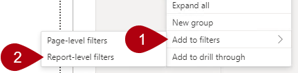
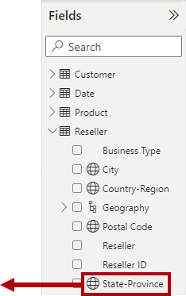
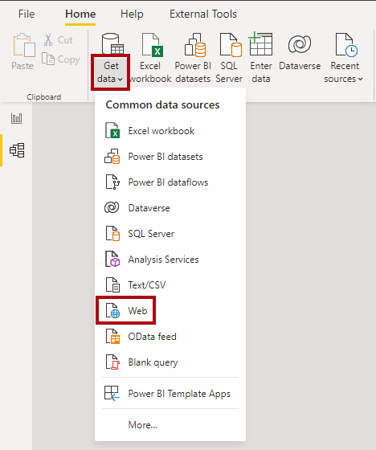
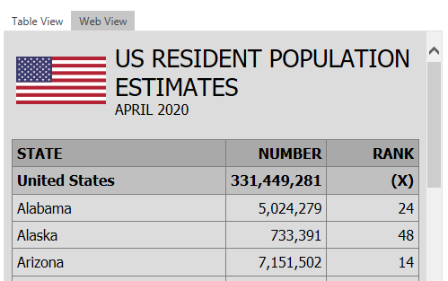
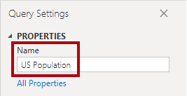
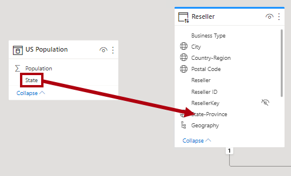
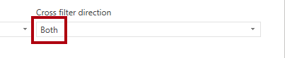
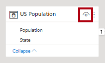

---
lab:
  title: 재사용 가능한 Power BI 자산 만들기
  module: Manage the analytics development lifecycle
---

# 재사용 가능한 Power BI 자산 만들기

## 개요

**이 랩을 완료하는 데 걸리는 예상 완료 시간은 45분입니다.**

이 랩에서는 핵심 데이터 세트를 확장하는 특수 Power BI 데이터 세트를 만듭니다. 특수 데이터 세트를 사용하면 1인당 미국 매출을 분석할 수 있습니다.

이 랩에서는 다음 사항들을 수행하는 방법에 대해 알아봅니다.

- 라이브 연결 만들기

- 로컬 DirectQuery 모델 만들기

- 계보 보기를 사용하여 종속 Power BI 자산 검색

## 시작하기

이 연습에서는 환경을 준비합니다.

### 이 과정에 대한 리포지토리 복제

1. 시작 메뉴에서 명령 프롬프트를 엽니다.

    

1. 명령 프롬프트 창에서 다음을 입력하여 D 드라이브로 이동합니다.

    `d:` 

   Enter 키를 누릅니다.

    


1. 명령 프롬프트 창에서 다음 명령을 입력하여 과정 파일을 다운로드하고 DP500 폴더에 저장합니다.
    
    `git clone https://github.com/MicrosoftLearning/DP-500-Azure-Data-Analyst DP500`
   
1. 리포지토리가 복제되면 명령 프롬프트 창을 닫습니다. 
   
1. 파일 탐색기에서 D 드라이브를 열어 파일이 다운로드되었는지 확인합니다.

### Power BI 설정

이 작업에서는 Power BI를 설정합니다.

1. Power BI Desktop을 열려면 작업 표시줄에서 **Power BI Desktop** 바로 가기를 선택합니다.

2. 시작 창을 닫습니다.

3. 아직 로그인하지 않은 경우 Power BI Desktop 오른쪽 위 모서리에서 **로그인**을 선택합니다. 랩 자격 증명을 사용하여 로그인 프로세스를 완료합니다.

    
4. Microsoft Edge의 Power BI 가입 페이지로 리디렉션됩니다. **계속**을 선택하여 가입을 완료합니다.

    

5. 10자리 전화 번호를 입력하고 **시작**을 선택합니다. 다시 한 번 **시작**을 선택합니다. Power BI로 리디렉션됩니다.

6. 오른쪽 위에서 프로필 아이콘을 선택한 다음 **평가판 시작**을 선택합니다.

    

7. 메시지가 표시되면 **평가판 시작**을 선택합니다.


8. 나머지 작업을 수행하여 평가판 설정을 완료합니다.

    팁: Power BI 웹 브라우저 환경은 **Power BI 서비스**라고 알려져 있습니다.**

### Power BI 서비스에서 작업 영역 만들기

이 작업에서는 작업 영역을 만듭니다.

1. Power BI 서비스에서 작업 영역을 만들려면 왼쪽에 있는 **탐색** 창에서 **작업 영역**을 선택한 다음, **작업 영역 만들기**를 선택합니다.

    


2. 오른쪽에 있는 **작업 영역 만들기** 창에서 **작업 영역 이름** 상자에 작업 영역의 이름을 입력합니다.

    작업 영역 이름은 테넌트 내에서 고유해야 합니다.**

    

3. **저장**을 선택합니다.

    

    만들어지고 나면 작업 영역이 열립니다. 다음 작업에서는 이 작업 영역에 데이터 세트를 게시합니다.**

### Power BI Desktop에서 시작 파일 열기

1. 파일 탐색기를 열려면 작업 표시줄에서 **파일 탐색기** 바로 가기를 선택합니다.

2. **D:\DP500\Allfiles\16\Starter** 폴더로 이동합니다.

3. 미리 개발된 Power BI Desktop 파일을 열려면 **Sales Analysis - Create reusable Power BI artifacts.pbix** 파일을 두 번 클릭합니다.

4. 아직 로그인하지 않은 경우 Power BI Desktop 오른쪽 위 모서리에서 **로그인**을 선택합니다. 랩 자격 증명을 사용하여 로그인 프로세스를 완료합니다.

    

### 데이터 모델 검토

이 작업에서는 데이터 모델을 검토합니다.

1. Power BI Desktop의 왼쪽에서 **모델** 보기로 전환합니다.

    

2. 모델 다이어그램을 사용하여 모델 디자인을 검토합니다.

    

    이 모델은 여섯 개의 차원 테이블과 한 개의 팩트 테이블로 구성됩니다. **Sales** 팩트 테이블에는 판매 주문 세부 정보가 저장됩니다. 표준 별모양 스키마 디자인입니다.**

### 데이터 모델 게시

이 작업에서는 데이터 모델을 게시합니다.

1. 보고서를 게시하려면 **홈** 리본 탭에서 **게시**를 선택합니다. 

    변경 내용을 저장하라는 메시지가 표시되면 **저장**을 선택합니다.**

    

2. **Power BI에 게시** 창에서 작업 영역(개인 작업 영역 아님)을 선택한 다음, **선택**을 선택합니다.

3. 게시에 성공하면 **가져오기**를 선택합니다.

    일단 게시되면 모델은 Power BI 데이터 세트가 됩니다. 이 랩에서 이 데이터 세트는 비즈니스 분석가가 특수 데이터 세트를 만들기 위해 확장할 수 있는 핵심 데이터 세트입니다. 다음 연습에서는 특정 비즈니스 요구 사항을 해결하기 위해 특수 데이터 세트를 만듭니다.**

4. Power BI Desktop을 닫습니다.

5. 변경 내용을 저장하라는 메시지가 표시되면 **저장하지 않음**을 선택합니다.

## 특수 데이터 세트 만들기

이 연습에서는 1인당 미국 매출을 분석할 수 있는 특수 데이터 세트를 만듭니다. 핵심 데이터 세트에는 인구 값이 포함되어 있지 않으므로 새 테이블을 추가하여 모델을 확장합니다.

### 라이브 연결 만들기

이 작업에서는 이전 연습에서 게시한 **Sales Analysis - Create reusable Power BI artifacts** 데이터 세트에 대한 라이브 연결을 사용하는 새 보고서를 만듭니다.

1. Power BI Desktop을 열려면 작업 표시줄에서 **Power BI Desktop** 바로 가기를 선택합니다.

2. 시작 창을 닫습니다.

3. 파일을 저장하려면 **파일** 리본에서 **다른 이름으로 저장**을 선택합니다.

4. **다른 이름으로 저장** 창에서 **D:\DP500\Allfiles\16\MySolution** 폴더로 이동합니다.

5. **파일 이름** 상자에 **US Sales Analysis**를 입력합니다.

    

6. **저장**을 선택합니다.

7. 라이브 연결을 만들려면 **홈** 리본 탭의 **데이터** 그룹 내에서 **Power BI 데이터 세트**를 선택합니다.

    

8. **데이터 허브** 창에서 판매 분석 - 재사용 가능한 Power BI 아티팩트 데이터 세트 만들기를** 선택합니다**.

    

9. **연결**을 선택합니다.

10. **커넥트 데이터** 대화 상자에서 판매 분석 - 재사용 가능한 Power BI 아티팩**트 만들기 옆의 **상자에 검사 다음, 제출**을 선택하여 **데이터 원본에 연결합니다.

11. 잠재적인 보안 위험에 대한 메시지가 표시되면 알림을 읽은 다음 **확인**을 선택합니다.

12. 왼쪽 아래의 상태 표시줄에서 보고서가 데이터 세트에 라이브로 연결되어 있음을 확인합니다.

    

13. **모델** 보기로 전환합니다.

    

14. 필요한 경우 모델 다이어그램을 화면에 맞추려면 오른쪽 아래에서 **화면에 맞추기**를 선택합니다.

    

15. 테이블 머리글 위로 커서를 가져가 도구 설명을 표시합니다. 데이터 원본 형식이 SQL Server Analysis Services이고, 서버가 작업 영역을 참조하며 데이터베이스가 데이터 세트임을 확인합니다.

    

    이러한 속성은 원격 모델이 테이블을 호스트함을 나타냅니다. 다음 작업에서는 모델을 변경하여 확장합니다. 이 프로세스에서는 다양한 방법으로 수정할 수 있는 로컬 DirectQuery 모델을 만듭니다.**

16. Power BI Desktop 파일을 저장합니다.

    

### 로컬 DirectQuery 모델 만들기

이 작업에서는 로컬 DirectQuery 모델을 만듭니다.

1. **홈** 리본 탭의 **모델링** 그룹 내에서 **Make changes to this model**(이 모델을 변경합니다)을 선택합니다.

    

    참고: 이 모델을 변경하는 옵션이 표시되지 않으면 미리 보기 기능, PBI 데이터 세트용 DirectQuery, AS를 사용하도록 설정해야 합니다.**
    - **파일** > **옵션 및 설정** > **옵션**으로 이동하고 미리 보기 기능 섹션에서 Power BI 데이터 세트 및 Analysis Services용 DirectQuery 확인란을 선택하여 이 미리 보기 기능을 사용하도록 설정합니다. 변경 내용을 적용하려면 Power BI Desktop을 다시 시작해야 할 수도 있습니다. 

2. 메시지가 표시되면 대화 상자 창 메시지를 읽은 다음, **Add a local model**(로컬 모델 추가)을 선택합니다.

    

    모델은 이제 DirectQuery 모델입니다. 특정 테이블 또는 열 속성을 수정하거나 계산 열을 추가하여 모델을 향상시킬 수 있습니다. 다른 데이터 원본에서 가져온 새 데이터 테이블로 모델을 확장할 수도 있습니다. 미국 인구 데이터를 모델에 추가하기 위해 테이블을 추가합니다.**

3. **커넥트 데이터** 대화 상자에서 판매 분석 옆에 **있는 상자에 검사 있는지 확인합니다**. 재사용 가능한 Power BI 아티팩트를 만든 다음 제출**을 선택하여 **데이터 원본 스토리지 모드를 변경합니다.

4. 테이블 머리글 위로 커서를 가져가 도구 설명을 표시하고 테이블 스토리지 모드가 **DirectQuery**로 설정되어 있는지 확인합니다.

    

### 보고서 레이아웃 디자인

이 작업에서는 미국 주별 판매를 분석하기 위한 보고서 레이아웃을 디자인합니다.

1. **보고서** 보기로 전환합니다.

    

2. 오른쪽에 **있는 데이터** 창에서 재판매**인 **테이블을 엽니다.

3. **Country-Region** 필드를 마우스 오른쪽 단추로 클릭한 다음 **필터에 추가** > **보고서 수준 필터**를 선택합니다.

    

4. **시각화** 창의 왼쪽에 있는 **필터** 창을 열어 확장합니다.

5. **필터** 창에 있는 **모든 페이지의 필터** 섹션의 **Country-Region** 카드에서 **United States**를 선택합니다.

    

6. 테이블 시각적 개체를 추가하려면 **시각화** 창에서 테이블 시각적 개체 아이콘을 선택합니다.

    

7. 전체 페이지를 채우도록 테이블의 위치를 변경하고 크기를 조정합니다.

8. 데이터 창의 **재판매**인 테이블 내부에서 **State-Province** 필드를 끌어 **테이블 시각적 개체에 놓**습니다.

    

9. 데이터** 창에서 **Sales** 테이블을 확장한 **다음 Sales Amount** 필드를 테이블 시각적 개체에 추가**합니다.

    

10. 판매 금액의 내림차순으로 상태를 정렬하려면 Sales Amount** 합계 헤더를 **선택합니다.


    이 보고서 레이아웃은 이제 미국 주별 판매에 대한 기본 세부 정보를 제공합니다. 그러나 추가 요구 사항은 1인당 매출을 표시하고 해당 측정값의 내림차순으로 상태를 정렬하는 것입니다.**

### 테이블 추가

이 작업에서는 웹 페이지에서 가져온 미국 인구 데이터의 테이블을 추가합니다.

1. **모델** 보기로 전환합니다.

    

2. **홈** 리본 탭의 **데이터** 그룹 내에서 **데이터 가져오기**를 선택한 다음, **웹**을 선택합니다.

    

3. **URL** 상자에 다음 파일 경로를 입력합니다. **D:\DP500\Allfiles\16\Assets\us-resident-population-estimates-2020.html**

    이 랩의 목적을 위해 Power BI Desktop은 파일 시스템에서 웹 페이지에 액세스합니다.**

    팁: 파일 경로는 **D:\DP500\Allfiles\16\Assets\Snippets.txt** 파일에서 복사하여 붙여넣을 수 있습니다.**

4. **확인**을 선택합니다.

    

5. **탐색** 창의 오른쪽에서 **웹 보기**로 전환합니다.

    

    이 웹 페이지는 2020년 4월 인구 조사를 통해 얻은 미국 거주자 인구 추정치를 제공합니다.**

6. 테이블 보기로 다시 전환합니다.

    

7. 왼쪽에서 **Table 2**를 선택합니다.

    

8. 테이블 보기 미리 보기를 확인합니다.

    이 데이터 테이블에는 1인당 매출을 계산하기 위해 모델에 필요한 데이터가 포함되어 있습니다. 변환을 적용하여 데이터를 준비해야 합니다. 특히 **United States** 행을 제거하고 **RANK** 열을 제거하고 **STATE** 및 **NUMBER** 열의 이름을 바꿉니다.**

9. 데이터를 준비하려면 **데이터 변환**을 선택합니다.

    

10. Power Query 편집기 창의 오른쪽에 있는 **쿼리 설정** 창의 **이름** 상자에서 텍스트를 **US Population**으로 바꾼 다음, **Enter**를 누릅니다.

    

11. **United States** 행을 제거하려면 **STATE** 열 머리글에서 아래쪽 화살표를 선택한 다음, **United States** 항목의 선택을 취소합니다(목록 아래쪽으로 스크롤).

    

12. **확인**을 선택합니다.

    

13. **RANK** 열을 제거하려면 열 머리글을 마우스 오른쪽 단추로 클릭한 다음, **제거**를 선택합니다.

    

14. **STATE** 열의 이름을 바꾸려면 열 머리글을 두 번 클릭하고 텍스트를 **State**로 바꾼 다음, **Enter**를 누릅니다.

15. **NUMBER** 열의 이름을 **Population**으로 바꿉니다.

    

16. 쿼리를 적용하려면 **홈** 리본 탭의 **닫기** 그룹 내에서 **닫기 및 적용** 아이콘을 선택합니다.

    

17. 잠재적인 보안 위험에 대한 메시지가 표시되면 알림을 읽은 다음 **확인**을 선택합니다.

    

    Power BI Desktop은 쿼리를 적용하여 모델 테이블을 만듭니다. 모델에 인구 데이터를 가져오는 새 테이블을 추가합니다.**

18. **US Population** 테이블을 **Reseller** 테이블 근처에 다시 배치합니다.

19. 모델 관계를 만들려면 **US Population** 테이블에서 **State** 열을 끌어 **Reseller** 테이블의 **State-Province** 열에 가져다 놓습니다.

    

20. **관계 만들기** 창의 **교차 필터 방향** 드롭다운 목록에서 **모두**를 선택합니다.

    

    **Reseller** 테이블의 각 행은 재판매인을 저장하므로 **State-Province** 열에 있는 값에는 중복 값이 포함됩니다(예: 캘리포니아 주에는 많은 재판매인이 있습니다). 관계를 만들 때 Power BI Desktop은 자동으로 열 카디널리티를 결정하고 다대일 관계임을 발견했습니다. 필터가 **Reseller** 테이블에서 **US Population** 테이블로 전파되도록 하려면 관계가 양방향으로 교차 필터여야 합니다.**

21. **확인**을 선택합니다.

    

22. 새 테이블을 숨기려면 **US Population** 테이블의 머리글에서 표시 유형 아이콘을 선택합니다.

    

    보고서 작성자에게 테이블을 표시할 필요가 없습니다.**

### 측정값 추가

이 작업에서는 1인당 매출을 계산하는 측정값을 추가합니다.

1. **보고서** 보기로 전환합니다.

    

2. 데이터 창에서 Sales** 테이블을 마우스 오른쪽 단추로 **클릭한 다음 새 측정값**을 선택합니다**.** ** 

    

3. 수식 입력줄에 다음 측정값 정의를 입력합니다.

    팁: 측정값 정의는 **D:\DP500\Allfiles\16\Assets\Snippets.txt** 파일에서 복사하여 붙여넣을 수 있습니다.**

    ```
    Sales per Capita =
    DIVIDE(
    SUM(Sales[Sales Amount]),
    SUM('US Population'[Population])
    )
    ```

    **Sales per Capita**라는 측정값은 DAX [DIVIDE](https://docs.microsoft.com/dax/divide-function-dax) 함수를 사용하여 **Sales Amount** 열의 합계를 **Population** 열의 합계로 나눕니다.**

4. **측정 도구** 상황별 리본 탭의 **서식 지정** 그룹에서 소수 자릿수 상자에 **4**를 입력합니다.

    

5. 행렬 시각적 개체에 측정값을 추가하려면 데이터** 창의 **Sales** 테이블 내에서 **Capita**당 판매액 필드를 테이블 시각적 개체로 끌어**옵니다.

    이 측정값은 Power BI 서비스의 원격 모델에서 가져온 데이터를 새 모델로 가져온 로컬 테이블의 데이터와 결합하여 결과를 평가합니다.**

6. 1인당 판매액을 내림차순으로 정렬하려면 **Sales per Capita** 열 머리글을 선택합니다.

    

### 솔루션 게시

이 작업에서는 특수 데이터 모델 및 보고서로 구성된 솔루션을 게시합니다.

1. Power BI Desktop 파일을 저장합니다.

    

2. 솔루션을 게시하려면 **홈** 리본 탭에서 **게시**를 선택합니다.

    

3. **Power BI에 게시** 창에서 작업 영역을 선택한 다음, **선택**을 선택합니다.

    

4. 게시에 성공하면 **가져오기**를 선택합니다.

    

5. Power BI Desktop을 닫습니다.

6. 변경 내용을 저장하라는 메시지가 표시되면 **저장하지 않음**을 선택합니다.

    

### 특수 데이터 세트 검토

이 작업에서는 Power BI 서비스의 특수 데이터 세트를 검토합니다.

1. Power BI 서비스(웹 브라우저)로 전환합니다.

2. 작업 영역 방문 페이지에서 **US Sales Analysis** 보고서 및 **US Sales Analysis** 데이터 세트를 확인합니다.

    


3. **US Sales Analysis** 데이터 세트 위에 커서를 가져가 줄임표가 나타나면 줄임표를 선택한 다음, **계보 보기**를 선택합니다.

    

    **계보 보기** 옵션은 Power BI 자산 간의 종속성 검색을 지원합니다. 예를 들어 핵심 데이터 세트에 변경 내용을 게시하려는 경우에 중요합니다. 계보 보기는 테스트가 필요할 수 있는 종속 데이터 세트를 알려줍니다.**

4. 계보 보기에서 **US Sales Analysis** 데이터 세트 보고서 및 **Sales Analysis - Create reusable Power BI artifacts** 데이터 세트 보고서의 연결을 확인합니다.

    

    Power BI 데이터 세트가 다른 데이터 세트와 관련된 경우, 이를 연결이라고 합니다. 이 랩에서 **US Sales Analysis** 데이터 세트는 **Sales Analysis - Create reusable Power BI artifacts** 데이터 세트에 연결되어 있어 특수 목적으로 다시 사용할 수 있습니다.**
